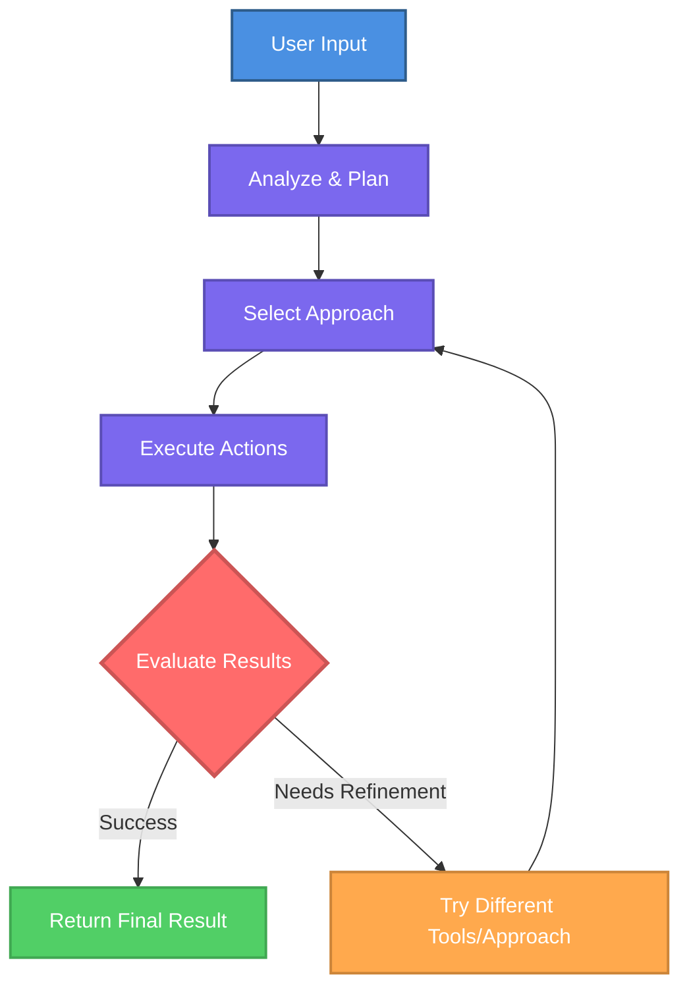

AI agents are specialized AI assistants with persistent instructions and dedicated tool access that deliver consistent, reliable results.

<Info>
Agents are like AI team members with specific roles and expertise. They remember their job across every conversation.
</Info>

---

## How Agents Differ from Regular Chat

<Tabs>
<Tab title="Getting Started">

Regular chat starts fresh each time. Agents have persistent instructions, roles, and tools that apply automatically to every conversation.

**Key advantages:**

<CardGroup cols={2}>
<Card title="Persistent Instructions" icon="file-lines">
Give agents permanent guidelines, roles, and expertise that apply to every conversation automatically.
</Card>

<Card title="Consistent Behavior" icon="equals">
Agents follow the same approach every time, delivering predictable, reliable results across all interactions.
</Card>

<Card title="Dedicated Tools" icon="wrench">
Equip agents with specific connectors they use automatically when needed for their tasks.
</Card>

<Card title="Specialized Roles" icon="user-tie">
Define agent personalities, tone, and expertise to match specific workflows or team functions.
</Card>
</CardGroup>

<Check>
Configure once, use everywhere. Agents keep their role and instructions across every conversation.
</Check>

## When to Use Agents

Use agents for:
- **Recurring workflows**: tasks you perform regularly with consistent requirements
- **Specialized expertise**: domain-specific knowledge applied consistently
- **Cross-tool workflows**: complex tasks spanning multiple systems
- **Team standardization**: shared workflows across your organization

## Agent Examples

Practical agents you can create for common business workflows:

<AccordionGroup>
<Accordion title="Email Assistant" icon="envelope">
Automatically review your unread emails, summarize key information, flag urgent messages, and draft responses based on your communication style.

**Connectors needed:** Outlook or Gmail
**Complexity:** Simple
</Accordion>

<Accordion title="Meeting Scheduler" icon="calendar">
Find available time slots across calendars, schedule meetings with participants, and draft meeting agendas based on the meeting context.

**Connectors needed:** Calendar, Email
**Complexity:** Simple
</Accordion>

<Accordion title="Customer Support Agent" icon="headset">
Handle customer inquiries by accessing your CRM, checking order status, and escalating complex issues to a human.

**Connectors needed:** CRM, order management, email
**Complexity:** Moderate
</Accordion>

<Accordion title="Data Analysis Agent" icon="chart-line">
Query databases for sales data, identify trends, and generate reports based on your reporting standards.

**Connectors needed:** Database, spreadsheet
**Complexity:** Moderate
</Accordion>

<Accordion title="Lead Qualification Agent" icon="user-check">
Review new leads, score them against your criteria, and draft personalized outreach.

**Connectors needed:** CRM, email
**Complexity:** Complex
</Accordion>

<Accordion title="Cross-System Workflow Agent" icon="diagram-project">
Orchestrate processes across multiple systems: retrieve information from Outlook, create records in your ERP, and update a spreadsheet.

**Connectors needed:** Multiple integrations
**Complexity:** Complex
</Accordion>
</AccordionGroup>

<Tip>
Start with simple, single-purpose agents and expand to more complex workflows as you gain experience.
</Tip>

---

## Getting Started with Agents

<CardGroup cols={2}>
  <Card title="Finding and Accessing Agents" icon="magnifying-glass" href="/en/ai-agents/finding-and-accessing-agents">
    Learn where agents live in WonkaChat and how to open them.
  </Card>
  <Card title="Using Existing Agents" icon="play" href="/en/ai-agents/using-existing-agents">
    Start using agents created by you or your organization.
  </Card>
  <Card title="Creating Your First Agent" icon="plus-circle" href="/en/ai-agents/creating-your-first-agent">
    Build your own agent tailored to your specific workflows.
  </Card>
  <Card title="Business Teaching" icon="graduation-cap" href="/en/ai-agents/business-teaching">
    Provide business context to agents for better, more accurate results.
  </Card>
</CardGroup>

</Tab>

<Tab title="Advanced Knowledge">

## Agent Architecture

Agents are built on several key components that work together:

<AccordionGroup>
<Accordion title="1. Agent Name" icon="tag">
A clear, descriptive identifier that makes the agent easy to find and select when starting conversations.
</Accordion>

<Accordion title="2. Instructions" icon="file-lines">
The **instructions** are the foundational set of directions that define your agent's identity and behavior. Unlike regular conversation messages, instructions are persistent and shape every response the agent generates.

**Instructions typically cover:**
- Role definition and expertise areas
- Communication tone and style
- Operational rules and constraints
- Business context and policies
- Decision-making frameworks

The quality of your instructions directly impacts agent effectiveness. Well-crafted instructions produce consistent, reliable results; vague instructions lead to unpredictable behavior.
</Accordion>

<Accordion title="3. Model Selection" icon="microchip">
The model choice affects both quality and speed. WonkaChat groups models by size, fast / standard / advanced, rather than by brand, so you pick based on the task rather than a specific vendor.

**Key considerations:**
- **Performance**: more advanced models handle complex, multi-step reasoning better
- **Speed**: faster models reduce latency for high-frequency interactions
- **Context window**: how much information the agent can process at once

<Warning>
Model selection impacts both quality and operational cost. Match model size to task complexity: don't overspend on simple tasks.
</Warning>

See [Choosing a Model](/en/improved-usage/choosing-a-model) for guidance on picking the right size, and [Creating Your First Agent](/en/ai-agents/creating-your-first-agent) for how to set it on an agent.
</Accordion>

<Accordion title="4. Capabilities" icon="wand-magic-sparkles">
Agents can be equipped with capabilities beyond text generation:

**Code Execution**: run code snippets for calculations, data transformations, or complex logic — if enabled for your organization.

**Web Search**: access current information from the internet when needed — if enabled for your organization and for the agent.

**Connectors (MCP)**: the most important capability, direct integration with your business systems through the Model Context Protocol.

Agents dynamically select which tool to use based on the task and their instructions.

<Info>
Connectors link agents to your business systems for real actions. See [Tools Connection](/en/tools-connection/introduction) for setup details.
</Info>
</Accordion>
</AccordionGroup>

## Execution Loop

Agents operate autonomously through a continuous loop, iterating until they reach the desired result:

<Check>
Agents iterate through multiple approaches and tool combinations until they successfully complete the task or reach a defined limit.
</Check>

## Security and Access Control

### Permission Inheritance

Agents operate within your existing security boundaries. They cannot perform any action you couldn't perform yourself. If you lack permission to access a system, read a file, or run an operation manually, the agent cannot bypass that restriction for you.

<Info>
See [Security & Governance](/en/security-governance/security-overview) for comprehensive security details.
</Info>

</Tab>
</Tabs>
