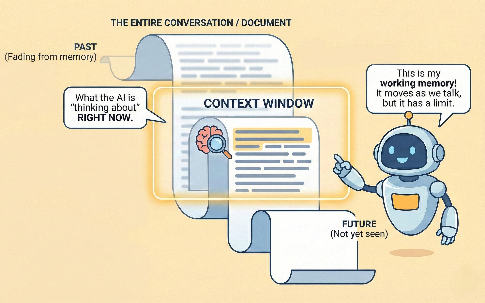

Understanding how AI models handle conversation history is essential for getting consistent, relevant responses. This guide explains context windows and strategies for managing conversations effectively.

<Info>
Within a single conversation, the AI remembers everything that fits in its context window. A separate conversation doesn't automatically share that history — unless your organization uses [Memories](/en/improved-usage/memories) or [Projects](/en/improved-usage/projects) to carry context across conversations.
</Info>

<Tabs>
<Tab title="Getting Started">

## What is a Context Window?

Think of the context window as the AI's "working memory" — it's how much of your conversation the AI can "see" and remember at any given moment.

**Analogy:**
Imagine reading a book through a narrow slot that only shows you a few pages at a time. As you slide the slot forward to read new pages, the earlier pages slide out of view. That's how a context window works.

<Frame caption="Context window visualization">

</Frame>

### Why It Matters

<CardGroup cols={2}>
<Card title="Response Relevance" icon="bullseye">
The AI can only reference information within its current context window.
</Card>

<Card title="Coherence" icon="link">
Details from early in very long conversations may fall outside the window.
</Card>
</CardGroup>

### What Happens When Context Fills Up?

When a conversation exceeds the context window, the AI loses access to the earliest parts of your conversation. This can lead to:

- Loss of context from earlier decisions or information
- Potential inconsistency with earlier statements
- Confused responses when you reference old messages

<Warning>
If you reference something from much earlier in a long conversation and get a confused response, the context window may be full. Start a new conversation and summarize the relevant context.
</Warning>

---

## When to Start or Continue a Conversation

Use the following guidance to decide whether to start a new conversation or continue your current one for optimal AI responses.

<Tabs>
<Tab title="Start a New Conversation" icon="sparkles">

You should start a new conversation when:

<CardGroup cols={2}>
<Card title="Changing Topics" icon="arrows-turn-to-dots">
You are moving to a completely unrelated subject.
</Card>

<Card title="AI Gets Confused" icon="circle-question">
The AI seems confused or gives inaccurate, off-topic, or incorrect responses.
</Card>

<Card title="Long Exchanges" icon="scroll">
Your conversation has become lengthy with extended back-and-forth.
</Card>

<Card title="Need a Fresh Perspective" icon="broom-ball">
You want an unbiased answer, free from prior discussion context.
</Card>
</CardGroup>

<Warning>
If response quality drops or the AI references outdated information, it is often more efficient to start a new conversation with a concise summary of your current needs rather than trying to correct the ongoing one.
</Warning>

</Tab>

<Tab title="Continue the Current Conversation" icon="layer-group">

Continue the current conversation when:

<CardGroup cols={2}>
<Card title="Building on Previous Work" icon="layer-group">
Each exchange builds directly on earlier questions or results.
</Card>

<Card title="Iterative Refinement" icon="pen-to-square">
You are improving, refining, or revising what was previously discussed.
</Card>

<Card title="Exploring Related Subtopics" icon="sitemap">
You are delving into related facets or aspects of the same overall topic.
</Card>

<Card title="Maintaining Context" icon="memory">
The AI needs to remember prior details, choices, or constraints to respond effectively.
</Card>
</CardGroup>

<Tip>
Ask yourself: "Does the AI need to retain our earlier discussion to answer this well?" If yes, continue. If not, start a new conversation.
</Tip>

</Tab>
</Tabs>

---

## Building on Previous Responses

Effective conversation flow builds naturally on what's already been discussed.

**Example progression:**
```
You: "Explain the benefits of containerization with Docker."

AI: [Provides explanation including portability, consistency, and isolation]

You: "You mentioned isolation as a benefit. How does Docker's isolation 
compare to traditional virtual machines in terms of resource usage?"
```

In longer conversations, periodically summarize key points to reinforce important context:

```
So far we've established that:
1. Microservices offer scalability benefits for our use case
2. The team needs Kubernetes experience
3. The initial setup cost is approximately 3 months

Given this context, what's the recommended team structure?
```

</Tab>
<Tab title="Advanced Knowledge">

### Understanding Tokens and Model Selection

Context windows are measured in **tokens**, which represent roughly 4 characters or about ¾ of a word.

Model sizes trade off context length against speed and reasoning depth: fast models generally offer smaller context windows, while standard and advanced reasoning models offer larger ones, some large enough to hold extended conversations or long documents in a single context window.

<Info>
When choosing a model in WonkaChat, consider the context window if you're planning extended conversations or working with long documents. See [Choosing a Model](/en/improved-usage/choosing-a-model) for how model sizes, the Router, and Fast/Pro modes work.
</Info>

### Managing Multiple Workstreams

For juggling multiple projects, use separate conversations by project:

```
Conversation 1: "Project Alpha - Frontend Development"
Conversation 2: "Project Alpha - Backend API"
Conversation 3: "Project Beta - Data Analysis"
```

This approach keeps context clean and prevents "polluting" your context window with information that might bias future responses.

<Tip>
If you find yourself managing several related conversations for the same piece of work, consider grouping them in a [Project](/en/improved-usage/projects) instead — related chats stay together and can share project-level context.
</Tip>

### Rehydrating Context

When starting a fresh conversation about a related topic, provide a concise summary of relevant prior context:

```
"Context from previous session: We're implementing a new CRM system for 
our sales team of 50 people. Budget is $100K, timeline is 6 months, and 
we need integration with our existing email platform and calendar system.

New question: Given these requirements, what training approach would you 
recommend for onboarding the sales team?"
```

### Finding Past Conversations

Your past conversations aren't lost when you start a new one. Use **Conversations** in the sidebar to find and reopen them, and **Archived chats** to browse conversations you've archived to keep your sidebar tidy.

</Tab>
</Tabs>

## Common Pitfalls to Avoid

<AccordionGroup>
<Accordion title="Expecting the AI to Remember Unrelated Conversations">
**Problem:** Starting a new conversation with "As we discussed yesterday..." without re-establishing context, when the earlier discussion happened in a separate, unrelated conversation.

**Solution:** Provide the relevant context again, or use a shared [Project](/en/improved-usage/projects) if this is ongoing related work.
</Accordion>

<Accordion title="Overloading a Single Conversation">
**Problem:** Using one conversation for multiple unrelated tasks, leading to confused responses.

**Solution:** Start new conversations for distinct topics.
</Accordion>

<Accordion title="Ignoring Quality Decline">
**Problem:** Continuing a conversation even when responses become less relevant or accurate.

**Solution:** Recognize when the context window is full and start fresh with a summary.
</Accordion>
</AccordionGroup>
