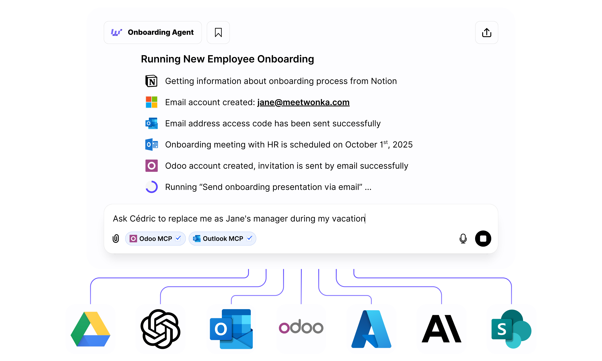

WonkaChat is an enterprise AI assistant that connects directly to your business tools, software, and data to help you accomplish complex tasks through simple conversation while maintaining your privacy and data integrity.

## Core Concept

WonkaChat consolidates your work across multiple software applications into a single chat interface. Instead of switching between different tools, you interact with one interface that coordinates actions across your connected systems.

Think of it as your intelligent business assistant that:
- Understands your company's processes and data
- Connects to your existing software and tools
- Executes multi-step workflows across different platforms
- Keeps your data secure within your environment

<Frame caption="Example: Automated employee onboarding across multiple systems">

</Frame>

In this example, a request to "Run New Employee Onboarding" automatically:

1. Gets information from **Notion** (onboarding checklist)
2. Creates an email account in **Microsoft 365**
3. Sends access codes via **Outlook**
4. Schedules an onboarding meeting in **Outlook Calendar**
5. Creates an **Odoo** account and sends an invitation
6. Sends the onboarding presentation by email

<Check>
This is the power of WonkaChat: complex multi-step workflows across different software, managed through natural conversation.
</Check>

---

## Key Capabilities

<CardGroup cols={2}>
<Card title="AI Agents" icon="robot">
Create specialized agents for specific tasks like onboarding, reporting, or customer support that run autonomously on your behalf.
</Card>

<Card title="External Connections" icon="plug">
Connect your existing software and business tools (from PM to CRM to communication platforms) so WonkaChat can work with your data.
</Card>

<Card title="Model Flexibility" icon="sliders">
Pick the model size that fits your task, or let the Router choose automatically. See [Choosing a Model](/en/improved-usage/choosing-a-model).
</Card>

<Card title="Business Teaching" icon="graduation-cap">
Use your company's knowledge by uploading documents and providing context. The AI adapts to your processes, terminology, and workflows.
</Card>
</CardGroup>

---

## What Can You Accomplish?

Real examples of what teams are doing with WonkaChat:

<AccordionGroup>
<Accordion title="Employee Onboarding in Minutes" icon="user-plus">
Automatically create accounts, schedule meetings, send welcome materials, and set up access across all your systems with a single request.

**Example:** "Onboard John Smith starting Monday" → Creates email, schedules HR meeting, adds to Slack, creates CRM account, sends laptop request.
</Accordion>

<Accordion title="Intelligent Document Search" icon="magnifying-glass">
Find information across all your connected systems (emails, documents, databases, wikis) without remembering where things are stored.

**Example:** "Find the Q3 marketing budget proposal" → Searches Google Drive, SharePoint, Notion, and Confluence simultaneously.
</Accordion>

<Accordion title="Automated Reporting" icon="chart-line">
Generate reports by pulling data from multiple sources, analyzing trends, and formatting results with no manual spreadsheet work.

**Example:** "Create a sales performance report for last month" → Pulls CRM data, calculates metrics, generates a formatted report.
</Accordion>

<Accordion title="Cross-Platform Workflows" icon="arrows-spin">
Execute complex multi-step processes that span different tools, eliminating manual coordination and context switching.

**Example:** "Create project in PM tool, notify team in Slack, send welcome email, schedule kickoff" → All happens automatically.
</Accordion>

<Accordion title="Meeting Intelligence" icon="calendar">
Schedule meetings considering everyone's availability, send agendas from templates, capture notes, and distribute action items, all in one flow.

**Example:** "Schedule quarterly review with leadership team next week" → Finds time slots, sends invites with agenda, creates notes doc.
</Accordion>

<Accordion title="Customer Support Automation" icon="headset">
Answer support questions using your knowledge base, create tickets, escalate when needed, and update customers to reduce response time.

**Example:** "Customer asking about refund policy" → Retrieves policy, drafts response, creates ticket if needed, logs interaction.
</Accordion>
</AccordionGroup>

<Tip>
These workflows run through simple conversation with no coding or complex configuration required.
</Tip>

---

## Ready to Get Started?

<CardGroup cols={2}>
<Card title="Why Choose WonkaChat?" icon="star" href="/en/welcome/why-wonka-chat">
Discover the unique advantages and security benefits of using WonkaChat for your team.
</Card>

<Card title="Quick Start Guide" icon="rocket" href="/en/welcome/quick-start">
Get up and running with your first conversation in just 5 minutes.
</Card>
</CardGroup>
