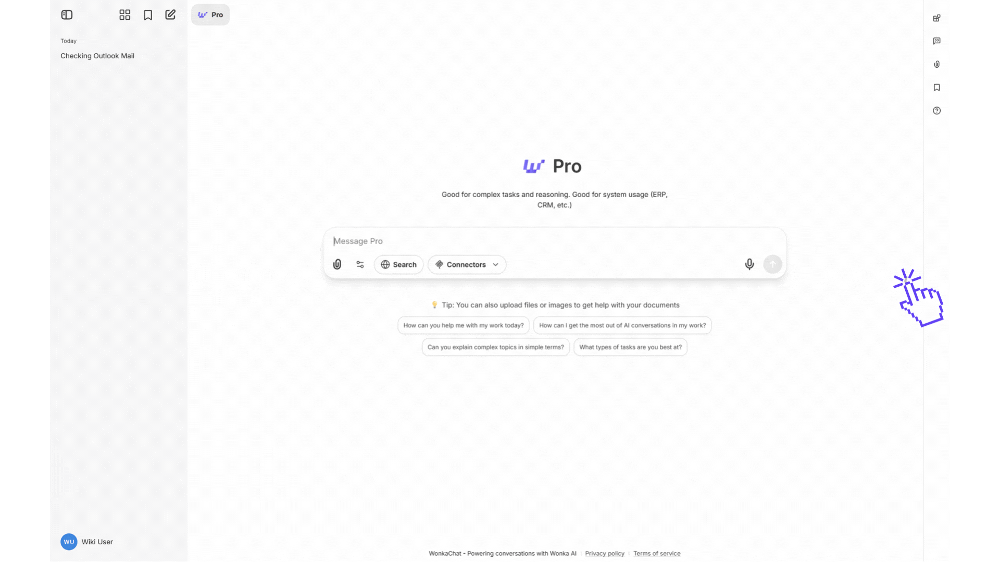

Enseigner le contexte métier à vos agents garantit qu'ils comprennent la terminologie, les processus et les politiques de votre entreprise. Cela permet aux agents de fournir des réponses fondées sur vos opérations réelles au lieu de s'appuyer sur des hypothèses génériques.

<Info>
L'enseignement métier aide les agents à utiliser votre terminologie exacte, à suivre vos processus et à s'aligner avec les politiques de votre entreprise.
</Info>

---

## Pourquoi enseigner votre contexte métier ?

Sans contexte métier, les agents font des hypothèses génériques. Avec lui, ils fournissent des réponses précises et spécifiques à l'entreprise.

**Exemple - Rédiger un e-mail de support client :**

**Sans contexte :** « La plupart des entreprises offrent des remboursements dans les 14-30 jours. Vérifiez la politique spécifique de votre entreprise. »

**Avec contexte :** « Notre politique de remboursement permet les demandes dans les 30 jours, traitées en 3-5 jours ouvrables. Souhaitez-vous que j'en initie une ? »

### Avantages clés

<CardGroup cols={2}>
<Card title="Réponses précises" icon="check-circle">
Les agents utilisent vos termes exacts, politiques et processus
</Card>

<Card title="Erreurs réduites" icon="shield-check">
L'ancrage dans vos informations empêche les hallucinations (l'IA qui invente des détails incorrects)
</Card>

<Card title="Cohérence de marque" icon="palette">
Les agents maintiennent votre voix, ton et style de communication
</Card>

<Card title="Meilleurs résultats" icon="trophy">
Les membres de l'équipe obtiennent des informations fiables et exploitables
</Card>
</CardGroup>

---

## Comment fournir un contexte métier

### Ajouter du contexte aux instructions de l'agent

Incluez des informations spécifiques à l'entreprise directement dans les instructions de l'agent. Commencez par l'essentiel et développez au besoin.

<AccordionGroup>
<Accordion title="Directives de voix et de ton" icon="message">
Définissez comment les agents doivent communiquer pour correspondre à votre marque.

**Exemple :**
```
Style de communication :
- Professionnel mais amical, jamais trop décontracté
- Utiliser la voix active et un langage direct
- S'adresser aux clients par leur prénom
- Garder les réponses concises et exploitables
```

<Tip>
Incluez des phrases spécifiques à utiliser ou à éviter. Cela garantit la cohérence dans toutes les interactions de l'agent.
</Tip>
</Accordion>

<Accordion title="Terminologie et glossaires" icon="book">
Définissez les termes spécifiques à l'entreprise, les noms de produits et les acronymes.

**Exemple :**
```
Termes clés :
- "Niveau Premium" = niveau d'abonnement entreprise
- "Démarrage rapide" = notre processus d'intégration de 15 minutes
- MRR = Revenu Mensuel Récurrent
- CS = Customer Success (pas Customer Support)
```

Des définitions claires préviennent les malentendus et garantissent que les agents utilisent votre langage.
</Accordion>

<Accordion title="Intégration des politiques" icon="shield">
Incluez les politiques pertinentes pour que les agents puissent répondre aux questions avec précision.

**Exemple :**
```
Politiques clés :
- Remboursements : Remboursement complet dans les 30 jours, traité en 3-5 jours ouvrables
- Heures de support : 9h-18h EST, lundi-vendredi
- SLA de réponse : 4 heures ouvrables pour standard, 1 heure pour entreprise
- Escalade : Les problèmes dépassant 500€ nécessitent l'approbation du responsable
```

<Warning>
Vérifiez toujours que les agents appliquent correctement les politiques avant de les déployer à votre équipe. Testez avec des scénarios réalistes.
</Warning>
</Accordion>

<Accordion title="Instructions de processus" icon="list-check">
Documentez les flux de travail étape par étape que les agents doivent suivre.

**Exemple :**
```
Processus d'intégration client :
1. Envoyer un e-mail de bienvenue avec les identifiants de connexion
2. Planifier un appel d'orientation dans les 48 heures
3. Attribuer un responsable de succès dédié
4. Fournir l'accès aux supports de formation
5. Faire un suivi après 7 jours
```

Des processus clairs garantissent la cohérence et l'exhaustivité des actions de l'agent.
</Accordion>
</AccordionGroup>

**Bonne pratique :** Mettez à jour les instructions lorsque les politiques ou processus changent. Un contexte obsolète conduit à des informations incorrectes.

---

### Télécharger des documents pour un contexte approfondi

Pour des informations étendues comme la documentation produit, les manuels de politiques ou les bases de connaissances, téléchargez des documents que les agents peuvent automatiquement rechercher et référencer lorsqu'ils répondent aux questions.

<Frame caption="Téléchargez des documents pour le contexte de l'agent">

</Frame>

**Pourquoi télécharger des documents ?**
- Les agents peuvent accéder aux informations détaillées sans encombrer les instructions
- Parfait pour la documentation complète qui est trop volumineuse pour les instructions
- Les informations restent à jour en mettant à jour les documents à tout moment sans changer les instructions de l'agent

**Meilleur pour :** Documentation produit, manuels de politiques, guides de processus, supports de formation, bases de connaissances

<Tip>
Utilisez les instructions pour les informations critiques nécessaires dans chaque réponse. Utilisez les documents pour le matériel de référence extensif que les agents récupèrent uniquement si pertinent.
</Tip>

<Accordion title="Détails techniques : Comment fonctionne la récupération de documents" icon="gear">

Lorsque vous téléchargez des documents, WonkaChat utilise **RAG (Retrieval-Augmented Generation)** pour les rendre consultables par les agents.

**Comment ça fonctionne :**

1. **Téléchargement** : Vous fournissez les documents de l'entreprise
2. **Indexation** : Les documents sont traités et rendus consultables
3. **Récupération** : Si pertinent, les agents trouvent automatiquement les informations des documents
4. **Génération** : Les agents produisent des réponses ancrées dans votre documentation réelle

**Conseils de préparation des documents :**
- **Utiliser des titres clairs** : Les sections bien structurées améliorent la précision de la récupération
- **Garder les sections ciblées** : Un sujet par section
- **Inclure du contexte** : Rédigez les sections pour qu'elles soient compréhensibles indépendamment (par exemple, « Notre niveau Premium (99€/mois) comprend... » et non pas simplement « Il comprend... »)
- **Rester cohérent** : Utilisez la même terminologie partout

**Sécurité et confidentialité :**
- Documents stockés en toute sécurité dans votre environnement WonkaChat
- Jamais utilisés pour entraîner des modèles IA
- Accessibles uniquement aux utilisateurs avec des autorisations d'agent

**En savoir plus sur RAG :** Pour des détails techniques plus approfondis, consultez les guides RAG [d'Anthropic](https://www.anthropic.com/engineering/contextual-retrieval), [d'OpenAI](https://platform.openai.com/docs/guides/optimizing-llm-accuracy#retrieval-augmented-generation-rag) ou [de Google](https://cloud.google.com/use-cases/retrieval-augmented-generation).

</Accordion>

---

## Exemples par cas d'usage

<AccordionGroup>
<Accordion title="Agent de support client" icon="headset">
**Contexte nécessaire :** Fonctionnalités produit, politiques de support, étapes de dépannage, directives de communication

**Exemple d'extrait d'instruction :**
```
Directives de support :
- Toujours vérifier le compte avant de partager des détails
- Utiliser les articles de la base de connaissances pour les problèmes techniques
- Escalader les problèmes de facturation dépassant 500€ à l'équipe finance
- Ton de réponse : Empathique, axé sur les solutions, professionnel
```
</Accordion>

<Accordion title="Assistant e-mail" icon="envelope">
**Contexte nécessaire :** Voix de l'entreprise, types d'e-mails courants, flux d'approbation, terminologie interne

**Exemple d'extrait d'instruction :**
```
Style d'e-mail :
- E-mails internes : Direct et concis
- E-mails externes : Professionnel et courtois
- Toujours inclure les parties prenantes pertinentes en CC le cas échéant
- Utiliser le format de signature de l'entreprise : [Nom] | [Titre] | [Département]
```
</Accordion>

<Accordion title="Assistant commercial" icon="chart-line">
**Contexte nécessaire :** Positionnement produit, tarification, public cible, processus de vente, informations concurrentielles

**Exemple d'extrait d'instruction :**
```
Contexte commercial :
- Cible : Entreprises du marché intermédiaire (50-500 employés)
- Proposition de valeur clé : Économie de temps de 40% sur la gestion de projets
- Tarification : À partir de 49€/utilisateur/mois
- Jamais accorder de réduction sans approbation du responsable
```
</Accordion>
</AccordionGroup>

---

## Maintenir le contexte métier à jour

<Steps>
<Step title="Examens réguliers">
Planifiez des examens trimestriels des instructions et documents de l'agent pour garantir l'exactitude.

<Tip>
Créez un rappel de calendrier pour examiner le contexte de l'agent après les changements de politique ou de processus majeurs.
</Tip>
</Step>

<Step title="Collecte de commentaires">
Demandez aux membres de l'équipe de signaler quand les agents fournissent des informations obsolètes ou incorrectes.

**Ce qu'il faut surveiller :**
- Anciens prix ou conditions mentionnés
- Processus qui ont changé
- Politiques qui ne sont plus en vigueur
- Nouvelles fonctionnalités de produit non reflétées
</Step>

<Step title="Mises à jour de version">
Versionner vos instructions et documents d'agent. Lorsque vous apportez des modifications, notez ce qui a changé et quand.

**Exemple :**
```
Version 2.1 (Janv 2024) :
- Mise à jour de la politique de remboursement : 30 jours → 45 jours
- Ajout d'un nouveau niveau de tarification Premium Plus
- Heures de support étendues : 9h-18h → 8h-20h
```
</Step>
</Steps>

<Warning>
Un contexte métier obsolète est pire que pas de contexte du tout. Il conduit à une confiance mal placée dans des informations incorrectes.
</Warning>

---

## Prochaines étapes

<CardGroup cols={2}>
<Card title="Créer votre premier agent" icon="plus-circle" href="/fr/ai-agents/creating-your-first-agent">
Appliquez l'enseignement métier lors de la création d'agents.
</Card>

<Card title="Utiliser les agents existants" icon="play" href="/fr/ai-agents/using-existing-agents">
Tirez le meilleur parti des agents avec un bon contexte.
</Card>
</CardGroup>
