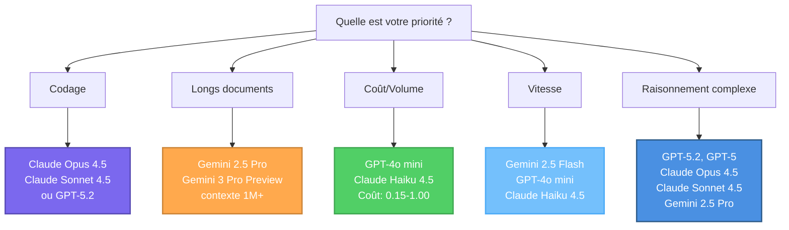

Créez des agents IA spécialisés adaptés à vos flux de travail. Ce guide couvre la création d'agents de la configuration initiale au déploiement.

<Info>
La construction d'un agent IA signifie définir son rôle, écrire des instructions, sélectionner un modèle et optionnellement connecter des outils.
</Info>

<Tabs>
<Tab title="Démarrage">

## Création d'agent - Explication vidéo

Explorez les instructions étape par étape sur la création d'agents IA par vidéo. Ces deux vidéos démontrent visuellement les décisions et actions clés dont vous avez besoin pour construire, configurer et déployer vos propres agents personnalisés.


<AccordionGroup>
<Accordion title="Création d'agent basique" icon="user" defaultOpen="true">

### Agent basique :

Regardez comment créer un agent basique avec des instructions simples. Cela vous aide à apprendre les fondamentaux de la création d'agents.

<iframe
  className="w-full aspect-video rounded-xl"
  src="https://www.youtube.com/embed/GQ8LYovybDU"
  title="Créer un agent basique"
  frameBorder="0"
  allow="accelerometer; clipboard-write; encrypted-media; gyroscope; picture-in-picture"
  allowFullScreen
></iframe>

<Tip>
Commencez par des agents simples pour comprendre les concepts de base avant de passer à des agents plus complexes avec des configurations d'outils.
</Tip>

</Accordion>

<Accordion title="Création d'agent connecté à des outils" icon="screwdriver-wrench">

### Agent connecté à des outils : 

Regardez comment créer un agent qui connecte un outil pour automatiser les flux de travail. C'est un exemple pratique d'intégration multi-systèmes.

<iframe
  className="w-full aspect-video rounded-xl"
  src="https://www.youtube.com/embed/N8rC1fks2oY"
  title="Créer un agent connecté à des outils"
  frameBorder="0"
  allow="accelerometer; clipboard-write; encrypted-media; gyroscope; picture-in-picture"
  allowFullScreen
></iframe>

<Tip>
Cet exemple démontre comment les agents peuvent connecter d'autres systèmes métier pour automatiser les flux de travail qui nécessitent habituellement un transfert de données manuel.
</Tip>

</Accordion>
</AccordionGroup>


## Création d'agent - Explication étape par étape

<Steps>
<Step title="Avant de commencer">

Définissez l'objectif de votre agent :
- **Quelle tâche** cet agent va-t-il gérer ?
- **À quel point** le flux de travail est-il complexe ?
- **Quels outils** a-t-il besoin ?
</Step>

<Step title="Accéder à la création d'agent">
Naviguez vers l'interface de création d'agent et cliquez sur « Créer un nouvel agent ».

<Frame caption="Interface de création d'agent">

</Frame>
</Step>

<Step title="Nommer votre agent">
Choisissez un nom clair et descriptif qui indique l'objectif.

**Bien :** « Assistant de support client », « Analyseur de données de ventes Q4 »  
**À éviter :** « Assistant », « Agent 1 »

<Tip>
Si vous prévoyez un partage à l'échelle de l'organisation, choisissez des noms qui ont du sens pour tous les utilisateurs.
</Tip>
</Step>

<Step title="Écrire vos instructions">
Les instructions spécifient le rôle, l'expertise, le ton et le comportement de votre agent. Rédigez des instructions claires et détaillées pour garantir que l'agent fonctionne de manière cohérente comme prévu.

### Guide des instructions de base

<AccordionGroup>
<Accordion title="Définition du rôle">
Indiquez ce que l'agent est et fait.

**Exemple :** « Vous êtes un spécialiste du support client pour notre plateforme SaaS. Aidez les utilisateurs à résoudre les problèmes techniques, répondez aux questions sur les produits et guidez-les à travers les flux de travail courants. »
</Accordion>

<Accordion title="Style de communication">
Définissez le ton et le format.

**Exemple :** « Communiquez dans un ton amical et professionnel. Soyez concis mais complet. Utilisez des points pour plus de clarté. »
</Accordion>

<Accordion title="Directives opérationnelles">
Fournissez des règles spécifiques sur la façon dont l'agent doit exécuter les tâches et prendre des décisions.

**Exemple :** « Lors de l'analyse des données de ventes, comparez toujours au trimestre précédent et aux métriques d'une année sur l'autre. Si les données sont incomplètes, notez explicitement les lacunes plutôt que de faire des hypothèses. »
</Accordion>

<Accordion title="Directives d'utilisation des outils">
Spécifiez quand et comment l'agent doit utiliser les outils disponibles.

**Exemple :** « Utilisez l'outil CRM pour récupérer les informations client avant de faire des recommandations. Lors de l'interrogation de la base de données, limitez les résultats aux 90 derniers jours sauf indication contraire. »
</Accordion>

<Accordion title="Contexte métier">
Incluez des informations spécifiques à l'entreprise.

**Exemple :** « Heures de support : 9h-18h EST. Nous proposons trois niveaux : Basique, Pro, Entreprise. »
</Accordion>
</AccordionGroup>

<Check>
Des instructions claires et détaillées sont le fondement de l'efficacité de l'agent.
</Check>
</Step>

<Step title="Choisir un modèle IA">
Sélectionnez le bon modèle en fonction de la complexité des tâches de votre agent et de la fréquence d'utilisation.

### Guide de sélection rapide

**Pour des tâches simples et fréquentes :**
- Utilisez **GPT-4o mini** (le plus rentable) ou **Gemini 2.5 Flash** (rapide avec grand contexte)
- Considérez aussi : **Claude Haiku 4.5** (rapide avec intelligence proche de la frontière)
- Exemples de tâches : Rédaction d'e-mails, recherche de données, formatage simple, opérations à haut volume

**Pour un raisonnement complexe :**
- Utilisez **Claude Opus 4.5**, **Claude Sonnet 4.5**, **GPT-5.2** ou **GPT-5** (capacités avancées)
- Exemples de tâches : Analyse multi-étapes, planification stratégique, utilisation multi-outils, codage complexe

**Pour un long contexte :**
- Utilisez **Gemini 2.5 Pro** (fenêtre de contexte de 1M) ou **Gemini 2.5 Flash** (1M contexte, plus rapide)
- Exemples de tâches : Analyse de documents, recherche complète, traitement de grands ensembles de données

<Tip>
Commencez par un modèle rentable comme **GPT-4o mini** ou **Claude Haiku 4.5** pour la plupart des agents. Passez à des modèles plus capables (Claude Opus 4.5, GPT-5.2 ou Gemini 2.5 Pro) uniquement si les résultats ne répondent pas à vos besoins.
</Tip>

<Info>
**Besoin de conseils détaillés ?** Consultez le [Guide de sélection du modèle](#guide-de-selection-du-modele) dans l'onglet Connaissances avancées pour des comparaisons complètes, les tarifs et les recommandations par cas d'usage.
</Info>
</Step>

<Step title="Connecter des logiciels externes (Optionnel)">
Ajoutez une connexion MCP si votre agent doit interagir avec des systèmes externes.


**Principes de sélection des outils :**
- N'ajoutez que les outils dont l'agent a réellement besoin
- Trop d'outils peuvent causer de la confusion dans la sélection
- Assurez-vous d'avoir les autorisations pour les outils attribués

<Warning>
Les agents ne peuvent accéder qu'aux outils explicitement qui leur sont attribués et héritent de vos autorisations personnelles. Consultez la section <a href="/fr/security-governance/access-control#tool-restrictions" target="_blank" rel="noopener">Restrictions d'outils</a> dans Contrôle d'accès pour plus de détails.
</Warning>

**Exemples de configurations :**
- **Support client :** CRM, système de tickets, base de connaissances, e-mail
- **Analyse de données :** Connexions de base de données, visualisation, feuilles de calcul
- **Contenu :** Stockage de documents, plateforme de publication, bibliothèque de ressources
</Step>

<Step title="Examiner et tester">
Testez minutieusement avant le déploiement.

**Tester :**
- Fonctionnalité de base avec des demandes typiques
- Cas limites et informations incomplètes
- Gestion des erreurs lorsque les outils échouent
- Cohérence sur plusieurs demandes similaires

<Check>
Des tests approfondis garantissent que les utilisateurs obtiennent des résultats fiables.
</Check>
</Step>

<Step title="Déployer ou partager">
**Utilisation personnelle :** Commencez à utiliser immédiatement, affinez en fonction de l'utilisation réelle

**Partage organisationnel :** Contactez l'administrateur, fournissez le contexte sur l'objectif et la valeur, attendez l'examen et l'approbation

<Info>
Consultez [Contrôle d'accès](/fr/security-governance/access-control) pour les détails sur le partage d'agents.
</Info>
</Step>
</Steps>

## Bonnes pratiques

<CardGroup cols={2}>
<Card title="Soyez explicite" icon="list-check">
Définissez des objectifs spécifiques, des actions et des résultats attendus pour chaque étape afin de réduire l'ambiguïté.
</Card>

<Card title="Incluez les cas limites" icon="diamond-exclamation">
Anticipez les situations inhabituelles et fournissez des conseils de gestion.
</Card>

<Card title="Fournissez du contexte" icon="lightbulb">
Donnez aux agents des informations de base sur vos processus métier et votre terminologie.
</Card>

<Card title="Itérez" icon="rotate">
Commencez simple, testez minutieusement, affinez en fonction des performances et des cas d'utilisation réels.
</Card>
</CardGroup>

## Erreurs courantes

<AccordionGroup>
<Accordion title="Instructions vagues">
**Problème :** « Vous êtes un assistant utile » manque de conseils.  
**Solution :** Soyez spécifique sur le rôle, l'expertise, le ton et les directives.
</Accordion>

<Accordion title="Trop de responsabilités">
**Problème :** Un agent gérant des tâches non liées comme le support client et l'analyse de données.  
**Solution :** Créez des agents concentrés pour des flux de travail spécifiques.
</Accordion>

<Accordion title="Surcharge d'outils">
**Problème :** Attribuer tous les outils disponibles.  
**Solution :** N'ajoutez que les outils nécessaires pour éviter la confusion dans la sélection.
</Accordion>

<Accordion title="Tests insuffisants">
**Problème :** Déploiement sans tests approfondis.  
**Solution :** Testez de manière extensive avec des scénarios réalistes d'abord.
</Accordion>
</AccordionGroup>


</Tab>

<Tab title="Connaissances avancées">

## Cours intensif sur les instructions des agents IA

Ce guide introduit cinq éléments clés qui aident à créer des agents plus efficaces. Bien que ces fondamentaux fournissent un point de départ solide, ils représentent des exemples de bonnes pratiques plutôt qu'un cadre complet. Cependant, la construction d'agents vraiment fiables nécessite une exploration et une itération plus approfondies au-delà de ces bases.

<AccordionGroup>
<Accordion title="1. Persona : Qui est votre agent ?" icon="user">
Définissez le rôle, l'expertise et la perspective de votre agent pour façonner le style et la profondeur de réponse.

**Exemple :**
```
Vous êtes un conseiller financier senior avec 20 ans d'expérience 
spécialisé dans la planification de la retraite pour les investisseurs conservateurs.
```

<Tip>
**Spécifique bat générique :** « Vous êtes un assistant utile » ne fournit aucun conseil. Définissez l'expertise, le niveau d'expérience et la spécialisation.
</Tip>
</Accordion>

<Accordion title="2. Objectifs : Que doit-il accomplir ?" icon="bullseye">
Énoncez clairement l'objectif et le résultat souhaité pour chaque interaction.

**Exemple :**
```
Votre objectif est d'analyser les données de ventes du dernier trimestre, 
d'identifier les 3 produits en déclin et de recommander des actions 
spécifiques pour inverser la tendance. Présentez les résultats dans un 
format de résumé exécutif concis.
```

<Check>
Des objectifs spécifiques et mesurables produisent des résultats cohérents et exploitables.
</Check>
</Accordion>

<Accordion title="3. Outils : Que peut-il utiliser ?" icon="wrench">
Spécifiez quels outils utiliser et quand. Fournissez des directives claires pour la sélection d'outils lorsque plusieurs options existent.

**Exemple :**
```
Outils disponibles :
- database_query : Utilisez pour toutes les recherches de données client
- crm_api : Utilisez uniquement quand la base de données n'est pas disponible
- email_tool : Utilisez pour envoyer des notifications

Interrogez toujours la base de données avant de faire des recommandations.
Ne mettez jamais à jour les enregistrements sans confirmation explicite de l'utilisateur.
```

<Warning>
Trop d'outils similaires confondent les agents. Si votre agent a du mal avec la sélection d'outils, fournissez des critères d'utilisation plus clairs ou réduisez le nombre d'outils.
</Warning>
</Accordion>

<Accordion title="4. Contraintes : Quelles sont les limites ?" icon="shield-halved">
Définissez des limites claires pour le format, le ton, la longueur, les autorisations et les actions interdites.

**Exemple :**
```
Contraintes :
- Gardez les réponses en dessous de 200 mots sauf si l'analyse nécessite des détails
- Utilisez un ton professionnel mais amical
- Ne faites jamais de promesses sur les dates de livraison
- Si les demandes client dépassent 500€, escaladez vers l'approbation humaine
- Formatez tous les tableaux de données en markdown
```

<Info>
Les contraintes préviennent les modes de défaillance courants. Ajoutez de nouvelles contraintes au fur et à mesure que vous découvrez des cas limites en production.
</Info>
</Accordion>

<Accordion title="5. Contexte : Quelles informations de base comptent ?" icon="book-open">
Fournissez des informations contextuelles pertinentes, des règles métier et des connaissances spécifiques au domaine.

**Exemple :**
```
Contexte entreprise :
- Nous servons des clients B2B SaaS avec 3 niveaux de tarification
- Heures de support standard : 9h-18h EST, Lun-Ven
- Les clients Entreprise obtiennent la priorité dans les 2 heures
- Notre politique de remboursement permet une garantie de remboursement de 30 jours
- Abréviations courantes : ARR (Annual Recurring Revenue), 
  MRR (Monthly Recurring Revenue)
```

<Tip>
Incluez la terminologie, les acronymes, les règles métier et toute connaissance du domaine dont l'agent a besoin pour interpréter correctement les demandes.
</Tip>
</Accordion>
</AccordionGroup>

### Framework rapide

Utilisez ce modèle comme point de départ :

```
[PERSONA]
Vous êtes un [rôle spécifique] avec [expertise/expérience].

[OBJECTIFS]
Votre objectif est de [objectif principal]. Concentrez-vous sur [résultats clés].

[CONTEXTE]
Informations de base importantes : [connaissances du domaine, règles métier, terminologie]

[OUTILS]
Outils disponibles : [liste]
Utilisez [outil A] quand [condition].
Utilisez [outil B] pour [scénario].

[CONTRAINTES]
- Format : [exigences]
- Ton : [directives de style]
- Jamais : [actions interdites]
- Toujours : [comportements requis]
- Escalader quand : [critères d'escalade]
```

<CardGroup cols={2}>
<Card title="Commencer simplement" icon="seedling">
Commencez par le persona, l'objectif et les contraintes. Ajoutez de la complexité uniquement si nécessaire.
</Card>

<Card title="Tester minutieusement" icon="flask">
Exécutez vos prompts sur des cas limites. Affinez en fonction des échecs réels.
</Card>

<Card title="Itérer" icon="arrows-rotate">
Les prompts s'améliorent grâce à l'utilisation réelle. Mettez à jour en fonction des apprentissages en production.
</Card>

<Card title="En savoir plus" icon="graduation-cap">
Explorez des techniques plus avancées avec les guides de prompting [d'OpenAI](https://platform.openai.com/docs/guides/prompt-engineering), [d'Anthropic](https://docs.anthropic.com/en/docs/build-with-claude/prompt-engineering/overview) ou même [de Google](https://ai.google.dev/gemini-api/docs/prompting-intro).
</Card>
</CardGroup>

<Info>
**Vous voulez des connaissances plus approfondies ?** Recherchez « Bonnes pratiques d'ingénierie de prompts », « modèles de conception d'agents IA » et « stratégies d'appel d'outils » pour explorer des techniques avancées.
</Info>

---

## Guide de sélection du modèle

Comparaison rapide pour vous aider à choisir le bon modèle. Pour les spécifications détaillées et les benchmarks, visitez [OpenAI](https://openai.com), [Anthropic](https://anthropic.com) ou [Google DeepMind](https://deepmind.google/technologies/gemini/).

### Comparaison des modèles

<AccordionGroup>
<Accordion title="Modèles OpenAI" icon="openai">

| Modèle | Contexte | Coût (Entrée/Sortie) | Meilleur pour |
|-------|---------|---------------------|----------|
| **GPT-5.2** | 128K+ | Tarification premium | Dernier modèle, raisonnement avancé, tâches complexes |
| **GPT-5** | 128K+ | 2,50€ / 10€ par 1M | Codage avancé, flux de travail agentiques, raisonnement complexe |
| **GPT-4o** | 128K | 2,50€ / 10€ par 1M | Usage général, tâches équilibrées, multimodal |
| **GPT-4o mini** | 128K | 0,15€ / 0,60€ par 1M | Haut volume, tâches sensibles au coût |

**Fonctionnalités clés :** Forte performance générale, fiabilité prouvée, capacités multimodales
</Accordion>

<Accordion title="Modèles Anthropic (Claude)" icon="brain">

| Modèle | Contexte | Coût (Entrée/Sortie) | Meilleur pour |
|-------|---------|---------------------|----------|
| **Claude Opus 4.5** | 200K | 5€ / 25€ par 1M | Capacité la plus élevée, raisonnement complexe, codage avancé |
| **Claude Sonnet 4.5** | 200K-1M | 3€ / 15€ par 1M | Performance équilibrée, codage, agents (1M bêta) |
| **Claude Sonnet 4** | 200K | 3€ / 15€ par 1M | Fort en codage et raisonnement |
| **Claude Haiku 4.5** | 200K | 1€ / 5€ par 1M | Le plus rapide, le plus rentable, intelligence proche de la frontière |
| **Claude Sonnet 3.7** | 200K | 3€ / 15€ par 1M | Tâches générales, performance prouvée |

**Fonctionnalités clés :** Codage leader du secteur, raisonnement fort, fenêtres de contexte flexibles
</Accordion>

<Accordion title="Modèles Google (Gemini)" icon="google">

| Modèle | Contexte | Coût (Entrée/Sortie) | Meilleur pour |
|-------|---------|---------------------|----------|
| **Gemini 3 Pro Preview** | 1M+ | Tarification preview | Capacités nouvelle génération, analyse avancée (preview) |
| **Gemini 3 Flash Preview** | 1M+ | Tarification preview | Vitesse et efficacité nouvelle génération (preview) |
| **Gemini 2.5 Pro** | 1M | 1,25-2,50€ / 10-15€ par 1M | Longs documents, analyse complexe |
| **Gemini 2.5 Flash** | 1M | 0,30€ / 2,50€ par 1M | Vitesse, temps réel, rentabilité |

**Fonctionnalités clés :** Plus grande fenêtre de contexte (1M+ jetons), optimisé pour la vitesse et l'analyse de documents
</Accordion>

<Accordion title="Modèles Mistral" icon="wind">

| Modèle | Contexte | Coût (Entrée/Sortie) | Meilleur pour |
|-------|---------|---------------------|----------|
| **Mistral Large Latest** | 128K | Tarification compétitive | Forte performance, IA européenne |
| **Mistral Medium Latest** | 32K | Coût inférieur | Tâches équilibrées, rentable |

**Fonctionnalités clés :** Fondation open-source, option de souveraineté des données européennes
</Accordion>
</AccordionGroup>

<Info>
**Modèles Pro disponibles :** GPT-5.2, GPT-5, Claude Opus 4.5, Claude Sonnet 4.5, Claude Sonnet 4 et Gemini 2.5 Pro prennent tous en charge le raisonnement avancé et la gestion des tâches complexes.
</Info>

### Sélection rapide par tâche

<AccordionGroup>
<Accordion title="Codage et développement" icon="code">
**Pro :** Claude Opus 4.5, Claude Sonnet 4.5, GPT-5.2 ou GPT-5 (codage avancé, grand contexte)  
**Budget :** GPT-4o mini (0,15€/0,60€) ou Claude Haiku 4.5 (1€/5€)

<Check>
Utilisez les modèles Pro pour le code de production ou les refactorisations complexes. Utilisez les modèles budget pour les scripts et les tâches simples.
</Check>
</Accordion>

<Accordion title="Longs documents et analyse" icon="chart-bar">
**Meilleur :** Gemini 2.5 Pro (contexte 1M) ou Gemini 3 Pro Preview (contexte 1M+)  
**Alternative :** Claude Sonnet 4.5 (200K-1M bêta), GPT-5.2 ou GPT-5

<Tip>
Les modèles Gemini gèrent le mieux les documents de plus de 200K jetons avec leurs fenêtres de contexte de 1M+. Pour un raisonnement approfondi sur des documents plus courts, utilisez Claude Opus 4.5, Claude Sonnet 4.5 ou GPT-5.2.
</Tip>
</Accordion>

<Accordion title="Tâches à haut volume" icon="bolt">
**Meilleur :** GPT-4o mini (coût le plus bas à 0,15€/0,60€)  
**Alternative :** Gemini 2.5 Flash (plus rapide, contexte 1M, 0,30€/2,50€) ou Claude Haiku 4.5 (1€/5€)

<Warning>
Les différences de coût se composent rapidement à grande échelle. GPT-4o mini et Claude Haiku 4.5 peuvent économiser des milliers mensuellement sur les agents à haut volume.
</Warning>
</Accordion>

<Accordion title="Raisonnement complexe et planification" icon="brain">
**Modèles premium pour tâches complexes :** GPT-5.2, GPT-5, Claude Opus 4.5, Claude Sonnet 4.5, Gemini 2.5 Pro

**Choisissez en fonction des besoins :**
- **Long contexte :** Gemini 2.5 Pro (1M jetons) ou Claude Sonnet 4.5 (1M bêta)
- **Meilleur codage :** Claude Opus 4.5 ou Claude Sonnet 4.5 (leader du secteur)
- **Dernières capacités :** GPT-5.2 (dernier modèle OpenAI)
- **Équilibré :** GPT-5 ou Claude Sonnet 4.5
- **Preview nouvelle génération :** Gemini 3 Pro Preview

<Info>
Utilisez les modèles premium pour un raisonnement vraiment complexe, des flux de travail multi-étapes et des tâches agentiques. Pour les tâches plus simples, les modèles rapides comme GPT-4o mini ou Claude Haiku 4.5 suffisent.
</Info>
</Accordion>

<Accordion title="Vitesse et temps réel" icon="gauge-high">
**Rapide :** Gemini 2.5 Flash (latence optimisée, contexte 1M) ou Gemini 3 Flash Preview (vitesse nouvelle génération)  
**Le plus rapide et le moins cher :** GPT-4o mini (coût le plus bas, bonne vitesse) ou Claude Haiku 4.5 (intelligence proche de la frontière)

Chat en temps réel, traitement de données en direct, applications interactives, streaming
</Accordion>
</AccordionGroup>


### Arbre de décision rapide



---

## Paramètres du modèle

Affinez le comportement de l'agent avec ces paramètres. Les valeurs par défaut fonctionnent pour la plupart des cas, vous ne devriez ajuster que si nécessaire.

<AccordionGroup>
<Accordion title="Jetons de contexte maximum" icon="inbox">
**Ce qu'il fait :** Longueur d'entrée maximale que le modèle peut traiter (inclut votre prompt + historique de conversation)

**Quand ajuster :**
- Votre agent doit traiter de longs documents ou un historique de conversation étendu
- Par défaut généralement suffisant pour la plupart des agents

<Tip>
Vérifiez la limite de contexte de votre modèle : GPT-4o (128K), GPT-5/5.2 (128K+), modèles Claude (200K-1M), modèles Gemini (1M+)
</Tip>
</Accordion>

<Accordion title="Jetons de sortie maximum" icon="message">
**Ce qu'il fait :** Limite la longueur des réponses de l'agent

**Valeurs recommandées :**
- **Réponses courtes :** 100-300 jetons (~75-225 mots)
- **Réponses standard :** 500-1000 jetons (~375-750 mots)
- **Contenu long :** 2000+ jetons

<Warning>
Des valeurs plus basses préviennent les réponses trop verbeuses et réduisent les coûts. Augmentez uniquement si les réponses sont coupées.
</Warning>
</Accordion>

<Accordion title="Température (0.0-2.0)" icon="temperature-half">
**Ce qu'il fait :** Contrôle la créativité vs la cohérence dans les réponses

**Valeurs recommandées :**
- **0.0-0.3 :** Tâches factuelles, extraction de données, réponses précises. Produit des réponses cohérentes, prévisibles et concentrées
- **0.7-1.2 :** Écriture créative, brainstorming, réponses variées. Génère des résultats plus créatifs, diversifiés et imprévisibles
- **1.0 :** Paramètre équilibré avec un bon mélange de cohérence et de créativité pour la plupart des tâches générales (par défaut)
- **1.5-2.0 :** Très créatif/imprévisible (rarement nécessaire)

<Check>
Plus bas = plus prévisible et concentré. Plus haut = plus créatif et diversifié.
</Check>
</Accordion>

<Accordion title="Top P (0.0-1.0)" icon="filter">
**Ce qu'il fait :** Alternative à la température. Il limite les choix de mots aux options les plus probables

**Valeurs recommandées :**
- **0.1-0.5 :** Sorties très concentrées et cohérentes
- **0.6-0.8 :** Petite réduction de la diversité
- **0.95-1.0 :** Diversité maximale (par défaut)

<Info>
**Important :** Ajustez Température OU Top P, pas les deux en même temps. Ajuster les deux simultanément peut produire des résultats inattendus.
</Info>
</Accordion>

<Accordion title="Pénalité de fréquence (-2.0 à 2.0)" icon="repeat">
**Ce qu'il fait :** Réduit la répétition de mots/phrases en fonction de leur fréquence d'apparition

**Valeurs recommandées :**
- **0.0 :** Pas de pénalité (par défaut, permet la répétition naturelle)
- **0.3-0.7 :** Réduit les formulations répétitives
- **1.0-2.0 :** Décourage fortement la répétition (peut affecter la qualité)

**Utiliser quand :** L'agent répète les mêmes phrases, mots ou structures de phrases trop souvent
</Accordion>

<Accordion title="Pénalité de présence (-2.0 à 2.0)" icon="lightbulb">
**Ce qu'il fait :** Encourage l'introduction de nouveaux sujets/concepts plutôt que de rester sur les actuels

**Valeurs recommandées :**
- **0.0 :** Pas de pénalité (par défaut, continuation naturelle du sujet)
- **0.3-0.7 :** Encourage la diversité des sujets
- **1.0-2.0 :** Pousse fortement vers de nouveaux sujets (peut perdre en cohérence)

**Utiliser quand :** Vous voulez une couverture complète de plusieurs aspects ou l'agent reste bloqué sur un sujet
</Accordion>

<Accordion title="Séquences d'arrêt" icon="octagon">
**Ce qu'il fait :** Chaînes de texte personnalisées qui indiquent au modèle d'arrêter de générer

**Comment utiliser :**
- Ajoutez des phrases spécifiques comme `---`, `FIN` ou des marqueurs personnalisés
- Le modèle s'arrête immédiatement lorsqu'il génère une séquence d'arrêt
- Utile pour les sorties structurées ou pour empêcher la continuation indésirable

**Exemple :** Utilisez `\n\n---\n\n` pour s'arrêter après avoir complété une section
</Accordion>
</AccordionGroup>

<CardGroup cols={2}>
<Card title="Commencer avec les valeurs par défaut" icon="circle-check">
Les paramètres par défaut fonctionnent bien pour la plupart des cas d'usage. N'ajustez que si vous avez des exigences spécifiques.
</Card>

<Card title="Ajuster un à la fois" icon="sliders">
Changez un paramètre, testez, puis ajustez-en un autre. Notez ce qui a fonctionné et ce qui n'a pas fonctionné
</Card>
</CardGroup>

---

## Bonnes pratiques de sécurité

Suivez ces pratiques de sécurité essentielles lors de la construction d'agents :

### Limiter l'accès aux outils

N'accordez que les outils absolument nécessaires pour la tâche spécifique de l'agent. Si votre agent rédige des e-mails en utilisant Outlook ou Gmail, supprimez la capacité « envoyer e-mail » pour empêcher les envois accidentels. L'agent peut préparer des brouillons pendant que vous maintenez le contrôle final sur l'envoi.

<Tip>
Moins d'outils signifient moins de risques de mauvais comportement potentiels et une sortie plus prévisible.
</Tip>

### Isoler les intégrations

Évitez de connecter des systèmes qui ne devraient pas interagir entre eux dans le même agent. Si vous avez deux systèmes logiciels qui doivent rester séparés, n'ajoutez pas les deux intégrations au même agent. Créez des agents séparés pour différents domaines pour maintenir des limites claires.

### Tester de manière itérative

Commencez avec des autorisations minimales et testez de manière extensive avant d'étendre les capacités. Évitez de déployer des agents avec toutes les autorisations initialement. Un comportement inattendu est courant et devrait être identifié pendant les tests.

**Approche recommandée :**
- Commencez avec un accès en lecture seule si possible
- Testez d'abord avec des données hors production
- Ajoutez progressivement des outils au fur et à mesure que vous vérifiez le comportement
- Surveillez de près les actions de l'agent pendant le déploiement initial

<Warning>
N'essayez pas de tout construire en une seule fois. Testez de manière incrémentale pour éviter des résultats surprenants et indésirables.
</Warning>

### Mettre en œuvre des protections

Ajoutez des mesures de protection pour les opérations sensibles :
- Exiger une confirmation humaine pour les actions à fort impact (Mode sécurisé)
- Définir des limites claires pour la portée et l'autorité de l'agent
- Tester les changements dans un environnement de staging avant le déploiement en production

<Info>
Consultez [Sécurité et gouvernance](/fr/security-governance/security-overview) pour des pratiques de sécurité complètes.
</Info>

</Tab>
</Tabs>
