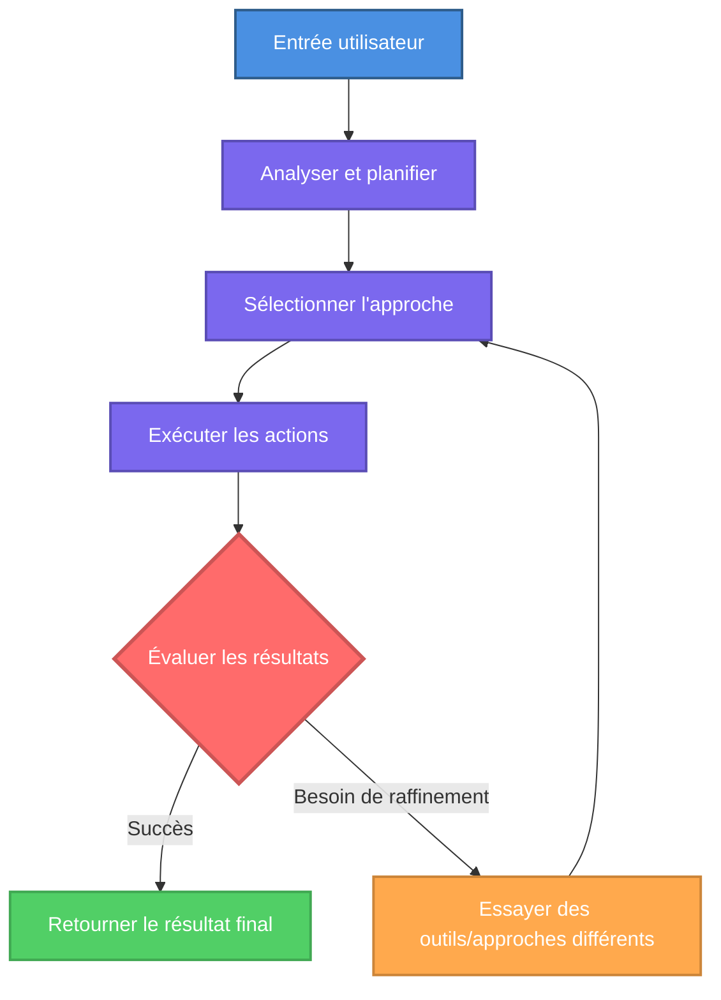

Les agents IA sont des assistants IA spécialisés avec des instructions persistantes et un accès dédié aux outils qui offrent des résultats cohérents et fiables.

<Info>
Les agents sont comme des membres de l'équipe IA avec des rôles spécifiques et une expertise. Ils se souviennent de leur travail dans toutes les conversations.
</Info>

---

## Comment les agents diffèrent du chat ordinaire

<Tabs>
<Tab title="Démarrage">

Le chat ordinaire recommence zéro à chaque fois. Les agents ont des instructions persistantes, des rôles et des outils qui s'appliquent automatiquement à chaque conversation.

**Avantages clés :**

<CardGroup cols={2}>
<Card title="Instructions persistantes" icon="file-lines">
Donnez aux agents des directives permanentes, des rôles et une expertise qui s'appliquent automatiquement à chaque conversation.
</Card>

<Card title="Comportement cohérent" icon="equals">
Les agents suivent la même approche à chaque fois, offrant des résultats prévisibles et fiables dans toutes les interactions.
</Card>

<Card title="Outils dédiés" icon="wrench">
Équipez les agents avec des connexions externes spécifiques (MCP) qu'ils utiliseront automatiquement si nécessaire pour leurs tâches.
</Card>

<Card title="Rôles spécialisés" icon="user-tie">
Définissez les personnalités d'agent, le ton et l'expertise pour correspondre à des flux de travail ou des fonctions d'équipe spécifiques.
</Card>
</CardGroup>

<Check>
Configurez une fois, utilisez partout. Les agents maintiennent leur rôle et leurs instructions dans toutes les conversations.
</Check>

## Quand utiliser les agents

Utilisez les agents pour :
- **Flux de travail récurrents** : Tâches que vous effectuez régulièrement avec des exigences cohérentes
- **Expertise spécialisée** : Connaissances spécifiques au domaine appliquées de manière cohérente
- **Flux de travail multi-outils** : Tâches complexes s'étendant sur plusieurs systèmes
- **Standardisation de l'équipe** : Flux de travail partagés dans votre organisation

## Exemples d'agents

Agents pratiques que vous pouvez créer pour des flux de travail métier courants :

<AccordionGroup>
<Accordion title="Assistant e-mail" icon="envelope">
Passez automatiquement en revue vos derniers e-mails non lus, résumez les informations clés, signalez les messages urgents et rédigez des réponses en fonction de votre style de communication.

**Outils nécessaires :** E-mail (Outlook, Gmail)
**Complexité :** Simple
</Accordion>

<Accordion title="Planificateur de réunions" icon="calendar">
Trouvez des créneaux horaires disponibles dans plusieurs calendriers, planifiez des réunions avec les participants, envoyez les invitations et créez des ordres du jour basés sur le contexte de la réunion.

**Outils nécessaires :** Calendrier, E-mail
**Complexité :** Simple
</Accordion>

<Accordion title="Agent de support client" icon="headset">
Gérez les demandes de clients en accédant à votre CRM, en vérifiant le statut de la commande, en traitant les demandes de remboursement dans les limites définies et en escaladant les problèmes complexes aux agents humains.

**Outils nécessaires :** CRM, Gestion des commandes, E-mail
**Complexité :** Modérée
</Accordion>

<Accordion title="Agent d'analyse de données" icon="chart-line">
Interrogez les bases de données pour les données de ventes, effectuez une analyse de cohorte, identifiez les tendances et générez des rapports avec des visualisations en fonction de vos normes de rapport.

**Outils nécessaires :** Base de données, Feuille de calcul, Outils de visualisation
**Complexité :** Modérée
</Accordion>

<Accordion title="Agent de qualification des prospects" icon="user-check">
Passez en revue les nouveaux prospects provenant de plusieurs sources, enrichissez les données à partir de sources publiques, notez en fonction de vos critères, attribuez aux membres appropriés de l'équipe de vente et envoyez des communications personnalisées.

**Outils nécessaires :** CRM, E-mail, Enrichissement de données
**Complexité :** Complexe
</Accordion>

<Accordion title="Agent de flux de travail multi-systèmes" icon="diagram-project">
Orchestrez des processus sur plusieurs systèmes. Par exemple, récupérez des informations d'Outlook, créez des enregistrements dans Odoo, mettez à jour les feuilles de calcul et notifiez les équipes via les plateformes de messagerie.

**Outils nécessaires :** Intégrations de plusieurs systèmes
**Complexité :** Complexe
</Accordion>
</AccordionGroup>

<Tip>
Commencez par des agents simples et à usage unique, puis élargissez à des flux de travail plus complexes au fur et à mesure que vous acquérez de l'expérience.
</Tip>

---

## Commencer avec les agents

<CardGroup cols={2}>
  <Card
    title="Trouver et accéder aux agents"
    icon="magnifying-glass"
    href="/fr/ai-agents/finding-and-accessing-agents"
  >
    Apprenez où se trouvent les agents et comment y accéder dans WonkaChat.
  </Card>
  <Card
    title="Utiliser les agents existants"
    icon="play"
    href="/fr/ai-agents/using-existing-agents"
  >
    Commencez à utiliser les agents pré-construits créés par votre organisation.
  </Card>
  <Card
    title="Créer votre premier agent"
    icon="plus-circle"
    href="/fr/ai-agents/creating-your-first-agent"
  >
    Construisez votre propre agent adapté à vos flux de travail spécifiques.
  </Card>
  <Card
    title="Enseignement métier"
    icon="graduation-cap"
    href="/fr/ai-agents/business-teaching"
  >
    Fournissez du contexte métier aux agents pour de meilleurs résultats plus précis.
  </Card>
</CardGroup>

</Tab>

<Tab title="Connaissances avancées">

## Architecture des agents

Les agents sont construits sur plusieurs composants clés qui travaillent ensemble pour créer des assistants IA spécialisés :

<AccordionGroup>
<Accordion title="1. Nom de l'agent" icon="tag">
Un identifiant clair et descriptif qui indique l'objectif de l'agent et facilite sa recherche et sa sélection lors du démarrage des conversations.
</Accordion>

<Accordion title="2. Prompt système (Instructions)" icon="file-lines">
Le **prompt système** est l'ensemble fondamental d'instructions qui définit l'identité et le comportement de votre agent. Contrairement aux messages de conversation ordinaires qui peuvent être modifiés ou ignorés, le prompt système est persistant et faisant autorité. Ce prompt façonne chaque réponse générée par l'agent.

**Les prompts système incluent :**
- Définition du rôle et domaines d'expertise
- Ton et style de communication
- Règles opérationnelles et contraintes
- Contexte métier et politiques
- Cadres de prise de décision
- Procédures de gestion des erreurs

La qualité de votre prompt système impacte directement l'efficacité de l'agent. Les instructions bien conçues produisent des résultats cohérents et fiables ; les instructions vagues entraînent un comportement imprévisible.
</Accordion>

<Accordion title="3. Sélection du modèle" icon="microchip">
Le modèle IA est un choix important qui affecte considérablement les performances et les coûts. Différents modèles ont des capacités, une vitesse et des tarifications différentes.

**Points clés à considérer :**
- **Performance** : Les modèles plus capables (modèles pensants) excellent dans le raisonnement complexe mais coûtent plus cher
- **Coût** : Les modèles simples sont rentables pour les tâches directes
- **Vitesse** : Les modèles plus rapides réduisent la latence pour les interactions à haute fréquence
- **Fenêtre de contexte** : Détermine la quantité d'informations que l'agent peut traiter à la fois

<Warning>
La sélection du modèle impacte la qualité de votre agent et les coûts opérationnels. Faites correspondre la capacité du modèle à la complexité de la tâche : ne surpayez pas pour les tâches simples ou ne sous-investissez pas dans les flux de travail complexes.
</Warning>

En plus du choix du modèle, vous pouvez ajuster les **paramètres du modèle** qui contrôlent l'aléatoire des réponses, la créativité et la répétition. Voir [Créer votre premier agent](/fr/ai-agents/creating-your-first-agent) pour une configuration détaillée des paramètres.
</Accordion>

<Accordion title="4. Capacités" icon="wand-magic-sparkles">
Les agents peuvent être équipés de diverses capacités au-delà de la génération de texte :

**Exécution de code** : Exécutez des extraits de code pour effectuer des calculs, des transformations de données ou des opérations logiques complexes.

**Recherche Web** : Accédez aux informations actuelles d'Internet si nécessaire pour les données en temps réel ou les événements récents.

**Connexions externes (MCP)** : La capacité la plus importante, intégration directe avec vos systèmes métier via le Model Context Protocol.

Les agents sélectionnent dynamiquement les outils à utiliser en fonction de la tâche et du guidage du prompt système.

<Info>
**MCP** connecte les agents à vos systèmes métier pour des actions réelles.
Voir [Connexion d'outils](/fr/tools-connection/introduction) pour les détails de configuration.
</Info>

</Accordion>
</AccordionGroup>

## Boucle d'exécution

Les agents fonctionnent de manière autonome via une boucle continue, itérant jusqu'à atteindre le résultat souhaité :

<Check>
Les agents itèrent à travers plusieurs approches et combinaisons d'outils jusqu'à compléter avec succès la tâche ou atteindre les limites définies.
</Check>

## Sélection du modèle

WonkaChat prend en charge plusieurs fournisseurs IA, ce qui vous permet de choisir n'importe quel modèle qui correspond le mieux à vos besoins. La sélection du modèle dépend de plusieurs facteurs :

- **Complexité de la tâche** : Le raisonnement plus complexe nécessite des modèles plus capables
- **Vitesse de réponse** : Certains modèles donnent la priorité aux réponses plus rapides
- **Considérations de coûts** : La tarification des modèles varie considérablement d'un fournisseur à l'autre

<Info>
Pour des conseils détaillés sur la sélection du modèle approprié pour votre agent, voir [Créer votre premier agent](/fr/ai-agents/creating-your-first-agent).
</Info>

## Sécurité et contrôle d'accès

### Héritage des autorisations

Les agents fonctionnent dans vos limites de sécurité existantes. Ils ne peuvent pas effectuer d'action que vous ne pourriez pas effectuer vous-même sans WonkaChat. Si vous n'avez pas la permission d'accéder à un système, de lire un fichier ou d'exécuter une opération manuellement, l'agent ne peut pas contourner ces restrictions pour vous.

<Info>
Voir [Sécurité et gouvernance](/fr/security-governance/access-control) pour les détails complets de sécurité.
</Info>

</Tab>
</Tabs>
