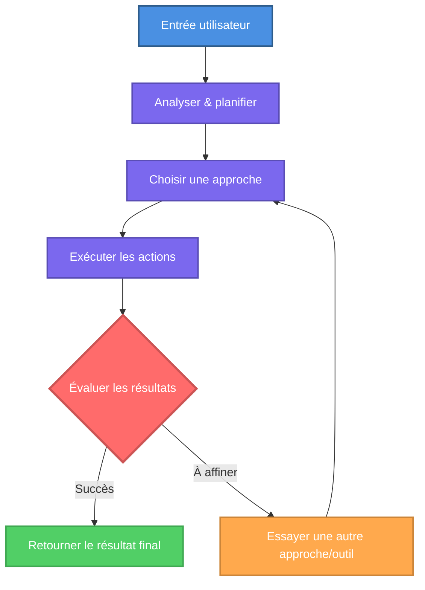

Les agents IA sont des assistants IA spécialisés, dotés d'instructions persistantes et d'un accès à des outils dédiés, qui délivrent des résultats cohérents et fiables.

<Info>
Les agents sont comme des membres d'équipe IA avec un rôle et une expertise précis. Ils gardent leur mission en mémoire d'une conversation à l'autre.
</Info>

---

## En quoi un agent diffère d'une conversation classique

<Tabs>
<Tab title="Prise en main">

Une conversation classique repart de zéro à chaque fois. Un agent dispose d'instructions, d'un rôle et d'outils persistants qui s'appliquent automatiquement à chaque conversation.

**Avantages clés :**

<CardGroup cols={2}>
<Card title="Instructions persistantes" icon="file-lines">
Donnez à l'agent des consignes, un rôle et une expertise permanents, appliqués automatiquement à chaque conversation.
</Card>

<Card title="Comportement cohérent" icon="equals">
L'agent applique la même approche à chaque fois, pour des résultats prévisibles et fiables.
</Card>

<Card title="Outils dédiés" icon="wrench">
Équipez l'agent de connecteurs spécifiques, qu'il utilise automatiquement quand la tâche le nécessite.
</Card>

<Card title="Rôles spécialisés" icon="user-tie">
Définissez la personnalité, le ton et l'expertise de l'agent pour un workflow ou une fonction précise.
</Card>
</CardGroup>

<Check>
Configurez une fois, utilisez partout. L'agent conserve son rôle et ses instructions à chaque conversation.
</Check>

## Quand utiliser un agent

Utilisez un agent pour :
- **Les workflows récurrents** : des tâches que vous effectuez régulièrement, avec des exigences constantes
- **L'expertise spécialisée** : des connaissances métier appliquées de façon cohérente
- **Les workflows multi-outils** : des tâches complexes qui traversent plusieurs systèmes
- **La standardisation d'équipe** : des workflows partagés au sein de votre organisation

## Exemples d'agents

Des agents concrets que vous pouvez créer pour des workflows métier courants :

<AccordionGroup>
<Accordion title="Assistant e-mail" icon="envelope">
Passe en revue vos e-mails non lus, résume les informations clés, signale les messages urgents et rédige des réponses selon votre style de communication.

**Connecteurs nécessaires :** Outlook ou Gmail
**Complexité :** Simple
</Accordion>

<Accordion title="Planificateur de réunions" icon="calendar">
Trouve des créneaux disponibles sur plusieurs agendas, planifie des réunions avec les participants et rédige des ordres du jour selon le contexte.

**Connecteurs nécessaires :** Agenda, e-mail
**Complexité :** Simple
</Accordion>

<Accordion title="Agent de support client" icon="headset">
Traite les demandes clients en accédant à votre CRM, vérifie le statut des commandes et escalade les cas complexes vers un humain.

**Connecteurs nécessaires :** CRM, gestion des commandes, e-mail
**Complexité :** Modérée
</Accordion>

<Accordion title="Agent d'analyse de données" icon="chart-line">
Interroge vos bases de données de ventes, identifie les tendances et génère des rapports selon vos standards de reporting.

**Connecteurs nécessaires :** Base de données, tableur
**Complexité :** Modérée
</Accordion>

<Accordion title="Agent de qualification de leads" icon="user-check">
Passe en revue les nouveaux leads, les note selon vos critères et rédige une prise de contact personnalisée.

**Connecteurs nécessaires :** CRM, e-mail
**Complexité :** Complexe
</Accordion>

<Accordion title="Agent de workflow multi-systèmes" icon="diagram-project">
Orchestre un processus à travers plusieurs systèmes : récupère des informations depuis Outlook, crée des enregistrements dans votre ERP et met à jour un tableur.

**Connecteurs nécessaires :** Plusieurs intégrations
**Complexité :** Complexe
</Accordion>
</AccordionGroup>

<Tip>
Commencez par des agents simples et mono-tâche, puis élargissez vers des workflows plus complexes en gagnant en expérience.
</Tip>

---

## Bien démarrer avec les agents

<CardGroup cols={2}>
  <Card title="Trouver et accéder aux agents" icon="magnifying-glass" href="/fr/ai-agents/finding-and-accessing-agents">
    Découvrez où se trouvent les agents dans WonkaChat et comment les ouvrir.
  </Card>
  <Card title="Utiliser des agents existants" icon="play" href="/fr/ai-agents/using-existing-agents">
    Commencez à utiliser des agents créés par vous ou votre organisation.
  </Card>
  <Card title="Créer votre premier agent" icon="plus-circle" href="/fr/ai-agents/creating-your-first-agent">
    Construisez votre propre agent adapté à vos workflows.
  </Card>
  <Card title="Enseigner votre contexte métier" icon="graduation-cap" href="/fr/ai-agents/business-teaching">
    Donnez du contexte métier à vos agents pour des résultats plus précis.
  </Card>
</CardGroup>

</Tab>

<Tab title="Notions avancées">

## Architecture d'un agent

Un agent repose sur plusieurs composants clés qui fonctionnent ensemble :

<AccordionGroup>
<Accordion title="1. Nom de l'agent" icon="tag">
Un identifiant clair et descriptif qui permet de retrouver et sélectionner facilement l'agent au démarrage d'une conversation.
</Accordion>

<Accordion title="2. Instructions" icon="file-lines">
Les **instructions** constituent l'ensemble de consignes fondamentales qui définissent l'identité et le comportement de votre agent. Contrairement aux messages d'une conversation, elles sont persistantes et façonnent chaque réponse générée.

**Les instructions couvrent généralement :**
- La définition du rôle et des domaines d'expertise
- Le ton et le style de communication
- Les règles et contraintes opérationnelles
- Le contexte et les politiques métier
- Les critères de décision

La qualité de vos instructions détermine directement l'efficacité de l'agent. Des instructions claires produisent des résultats cohérents et fiables ; des instructions vagues produisent un comportement imprévisible.
</Accordion>

<Accordion title="3. Choix du modèle" icon="microchip">
Le choix du modèle influence à la fois la qualité et la vitesse. WonkaChat regroupe les modèles par taille — rapide / standard / avancé — plutôt que par marque, pour choisir selon la tâche plutôt que selon un fournisseur précis.

**Éléments à considérer :**
- **Performance** : les modèles plus avancés gèrent mieux le raisonnement complexe en plusieurs étapes
- **Vitesse** : les modèles rapides réduisent la latence pour les interactions fréquentes
- **Fenêtre de contexte** : la quantité d'informations que l'agent peut traiter à la fois

<Warning>
Le choix du modèle a un impact sur la qualité et sur le coût opérationnel. Adaptez la taille du modèle à la complexité de la tâche, sans surdimensionner pour des tâches simples.
</Warning>

Consultez [Choisir un modèle](/fr/improved-usage/choosing-a-model) pour choisir la bonne taille, et [Créer votre premier agent](/fr/ai-agents/creating-your-first-agent) pour l'appliquer concrètement.
</Accordion>

<Accordion title="4. Capacités" icon="wand-magic-sparkles">
Un agent peut être équipé de capacités au-delà de la génération de texte :

**Exécution de code** : exécute des extraits de code pour des calculs, transformations de données ou une logique complexe — si votre organisation l'a activé.

**Recherche web** : accède à des informations actuelles depuis internet quand c'est nécessaire — si votre organisation l'a activé, et si l'agent l'autorise.

**Connecteurs (MCP)** : la capacité la plus importante, une intégration directe avec vos systèmes métier via le Model Context Protocol.

L'agent choisit dynamiquement l'outil à utiliser selon la tâche et ses instructions.

<Info>
Les connecteurs relient l'agent à vos systèmes métier pour des actions réelles. Voir [Connexion des outils](/fr/tools-connection/introduction) pour la configuration.
</Info>
</Accordion>
</AccordionGroup>

## Boucle d'exécution

Un agent fonctionne de manière autonome via une boucle continue, en itérant jusqu'à obtenir le résultat souhaité :

```mermaid
graph TD
    A[Entrée utilisateur] --> B[Analyser & planifier]
    B --> C[Choisir une approche]
    C --> D[Exécuter les actions]
    D --> E{Évaluer les résultats}
    E -->|Succès| F[Retourner le résultat final]
    E -->|À affiner| G[Essayer une autre approche/outil]
    G --> C

    style A fill:#4A90E2,stroke:#2E5C8A,stroke-width:2px,color:#fff
    style B fill:#7B68EE,stroke:#5A4DB5,stroke-width:2px,color:#fff
    style C fill:#7B68EE,stroke:#5A4DB5,stroke-width:2px,color:#fff
    style D fill:#7B68EE,stroke:#5A4DB5,stroke-width:2px,color:#fff
    style E fill:#FF6B6B,stroke:#CC5555,stroke-width:3px,color:#fff
    style F fill:#51CF66,stroke:#40A852,stroke-width:2px,color:#fff
    style G fill:#FFA94D,stroke:#CC8539,stroke-width:2px,color:#fff
```

<Check>
L'agent itère à travers plusieurs approches et combinaisons d'outils jusqu'à réussir la tâche ou atteindre une limite définie.
</Check>

## Sécurité et contrôle d'accès

### Héritage des permissions

Un agent opère dans le périmètre de sécurité qui est déjà le vôtre. Il ne peut réaliser aucune action que vous ne pourriez pas réaliser vous-même. Si vous n'avez pas la permission d'accéder à un système, de lire un fichier ou d'exécuter une opération manuellement, l'agent ne peut pas contourner cette restriction pour vous.

<Info>
Voir [Sécurité et gouvernance](/fr/security-governance/security-overview) pour tous les détails de sécurité.
</Info>

</Tab>
</Tabs>
