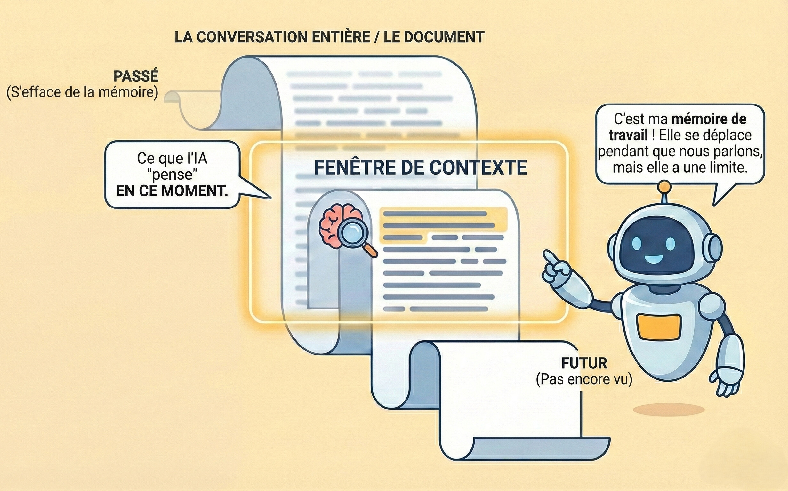

Comprendre comment les modèles IA gèrent l'historique des conversations est essentiel pour obtenir des réponses cohérentes et pertinentes. Ce guide explique les fenêtres de contexte et les stratégies pour gérer efficacement les conversations.

<Info>
Les modèles IA n'ont pas de mémoire entre les conversations séparées, ils ne se souviennent que de ce qui est dans la fenêtre de contexte de la conversation actuelle.
</Info>


<Tabs>
<Tab title="Démarrage">

## Qu'est-ce qu'une fenêtre de contexte ?

Pensez à la fenêtre de contexte comme la « mémoire de travail » de l'IA, c'est la quantité de votre conversation que l'IA peut « voir » et se souvenir à un moment donné.

**Analogie :**
Imaginez lire un livre à travers une fente étroite qui ne montre que quelques pages à la fois. Au fur et à mesure que vous faites glisser la fente vers l'avant pour lire de nouvelles pages, les pages précédentes glissent hors de vue. C'est ainsi que fonctionne une fenêtre de contexte.

<Frame caption="Visualisation de la fenêtre de contexte - Perte de mémoire">

</Frame>

### Pourquoi c'est important

<CardGroup cols={2}>
<Card title="Pertinence de la réponse" icon="bullseye">
L'IA ne peut référencer que les informations dans sa fenêtre de contexte actuelle.
</Card>

<Card title="Cohérence" icon="link">
Les détails du début de très longues conversations peuvent être « oubliés » lorsqu'ils sortent de la fenêtre.
</Card>
</CardGroup>

### Que se passe-t-il quand le contexte se remplit ?

Lorsqu'une conversation dépasse la fenêtre de contexte, l'IA « oublie » les parties les plus anciennes de votre conversation. Cela peut mener à :

- Perte de contexte des décisions ou informations précédentes
- Incohérence potentielle avec les déclarations antérieures
- Réponses confuses lorsque vous référencez de vieux messages

<Warning>
Si vous référencez quelque chose de beaucoup plus tôt dans une longue conversation et obtenez une réponse confuse, la fenêtre de contexte peut être pleine. Démarrez une nouvelle conversation et résumez le contexte pertinent.
</Warning>

---

## Quand démarrer ou continuer une conversation

Utilisez les conseils suivants pour décider s'il faut démarrer une nouvelle conversation ou continuer celle en cours pour des réponses IA optimales.

<Tabs>
<Tab title="Démarrer une nouvelle conversation" icon="sparkles">

Vous devriez démarrer une nouvelle conversation quand :

<CardGroup cols={2}>
<Card title="Changer de sujets" icon="arrows-turn-to-dots">
Vous passez à un sujet complètement non lié.
</Card>

<Card title="L'IA est confuse" icon="circle-question">
L'IA semble confuse ou donne des réponses inexactes, hors sujet ou incorrectes.
</Card>

<Card title="Longs échanges" icon="scroll">
Votre conversation est devenue longue avec des allers-retours étendus.
</Card>

<Card title="Besoin d'une perspective fraîche" icon="broom-ball">
Vous voulez une réponse impartiale, libre du contexte de discussion précédent.
</Card>
</CardGroup>

<Warning>
Si la qualité de la réponse baisse ou que l'IA référence des informations obsolètes, il est souvent plus efficace de démarrer une nouvelle conversation avec un résumé concis de vos besoins actuels plutôt que d'essayer de corriger celle en cours.
</Warning>

</Tab>


<Tab title="Continuer la conversation actuelle" icon="layer-group">

Continuez la conversation actuelle quand :

<CardGroup cols={2}>
<Card title="Construire sur le travail précédent" icon="layer-group">
Chaque échange s'appuie directement sur les questions ou résultats précédents.
</Card>

<Card title="Raffinement itératif" icon="pen-to-square">
Vous améliorez, affinez ou révisez ce qui a été précédemment discuté.
</Card>

<Card title="Explorer des sous-sujets liés" icon="sitemap">
Vous approfondissez des facettes ou aspects liés du même sujet global.
</Card>

<Card title="Maintenir le contexte" icon="memory">
L'IA doit se souvenir des détails, choix ou contraintes antérieurs pour répondre efficacement.
</Card>
</CardGroup>

<Tip>
Demandez-vous : « L'IA a-t-elle besoin de retenir notre discussion précédente pour bien répondre ? » Si oui, continuez. Sinon, démarrez une nouvelle conversation.
</Tip>

</Tab>
</Tabs>


---

## Construire sur les réponses précédentes

Un flux de conversation efficace se construit naturellement sur ce qui a déjà été discuté.

**Exemple de progression :**
```
Vous : « Expliquez les avantages de la conteneurisation avec Docker. »

IA : [Fournit une explication incluant la portabilité, la cohérence et l'isolation]

Vous : « Vous avez mentionné l'isolation comme avantage. Comment l'isolation de Docker 
se compare-t-elle aux machines virtuelles traditionnelles en termes d'utilisation des ressources ? »
```

Dans les conversations plus longues, résumez périodiquement les points clés pour renforcer le contexte important :

```
Jusqu'à présent nous avons établi que :
1. Les microservices offrent des avantages de scalabilité pour notre cas d'usage
2. L'équipe a besoin d'expérience Kubernetes
3. Le coût de configuration initial est d'environ 3 mois

Compte tenu de ce contexte, quelle est la structure d'équipe recommandée ?
```

</Tab>
<Tab title="Connaissances avancées">
 
### Comprendre les jetons et la sélection du modèle

Les fenêtres de contexte sont mesurées en **jetons** qui représentent environ 4 caractères ou environ ¾ d'un mot.

**Modèles courants et leurs fenêtres de contexte :**

| Modèle | Fenêtre de contexte | Meilleur pour |
|-------|---------------|----------|
| **GPT-4o** | 128K jetons | Performance équilibrée, tâches générales |
| **GPT-4o mini** | 128K jetons | Conversations à haut volume, sensibles au coût |
| **Claude Sonnet 4** | 200K jetons | Raisonnement avancé, analyse de documents |
| **Gemini 2.5 Pro** | 1M jetons | Conversations étendues, analyse de documents volumineux |
| **Gemini 2.5 Flash** | 1M jetons | Longues conversations optimisées pour la vitesse |

<Info>
Lors de la sélection d'un modèle dans WonkaChat, considérez la fenêtre de contexte si vous planifiez des conversations étendues. En savoir plus dans [Créer votre premier agent](/fr/ai-agents/creating-your-first-agent).
</Info>

### Gérer plusieurs flux de travail

Pour jongler avec plusieurs projets, utilisez des conversations séparées par projet :

```
Conversation 1 : « Projet Alpha - Développement Frontend »
Conversation 2 : « Projet Alpha - API Backend »
Conversation 3 : « Projet Beta - Analyse de données »
```

Cette approche garde le contexte propre et empêche de « polluer » votre fenêtre de contexte avec des informations qui pourraient biaiser les réponses futures.

### Réhydrater le contexte

Lors du démarrage d'une nouvelle conversation sur un sujet lié, fournissez un résumé concis du contexte antérieur pertinent :

```
« Contexte de la session précédente : Nous implémentons un nouveau système CRM pour 
notre équipe de vente de 50 personnes. Le budget est de 100K€, le calendrier est de 6 mois, et 
nous avons besoin d'une intégration avec notre plateforme de messagerie et système de calendrier existants.

Nouvelle question : Compte tenu de ces exigences, quelle approche de formation recommanderiez-vous 
pour l'intégration de l'équipe de vente ? »
```
</Tab>
</Tabs>

## Pièges courants à éviter

<AccordionGroup>
<Accordion title="S'attendre à ce que l'IA se souvienne des conversations passées">
**Problème :** Démarrer une nouvelle conversation avec « Comme nous avons discuté hier... » sans rétablir le contexte.

**Solution :** Fournissez toujours le contexte pertinent au début des nouvelles conversations.
</Accordion>

<Accordion title="Surcharger une seule conversation">
**Problème :** Utiliser une conversation pour plusieurs tâches non liées, menant à des réponses confuses.

**Solution :** Démarrez de nouvelles conversations pour des sujets distincts.
</Accordion>

<Accordion title="Ignorer la baisse de qualité">
**Problème :** Continuer une conversation même quand les réponses deviennent moins pertinentes ou précises.

**Solution :** Reconnaissez quand la fenêtre de contexte est pleine et recommencez avec un résumé.
</Accordion>
</AccordionGroup>

---

## Prochaines étapes

<CardGroup cols={2}>
<Card title="Poser des questions exceptionnelles" icon="lightbulb" href="/fr/improved-usage/asking-great-questions">
Apprenez des techniques de prompting efficaces pour de meilleures réponses IA.
</Card>

<Card title="Bibliothèque de prompts" icon="bookmark" href="/fr/improved-usage/prompt-library">
Sauvegardez et réutilisez vos meilleurs prompts avec des variables.
</Card>
</CardGroup>
