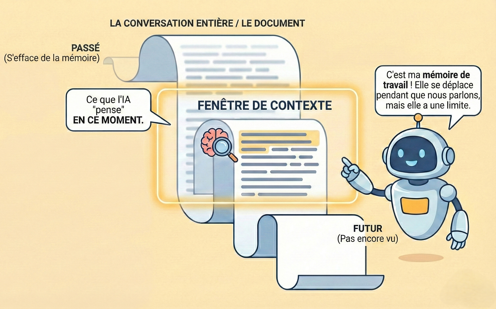

Comprendre comment les modèles IA gèrent l'historique des conversations est essentiel pour obtenir des réponses cohérentes et pertinentes. Ce guide explique les fenêtres de contexte et les stratégies pour gérer efficacement les conversations.

<Info>
Au sein d'une même conversation, l'IA se souvient de tout ce qui tient dans sa fenêtre de contexte. Une conversation distincte ne partage pas automatiquement cet historique — à moins que votre organisation n'utilise les [Souvenirs](/fr/improved-usage/memories) ou les [Projets](/fr/improved-usage/projects) pour faire circuler le contexte entre conversations.
</Info>

<Tabs>
<Tab title="Démarrage">

## Qu'est-ce qu'une fenêtre de contexte ?

Pensez à la fenêtre de contexte comme la « mémoire de travail » de l'IA : c'est la quantité de votre conversation que l'IA peut « voir » et se souvenir à un moment donné.

**Analogie :**
Imaginez lire un livre à travers une fente étroite qui ne montre que quelques pages à la fois. Au fur et à mesure que vous faites glisser la fente vers l'avant pour lire de nouvelles pages, les pages précédentes glissent hors de vue. C'est ainsi que fonctionne une fenêtre de contexte.

<Frame caption="Visualisation de la fenêtre de contexte">

</Frame>

### Pourquoi c'est important

<CardGroup cols={2}>
<Card title="Pertinence de la réponse" icon="bullseye">
L'IA ne peut référencer que les informations présentes dans sa fenêtre de contexte actuelle.
</Card>

<Card title="Cohérence" icon="link">
Les détails du début de très longues conversations peuvent sortir de la fenêtre.
</Card>
</CardGroup>

### Que se passe-t-il quand le contexte se remplit ?

Lorsqu'une conversation dépasse la fenêtre de contexte, l'IA perd l'accès aux parties les plus anciennes de votre conversation. Cela peut entraîner :

- Une perte de contexte sur des décisions ou informations précédentes
- Des incohérences potentielles avec des déclarations antérieures
- Des réponses confuses lorsque vous référencez d'anciens messages

<Warning>
Si vous référencez quelque chose de beaucoup plus tôt dans une longue conversation et obtenez une réponse confuse, la fenêtre de contexte est peut-être pleine. Démarrez une nouvelle conversation et résumez le contexte pertinent.
</Warning>

---

## Quand démarrer ou continuer une conversation

Utilisez les conseils suivants pour décider s'il faut démarrer une nouvelle conversation ou continuer celle en cours, afin d'obtenir des réponses optimales.

<Tabs>
<Tab title="Démarrer une nouvelle conversation" icon="sparkles">

Démarrez une nouvelle conversation quand :

<CardGroup cols={2}>
<Card title="Changement de sujet" icon="arrows-turn-to-dots">
Vous passez à un sujet complètement différent.
</Card>

<Card title="L'IA est confuse" icon="circle-question">
L'IA semble confuse ou donne des réponses inexactes, hors sujet ou incorrectes.
</Card>

<Card title="Longs échanges" icon="scroll">
Votre conversation est devenue longue, avec de nombreux allers-retours.
</Card>

<Card title="Besoin d'une perspective neuve" icon="broom-ball">
Vous voulez une réponse impartiale, sans le contexte de la discussion précédente.
</Card>
</CardGroup>

<Warning>
Si la qualité des réponses baisse ou que l'IA référence des informations obsolètes, il est souvent plus efficace de démarrer une nouvelle conversation avec un résumé concis de vos besoins actuels plutôt que d'essayer de corriger celle en cours.
</Warning>

</Tab>

<Tab title="Continuer la conversation actuelle" icon="layer-group">

Continuez la conversation actuelle quand :

<CardGroup cols={2}>
<Card title="Vous construisez sur le travail précédent" icon="layer-group">
Chaque échange s'appuie directement sur les questions ou résultats précédents.
</Card>

<Card title="Vous affinez itérativement" icon="pen-to-square">
Vous améliorez, précisez ou révisez ce qui a déjà été discuté.
</Card>

<Card title="Vous explorez des sous-sujets liés" icon="sitemap">
Vous approfondissez des aspects liés au même sujet global.
</Card>

<Card title="Le contexte doit être maintenu" icon="memory">
L'IA a besoin de se souvenir de détails, choix ou contraintes antérieurs pour bien répondre.
</Card>
</CardGroup>

<Tip>
Demandez-vous : « L'IA a-t-elle besoin de se souvenir de notre échange précédent pour bien répondre ? » Si oui, continuez. Sinon, démarrez une nouvelle conversation.
</Tip>

</Tab>
</Tabs>

---

## Construire sur les réponses précédentes

Un fil de conversation efficace s'appuie naturellement sur ce qui a déjà été dit.

**Exemple de progression :**
```
Vous : « Explique les avantages de la conteneurisation avec Docker. »

IA : [Fournit une explication incluant portabilité, cohérence et isolation]

Vous : « Tu as mentionné l'isolation comme avantage. Comment l'isolation de Docker
se compare-t-elle aux machines virtuelles traditionnelles en matière d'utilisation des ressources ? »
```

Dans les conversations longues, résumez périodiquement les points clés pour renforcer le contexte important :

```
Jusqu'ici, nous avons établi que :
1. Les microservices offrent des avantages de scalabilité pour notre cas d'usage
2. L'équipe a besoin d'expérience Kubernetes
3. Le coût de mise en place initial est d'environ 3 mois

Compte tenu de ce contexte, quelle structure d'équipe recommandes-tu ?
```

</Tab>
<Tab title="Connaissances avancées">

### Comprendre les tokens et le choix du modèle

Les fenêtres de contexte se mesurent en **tokens**, qui représentent environ 4 caractères ou ¾ de mot.

La taille des modèles détermine un compromis entre longueur de contexte, vitesse et profondeur de raisonnement : les modèles rapides ont généralement des fenêtres de contexte plus petites, tandis que les modèles standards et à raisonnement avancé en offrent de plus grandes, parfois suffisantes pour tenir des conversations très longues ou des documents entiers dans une seule fenêtre.

<Info>
Lorsque vous choisissez un modèle dans WonkaChat, tenez compte de la fenêtre de contexte si vous prévoyez des conversations étendues ou le traitement de longs documents. Voir [Choisir un modèle](/fr/improved-usage/choosing-a-model) pour comprendre les tailles de modèles, le Routeur et les modes Fast/Pro.
</Info>

### Gérer plusieurs chantiers en parallèle

Pour jongler entre plusieurs projets, utilisez des conversations distinctes par projet :

```
Conversation 1 : « Projet Alpha - Développement Frontend »
Conversation 2 : « Projet Alpha - API Backend »
Conversation 3 : « Projet Beta - Analyse de données »
```

Cette approche garde le contexte propre et évite de « polluer » votre fenêtre de contexte avec des informations qui pourraient biaiser les réponses futures.

<Tip>
Si vous gérez plusieurs conversations liées à un même chantier, envisagez de les regrouper dans un [Projet](/fr/improved-usage/projects) : les conversations restent ensemble et peuvent partager du contexte au niveau du projet.
</Tip>

### Réhydrater le contexte

Lorsque vous démarrez une nouvelle conversation sur un sujet lié, fournissez un résumé concis du contexte antérieur pertinent :

```
« Contexte de la session précédente : nous mettons en place un nouveau système CRM pour
notre équipe commerciale de 50 personnes. Le budget est de 100 000 €, le délai est de 6 mois, et
nous avons besoin d'une intégration avec notre plateforme de messagerie et notre calendrier existants.

Nouvelle question : compte tenu de ces exigences, quelle approche de formation recommandes-tu
pour intégrer l'équipe commerciale ? »
```

### Retrouver vos anciennes conversations

Vos conversations passées ne sont pas perdues quand vous en démarrez une nouvelle. Utilisez **Conversations** dans la barre latérale pour les retrouver et les rouvrir, et **Conversations archivées** pour parcourir celles que vous avez archivées afin de garder votre barre latérale bien rangée.

</Tab>
</Tabs>

## Pièges courants à éviter

<AccordionGroup>
<Accordion title="Attendre de l'IA qu'elle se souvienne d'une conversation non liée">
**Problème :** Démarrer une nouvelle conversation avec « Comme évoqué hier... » sans rétablir le contexte, alors que la discussion précédente a eu lieu dans une conversation distincte et non liée.

**Solution :** Redonnez le contexte pertinent, ou utilisez un [Projet](/fr/improved-usage/projects) partagé s'il s'agit d'un travail continu.
</Accordion>

<Accordion title="Surcharger une seule conversation">
**Problème :** Utiliser une même conversation pour plusieurs tâches non liées, ce qui entraîne des réponses confuses.

**Solution :** Démarrez de nouvelles conversations pour des sujets distincts.
</Accordion>

<Accordion title="Ignorer la baisse de qualité">
**Problème :** Continuer une conversation alors que les réponses deviennent moins pertinentes ou précises.

**Solution :** Reconnaissez quand la fenêtre de contexte est pleine et recommencez avec un résumé.
</Accordion>
</AccordionGroup>

---

## Prochaines étapes

<CardGroup cols={2}>
<Card title="Poser des questions exceptionnelles" icon="lightbulb" href="/fr/improved-usage/asking-great-questions">
Apprenez des techniques de prompting efficaces pour de meilleures réponses IA.
</Card>

<Card title="Bibliothèque de prompts" icon="bookmark" href="/fr/improved-usage/prompt-library">
Sauvegardez et réutilisez vos meilleurs prompts avec des variables.
</Card>
</CardGroup>
