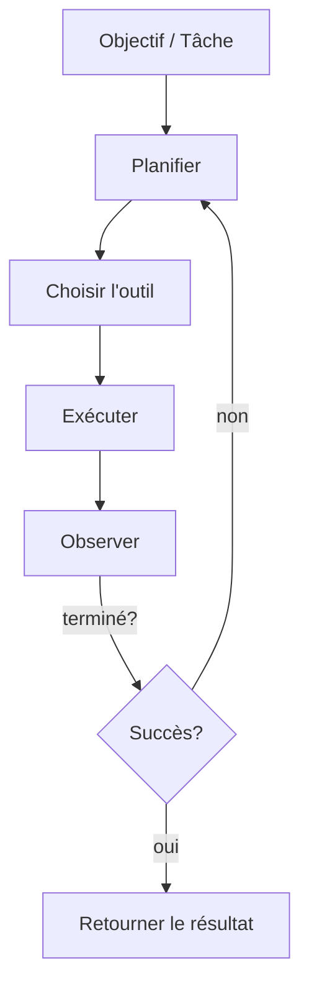

<Frame caption="Les agents planifient, utilisent des outils et itèrent jusqu'à ce que l'objectif soit atteint.">

</Frame>

### Définition
Un agent IA est un système logiciel qui peut poursuivre un objectif de manière autonome en planifiant des étapes, en appelant des outils ou API, en observant les résultats et en itérant jusqu'à ce que l'objectif soit atteint.

- **Raisonnement** : choisir les prochaines actions en fonction des objectifs et observations
- **Outils** : appeler des capacités externes (API, bases de données, navigateurs)
- **Mémoire** : se rappeler des étapes précédentes et des connaissances du domaine
- **Planification** : décomposer les objectifs en tâches exploitables

### Boucle d'agent minimale

### Modèles concrets
- Tri du support client et rédaction de réponses
- Extraction de données et génération de rapports
- Automatisations opérationnelles (tickets, mises à jour CRM)

<Tip>
Les agents sont plus efficaces lorsqu'ils sont contraints par des objectifs clairs, des outils sélectionnés et des garde-fous.
</Tip>

### Lectures supplémentaires
- Bases du Model Context Protocol (MCP) → `/fr/learn/mcp`
- Construire un agent fonctionnel → `/fr/learn/build-agents`
