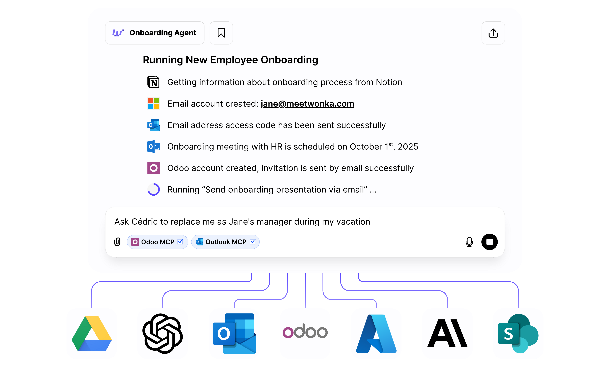

<CardGroup cols={1}>
<Card title="Bientôt disponible" icon="hourglass">
Nous élaborons une feuille de route réfléchie qui communique clairement ce qui vient ensuite et pourquoi. Revenez bientôt pour une vue transparente des jalons et priorités à venir.
</Card>
</CardGroup>

<Frame caption="Un petit aperçu du voyage à venir">

</Frame>

<Info>
Nous intégrons activement les retours des utilisateurs pour façonner la séquence de versions la plus précieuse.
</Info>

<CardGroup cols={2}>
<Card title="Démarrage rapide" icon="rocket" href="/fr/welcome/introduction">
Votre introduction à WonkaChat
</Card>

<Card title="Comment les équipes utilisent WonkaChat" icon="sparkles" href="/fr/use">
Explorez les flux de travail puissants et les meilleures pratiques.
</Card>
</CardGroup>
