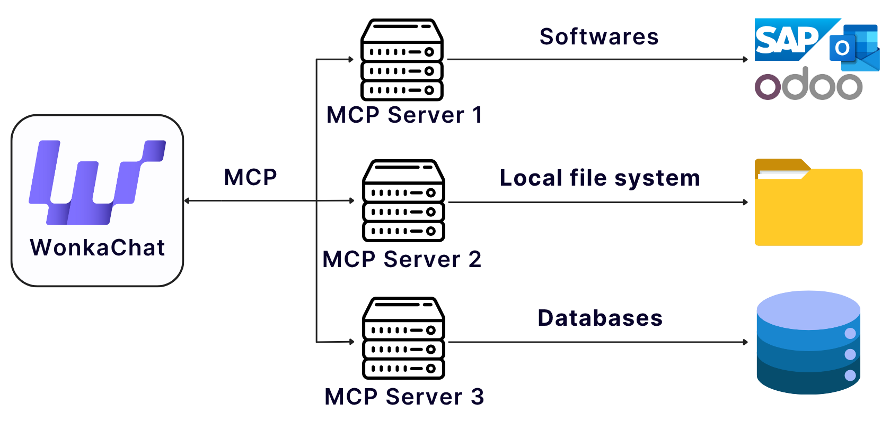
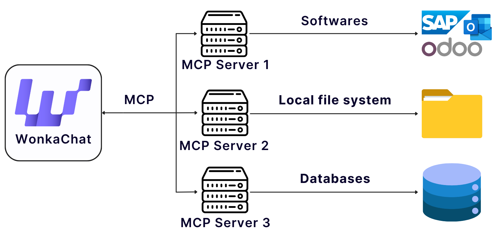

WonkaChat peut se connecter à vos outils métier, bases de données et logiciels, vous permettant d'accéder aux informations réelles et de prendre des actions via une conversation naturelle. Ces connexions sont appelées **Connecteurs** ou **connexions MCP** pour les personnes plus techniques.

<Info>
Vous voulez comprendre les détails techniques de comment ces connexions fonctionnent ? 
[Passez aux Détails techniques](#details-techniques) pour en savoir plus sur le Model Context Protocol (MCP) qui alimente ces intégrations.
</Info>

<Tabs>
<Tab title="Démarrage">

## Ce que permettent les connexions externes

Connecter vos logiciels externes et sources de données transforme WonkaChat d'un assistant IA autonome en un système connecté qui peut travailler avec vos données et flux de travail réels. Au lieu de simplement répondre aux questions générales, WonkaChat peut accéder à vos e-mails réels, gérer votre calendrier, mettre à jour votre CRM, créer des documents dans vos systèmes et coordonner des actions sur plusieurs plateformes, le tout via une conversation naturelle.

### Capacités concrètes

<CardGroup cols={2}>
<Card title="Accéder à vos données" icon="database">
Lisez des e-mails, événements de calendrier, documents et bases de données via une conversation naturelle sans changer d'applications.
</Card>

<Card title="Prendre des actions" icon="bolt">
Envoyez des e-mails, créez des tâches, mettez à jour des enregistrements et déclenchez des flux de travail, le tout en demandant à WonkaChat en langage simple.
</Card>

<Card title="Flux de travail multi-plateforme" icon="layer-group">
Combinez plusieurs connexions en une seule demande. Par exemple : « Vérifiez mon calendrier, trouvez des créneaux disponibles et envoyez-les par e-mail à Jean. »
</Card>

<Card title="Toujours à jour" icon="arrows-rotate">
Accédez aux données en direct de vos systèmes plutôt que de vous fier à des connaissances statiques ou des mises à jour manuelles.
</Card>
</CardGroup>

### Comment commencer

<Steps>
<Step title="Démarrer une connexion">
Allez dans les paramètres et connectez-vous à l'outil (comme Outlook, Gmail ou Slack) en fournissant vos identifiants. Ensuite, ajoutez-le à votre chat.

<Frame caption="Emplacement du bouton Outlook Mail">

</Frame>

<Info>
Ces connexions externes sont appelées « MCP » (Model Context Protocol). 

Bien que **vous n'ayez pas besoin de comprendre les détails techniques pour les utiliser**, vous pouvez en savoir plus dans la section [Détails techniques](#details-techniques) si vous êtes curieux.
</Info>
</Step>

<Step title="WonkaChat obtient un accès sécurisé">
Une connexion sécurisée est établie entre WonkaChat et vos outils métier. WonkaChat travaille en votre nom en utilisant le langage naturel, fonctionnant dans le cadre de vos autorisations existantes.

<Warning>
**Important :** WonkaChat hérite de vos autorisations exactes. Il ne peut accéder aux données et effectuer que les actions pour lesquelles vous avez personnellement la permission. Si vous ne pouvez pas accéder à un fichier, envoyer un e-mail depuis un compte spécifique ou modifier un enregistrement dans votre flux de travail normal, WonkaChat ne peut pas le faire non plus.
</Warning>
</Step>

<Step title="Discutez naturellement">
Posez des questions ou faites des demandes en langage simple. WonkaChat utilise automatiquement les bons outils et actions pour vous aider.

```
« Quels e-mails ai-je reçus de Sarah cette semaine ? »
```

WonkaChat se connecte à votre e-mail, récupère les informations et les présente clairement.
</Step>
</Steps>

---

## Exemple de connexions externes (MCP)

Connecter vos outils métier change radicalement ce que WonkaChat peut accomplir. Voici un exemple réel montrant la différence :

<Tabs>
<Tab title="Sans connexions">

**Votre demande :**
```
« Planifiez une réunion avec l'équipe marketing pour mardi prochain à 14h pour discuter des résultats de la campagne Q2. »
```

**Réponse de WonkaChat (limitée) :**
```
Je peux vous aider à rédiger une invitation de réunion, mais je ne peux pas accéder à votre calendrier 
ou système de messagerie pour planifier réellement la réunion. 

Voici ce que je suggère :
1. Vérifiez votre calendrier pour la disponibilité mardi à 14h
2. Envoyez une invitation de réunion à votre équipe marketing
3. Incluez « Discussion des résultats de campagne Q2 » comme sujet

Souhaitez-vous que je rédige le texte de l'invitation de réunion pour vous ?
```

<Warning>
Sans connexions, WonkaChat ne peut fournir que des conseils généraux et ne peut pas accéder à vos données réelles ou prendre de vraies actions.
</Warning>

</Tab>

<Tab title="Avec connexions">

**Votre demande :**
```
« Planifiez une réunion avec l'équipe marketing pour mardi prochain à 14h pour discuter des résultats de la campagne Q2. »
```

**Réponse de WonkaChat (puissante) :**
```
Je vais planifier cette réunion pour vous.

Vérification de votre calendrier... Mardi à 14h est disponible.

Recherche des membres de « l'équipe marketing »... Trouvé 5 membres d'équipe :
- Sarah Dupont (Directrice Marketing)
- Michel Chen (Responsable Contenu)  
- Emma Rodriguez (Responsable Réseaux Sociaux)
- David Kim (Spécialiste Analytique)
- Lisa Wang (Designer)

Création d'invitation de réunion avec :
- Titre : « Discussion des résultats de campagne Q2 »
- Heure : Mardi 21 octobre 2025 de 14h00 à 15h00
- Lieu : Salle de conférence B (réservée)
- Participants : Tous les 5 membres de l'équipe marketing

✓ Réunion planifiée et invitations envoyées.
✓ Salle de conférence réservée.
✓ Calendrier mis à jour.

Y a-t-il autre chose que vous aimeriez que j'ajoute à la réunion ?
```

<Check>
Avec les connexions, WonkaChat accède à votre calendrier réel, identifie les membres de l'équipe, vérifie la disponibilité des salles et complète toute la tâche automatiquement.
</Check>

</Tab>
</Tabs>

Cet exemple montre comment la connexion de vos outils métier permet à WonkaChat de passer du conseil à la prise d'actions réelles avec vos données métier réelles.

---

## Connexions externes disponibles (MCP)

WonkaChat prend en charge les connexions MCP vers **plus de 40 outils métier** dans toutes les catégories majeures. Voici toutes les connexions actuellement disponibles :

<AccordionGroup>
<Accordion title="Microsoft 365 et productivité" icon="microsoft">
Connectez vos outils Microsoft pour une productivité bureautique complète.

**Connexions disponibles :**
- Outlook Mail (e-mail)
- Outlook Calendrier (planification)
- Microsoft Teams (communication)
- OneDrive (stockage)
- Excel (tableurs)
- Word (documents)
</Accordion>

<Accordion title="Google Workspace" icon="google">
Intégrez avec la suite d'outils de productivité et de collaboration de Google.

**Connexions disponibles :**
- Gmail (e-mail)
- Google Calendrier (planification)
- Google Drive (stockage)
- Google Docs (documents)
- Google Sheets (tableurs)
</Accordion>

<Accordion title="Gestion de projet et collaboration" icon="list-check">
Connectez vos plateformes de gestion de projet et de collaboration d'équipe.

**Connexions disponibles :**
- Asana (gestion de projet)
- ClickUp (productivité)
- Jira (suivi de problèmes)
- Linear (gestion de projet)
- Monday (gestion du travail)
- Notion (base de connaissances)
- Confluence (documentation)
</Accordion>

<Accordion title="CRM et ventes" icon="handshake">
Intégrez avec des plateformes de gestion de la relation client et de ventes.

**Connexions disponibles :**
- Salesforce (CRM)
- HubSpot (CRM et marketing)
- Attio (CRM)
- Close (CRM de ventes)
- Klaviyo (automatisation marketing)
</Accordion>

<Accordion title="Développement et ingénierie" icon="code">
Connectez vos outils de développement, dépôts et plateformes de déploiement.

**Connexions disponibles :**
- GitHub (contrôle de version)
- GitLab (contrôle de version)
- Vercel (déploiement)
- Supabase (base de données)
</Accordion>

<Accordion title="Communication et planification" icon="comments">
Intégrez les outils de messagerie et de planification pour une communication fluide.

**Connexions disponibles :**
- Slack (messagerie d'équipe)
- Cal.com (planification)
- LinkedIn (réseau professionnel)
</Accordion>

<Accordion title="Stockage et bases de données" icon="database">
Connectez des plateformes de stockage de fichiers et de gestion de données.

**Connexions disponibles :**
- Airtable (base de données)
- Box (stockage)
- Fathom (analytique)
</Accordion>

<Accordion title="Design et outils spécialisés" icon="palette">
Intégrez des outils de design et métier spécialisés.

**Connexions disponibles :**
- Figma (design)
- Odoo (ERP)
</Accordion>
</AccordionGroup>

<Info>
Besoin d'une connexion qui n'est pas listée ? [Contactez notre équipe de support](/fr/support-resources/getting-help) pour demander de nouvelles intégrations MCP. Nous étendons constamment notre bibliothèque de connexions en fonction des besoins des utilisateurs.
</Info>

</Tab>

<Tab title="Détails techniques">

## Comprendre le Model Context Protocol (MCP)

WonkaChat utilise le **Model Context Protocol (MCP)** pour connecter les modèles IA à vos outils métier, bases de données et logiciels, permettant à l'IA d'accéder aux informations réelles et de prendre des actions en votre nom.

<Info>
MCP est un protocole ouvert qui permet aux systèmes IA de communiquer avec des sources de données externes et des logiciels de manière uniforme. 

Pensez-y comme un connecteur universel (comme l'USB pour les systèmes IA) qui permet aux différents modèles IA et outils logiciels de travailler ensemble de manière transparente sans intégrations personnalisées pour chaque combinaison.
</Info>

### Comment fonctionne MCP

Au lieu de construire des connecteurs personnalisés pour chaque paire IA et source de données, MCP permet à tous les clients IA et sources de données d'être connectés via une seule intégration.

<Frame caption="Avant et après MCP - de connexions fragmentées à protocole unifié">


</Frame>

**En termes simples :** Le client IA (WonkaChat) envoie des demandes structurées via MCP. Le serveur MCP communique avec vos systèmes sous-jacents (Outlook, GitHub, Odoo, etc.) et renvoie une réponse structurée.

---

## Gestion des risques et sécurité

<Frame caption="MCP agit comme un point de contrôle de sécurité central pour toutes les interactions IA">


</Frame>

<Warning>
L'une des plus grandes préoccupations concernant l'IA est la façon dont elle accède et utilise les données sensibles.
</Warning>

**MCP répond à cela en agissant comme un point de contrôle de sécurité pour tous vos systèmes IA**, suivant chaque interaction de données et appliquant les politiques de l'entreprise. Pensez-y comme avoir un journal détaillé de qui a accédé à quoi, quand et pourquoi, ce qui est essentiel pour la conformité réglementaire.

### Comment MCP protège vos données

<AccordionGroup>
<Accordion title="Couche de sécurité centrale" icon="shield-halved">
MCP introduit une couche centrale à travers laquelle toutes les interactions IA sont canalisées. Cela fournit **une cohérence dans les politiques de sécurité**, permettant aux entreprises d'appliquer l'authentification, l'autorisation et le masquage des données au niveau du protocole.

Tous vos outils IA se connectent via une passerelle sécurisée unique, plutôt que d'avoir des implémentations de sécurité séparées pour chaque connexion.
</Accordion>

<Accordion title="Comportement IA contrôlé" icon="gavel">
MCP aligne le comportement de l'IA avec les politiques métier internes. Parce que toutes les capacités sont exposées et gérées via le serveur MCP, les entreprises peuvent définir exactement **ce qu'un système IA est autorisé à faire** et rien de plus.

Les systèmes IA **ne peuvent pas accéder aux données sensibles** ou déclencher des actions qui ne leur ont pas été explicitement accordées. Chaque autorisation est contrôlée et auditable.
</Accordion>

<Accordion title="Piste d'audit complète" icon="clipboard-list">
Chaque interaction via MCP est enregistrée :
- **Qui** a accédé aux données (identité utilisateur)
- **Quoi** les données ont été accédées (ressources, actions)
- **Quand** cela s'est produit (horodatages)
- **Pourquoi** c'était nécessaire (contexte, détails de la demande)

Cette journalisation détaillée est essentielle pour la conformité réglementaire et les audits de sécurité.
</Accordion>
</AccordionGroup>

---

## Vue d'ensemble de l'architecture MCP

Le Model Context Protocol est un standard ouvert développé par [Anthropic](https://www.anthropic.com/news/model-context-protocol) qui permet des connexions sécurisées bidirectionnelles entre les applications IA et les sources de données externes.

<Info>
WonkaChat implémente MCP en tant que client, se connectant aux serveurs MCP qui exposent vos outils et données métier aux modèles IA. En savoir plus sur [modelcontextprotocol.io](https://modelcontextprotocol.io).
</Info>

### Implémentation technique

MCP utilise une **architecture client-serveur** où WonkaChat agit comme le client MCP, se connectant aux serveurs MCP qui s'intègrent à vos outils métier :

<Frame caption="WonkaChat se connecte à plusieurs serveurs MCP pour différents types de systèmes">


</Frame>


**Flux d'architecture :**
- **WonkaChat (Client MCP)** envoie des demandes structurées et gère l'authentification
- **Serveur MCP** agit comme la couche d'intégration, se connectant aux systèmes externes
- **Systèmes externes** (Outlook, Odoo, Salesforce, etc.) fournissent des données via leurs API
- Toutes les réponses circulent via le même canal sécurisé

**Avantages techniques clés :**
- Protocole de communication basé sur JSON-RPC
- Négociation de capacités lors de l'initialisation
- Limites de sécurité claires via l'architecture client-hôte-serveur
- Mécanismes de consentement utilisateur pour les interactions IA

### Implémentation de sécurité

WonkaChat implémente MCP avec des fonctionnalités de sécurité de niveau entreprise qui s'appuient sur les fondations du protocole :

<AccordionGroup>
<Accordion title="Sécurité du protocole MCP" icon="shield">
**Intégré au protocole :**
- **Consentement utilisateur** : Toutes les actions IA nécessitent une autorisation utilisateur explicite ([Bonnes pratiques MCP](https://modelcontextprotocol.io/specification/draft/basic/security_best_practices))
- **Négociation de capacités** : Les clients et serveurs s'accordent sur les fonctionnalités disponibles lors de l'initialisation
- **Validation de jetons** : Les serveurs n'acceptent que les jetons explicitement émis pour eux (framework OAuth 2.1)
- **Gestion de session** : Gestion de session sécurisée pour empêcher le détournement et l'usurpation
- **Limites de sécurité** : Architecture client-hôte-serveur avec isolation claire

**Recommandé par MCP :**
- Validation et assainissement des entrées pour tous les paramètres
- Limitation de débit et surveillance des abus
- Transport sécurisé (chiffrement TLS) pour toutes les connexions
</Accordion>

<Accordion title="Implémentation de WonkaChat" icon="lock">
**Authentification et contrôle d'accès :**
- OAuth 2.0 pour les services tiers (Google, Microsoft, Salesforce)
- Authentification par clé API pour les outils de développement
- Chiffrement des jetons au repos (AES-256) avec actualisation automatique
- Stockage de jetons par utilisateur avec isolation complète
- Les utilisateurs n'héritent que de leurs autorisations de plateforme existantes

**Sécurité d'entreprise :**
- Contrôle d'accès basé sur les rôles (RBAC) au niveau organisationnel
- Politiques de sécurité centralisées sur toutes les connexions MCP
- Délais d'expiration de connexion et protection des ressources
- Déploiement multi-régions avec basculement sécurisé
</Accordion>

<Accordion title="Audit et conformité" icon="clipboard-list">
**Piste d'audit de WonkaChat :**
<Info>
Documentation détaillée des fonctionnalités d'audit et de conformité à venir prochainement.

Ce sont des fonctionnalités d'implémentation WonkaChat, non intégrées au protocole MCP lui-même.
</Info>
</Accordion>
</AccordionGroup>

<Tip>
Si vous avez des exigences spécifiques ou des besoins uniques pour les intégrations MCP, contactez notre équipe de support. Nous sommes là pour aider à étendre ou adapter les connexions pour correspondre à vos flux de travail.
</Tip>


</Tab>
</Tabs>
