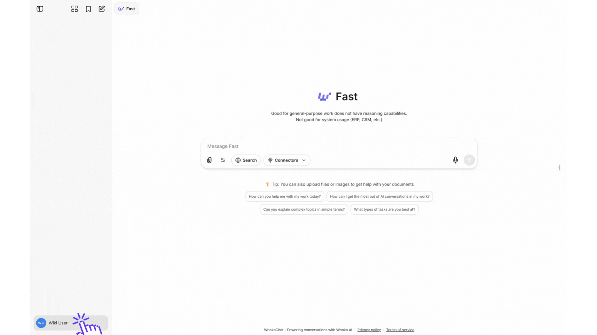
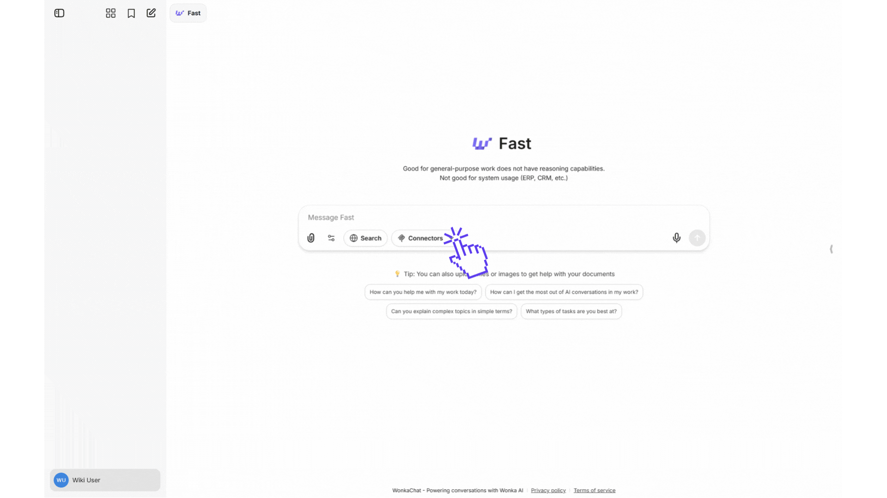

Connectez votre premier système métier à WonkaChat et débloquez l'accès alimenté par l'IA à vos données métier. Ce guide vous guide à travers le processus de connexion complet, de la sélection d'une connexion au test de votre première demande alimentée par l'IA.

## Comprendre les connexions vs outils

<AccordionGroup>
<Accordion title="Connexions" icon="usb">
**Les connexions** sont ce que vous ajoutez aux modèles IA - elles relient WonkaChat à vos systèmes métier comme Outlook, Slack ou Google Drive.
</Accordion>

<Accordion title="Outils" icon="wrench">
**Les outils** sont les capacités individuelles au sein de chaque connexion. Par exemple, une connexion Outlook peut inclure des outils pour lire les e-mails, envoyer des messages et gérer les événements de calendrier.
</Accordion>
</AccordionGroup>

## Avant de commencer

<CardGroup cols={2}>
<Card title="Vérifiez votre accès" icon="user-check">
Assurez-vous d'avoir les identifiants de connexion pour le système métier que vous souhaitez connecter (par exemple, votre e-mail et mot de passe Outlook).
</Card>

<Card title="Connaissez vos autorisations" icon="shield">
Vous ne pourrez accéder aux données dans les systèmes métier connectés que pour lesquelles vous avez déjà la permission de voir ou de modifier.
</Card>
</CardGroup>

## Visite guidée

Regardez ce guide étape par étape pour voir l'ensemble du processus de connexion en action :

<iframe
  className="w-full aspect-video rounded-xl"
  src="https://www.youtube.com/embed/srw1U5-SonA"
  title="Guide complet pour configurer votre première connexion"
  frameBorder="0"
  allow="accelerometer; clipboard-write; encrypted-media; gyroscope; picture-in-picture"
  allowFullScreen
></iframe>


<Tip>
Suivez la vidéo pendant la configuration de votre première connexion. Mettez en pause à chaque étape pour la compléter dans votre propre instance WonkaChat.
</Tip>

## Processus de connexion étape par étape

<Steps>
<Step title="Localiser le panneau des Connecteurs">
Dans votre interface WonkaChat, trouvez les **Connecteurs** à l'intérieur des paramètres en bas à gauche de l'écran. Ce panneau affiche toutes les connexions de systèmes métier disponibles.

<Frame caption="Panneau des connecteurs et exemple de connexion Outlook Mail">

</Frame>

<Tip>
Si vous ne voyez pas le panneau du côté droit, cliquez sur l'icône de flèche au centre-droit de votre écran pour développer la barre latérale.
</Tip>
</Step>

<Step title="Sélectionner votre connexion">
Parcourez ou recherchez la connexion que vous souhaitez ajouter. Cliquez sur le bouton de la connexion pour commencer le processus de connexion.

**Premières connexions populaires :**
- **Outlook Mail** ou **Gmail** pour l'accès aux e-mails
- **Slack** pour la communication d'équipe
- **Google Drive** ou **OneDrive** pour l'accès aux documents


<Check>
Pas sûr de quel logiciel connecter en premier ? Commencez par votre fournisseur d'e-mail, c'est la connexion la plus polyvalente pour les tâches quotidiennes.
</Check>
</Step>

<Step title="Authentifier votre compte">
Une fenêtre d'identifiants apparaîtra, demandant l'authentification pour le système métier sélectionné. Le processus varie légèrement selon le type de connexion :

<Tabs>
<Tab title="OAuth">
<Info>
L'authentification **OAuth** est utilisée pour la plupart des logiciels comme <strong>Outlook, Gmail, Google Drive</strong>.
</Info>

1. Cliquez sur **« Connecter »**.
2. Vous serez redirigé vers la page de connexion officielle du logiciel.
3. Entrez vos identifiants sur le site sécurisé du logiciel.
4. Vous serez automatiquement redirigé vers WonkaChat.

</Tab>

<Tab title="Clé API">
<Info>
Certains logiciels nécessitent une clé API. Si vous avez besoin d'aide pour obtenir ou utiliser votre clé API, consultez la page <a href="/fr/support-resources/getting-help">Obtenir de l'aide</a> pour des options de support personnalisées.
</Info>

1. Cliquez sur l'**icône d'engrenage**.
2. Obtenez votre clé API directement auprès du fournisseur.
3. Collez la clé API dans le champ d'identifiants WonkaChat.
4. Cliquez sur **« Connecter »**.


<Tip>
Besoin d'aide pour trouver votre clé API ? La plupart des logiciels l'ont sous <strong>Paramètres → API</strong> ou <strong>Paramètres → Intégrations</strong>. Consultez la documentation du logiciel si vous n'êtes pas sûr.
</Tip>
</Tab>

<Tab title="Personnalisé">
<Info>
Certains systèmes métier, comme <strong>Odoo</strong>, nécessitent une configuration personnalisée au-delà de l'authentification standard. Si vous avez besoin d'aide pour vous connecter, consultez la page <a href="/fr/support-resources/getting-help">Obtenir de l'aide</a> pour des options de support personnalisées.
</Info>

Certains systèmes métier nécessitent des paramètres de connexion supplémentaires :
- Nom de base de données ou URL d'instance
- Point de terminaison du serveur
- Combinaison nom d'utilisateur et mot de passe
- Jetons d'authentification personnalisés ou identifiants

**Processus de connexion :**
1. Cliquez sur l'**icône d'engrenage**.
2. Examinez les exigences de connexion affichées dans la fenêtre d'identifiants WonkaChat.
3. Entrez tous les champs requis.
4. Vérifiez que tout est exact avant de procéder.
5. Cliquez sur **« Connecter »** pour établir la connexion.

<Info>
Chaque logiciel affiche ses exigences de connexion spécifiques dans la fenêtre d'identifiants.

Si vous avez besoin d'aide avec les détails de connexion ou rencontrez des problèmes, <a href="https://www.meetwonka.com/fr/contact">contactez notre équipe de support</a> pour une aide personnalisée.
</Info>

<Warning>
Vérifiez toujours que vous êtes sur la page officielle WonkaChat de votre organisation avant d'entrer des identifiants ou de vous connecter à un logiciel.
</Warning>
</Tab>
</Tabs>


</Step>

<Step title="Activer la connexion">
Après une authentification réussie, vous devez activer la connexion pour le modèle IA que vous utilisez.

1. Cliquez sur le bouton **« Connecteurs »** sous le champ de saisie du chat
2. Trouvez votre système métier dans la liste
3. Cliquez dessus pour activer la connexion pour le chat actuel

<Frame caption="Exemple de connexion Outlook Mail">

</Frame>

<Check>
Une fois activé, le modèle IA peut accéder à ce système métier chaque fois que vous le lui demandez. Vous pouvez activer ou désactiver les connexions à tout moment.
</Check>
</Step>

<Step title="Tester votre connexion">
Vérifiez que la connexion fonctionne en posant à l'IA une question simple qui nécessite le système métier.

### Exemple pour l'e-mail (Outlook/Gmail) :
```
Quels e-mails ai-je reçus aujourd'hui ?
```

Si l'IA récupère et affiche avec succès les informations, votre connexion fonctionne correctement !

<Check>
Connexion réussie ! Vous pouvez maintenant utiliser le langage naturel pour accéder et interagir avec ce système métier via WonkaChat.
</Check>
</Step>


<Step title="Désactiver une connexion">

Pour supprimer une connexion :
1. Cliquez sur le bouton **« Connecteurs »** sous le champ de saisie du chat
2. Trouvez votre système métier dans la liste
3. Cliquez dessus pour désactiver la connexion pour le chat actuel en la retirant des connexions sélectionnées

<Warning>
Déconnecter un système métier révoque immédiatement l'accès de WonkaChat à ce service. Cependant, vos identifiants d'authentification restent stockés en toute sécurité pour de futures reconnexions.
</Warning>

</Step>
</Steps>

---


## Comprendre les autorisations et les actions

<AccordionGroup>
<Accordion title="À quoi WonkaChat peut-il accéder ?" icon="eye">
WonkaChat ne peut accéder qu'à :
- Les données pour lesquelles vous avez personnellement la permission de voir dans le système métier connecté
- Les informations que vous lui demandez explicitement de récupérer
- Les ressources dans vos limites organisationnelles (si applicable)

**WonkaChat ne peut pas :**
- Accéder aux données d'autres utilisateurs sauf s'ils les ont partagées avec vous
- Contourner le système de permission de votre système métier
- Lire ou modifier des données sans votre demande explicite
</Accordion>

<Accordion title="Quelles actions WonkaChat peut-il effectuer ?" icon="hand">
Les capacités de WonkaChat dépendent entièrement des outils implémentés pour chaque système métier. Si un fournisseur expose une action via sa connexion (MCP), l'IA peut l'effectuer. Si une action n'est pas implémentée dans le MCP, l'IA ne peut pas y accéder, peu importe si le système métier sous-jacent la prend en charge.

**Les capacités courantes incluent :**
- **Lecture** : Voir les e-mails, documents, tâches, événements de calendrier, enregistrements de base de données, etc.
- **Écriture** : Envoyer des e-mails, créer des tâches, mettre à jour des enregistrements, planifier des réunions, ajouter des commentaires
- **Suppression** : Supprimer des éléments, archiver des enregistrements, effacer des données (uniquement quand vous le demandez explicitement)
- **Recherche** : Interroger les documents, trouver des enregistrements spécifiques, filtrer les données
- **Exécution** : Exécuter des flux de travail, déclencher des automatisations, effectuer des calculs

<Check>
Chaque connexion (MCP) définit son propre ensemble d'actions disponibles. Consultez la documentation du système métier spécifique pour voir quelles opérations sont prises en charge via son implémentation MCP.
</Check>

**Important :** Le modèle IA est restreint uniquement aux actions que le MCP expose. Même si l'interface native d'un système métier prend en charge une fonctionnalité, WonkaChat ne peut l'utiliser que si le serveur MCP correspondant a implémenté cette capacité.

Toutes les actions nécessitent votre instruction explicite via une conversation. WonkaChat n'effectue des actions que lorsque vous le lui demandez.
</Accordion>

<Accordion title="Comment les identifiants sont-ils stockés ?" icon="lock">
Vos jetons d'authentification sont :
- Chiffrés au repos dans notre base de données sécurisée
- Uniques à votre compte utilisateur (jamais partagés avec d'autres)
- Automatiquement actualisés pour maintenir la connexion
- Supprimés immédiatement lorsque vous déconnectez un système métier

WonkaChat ne stocke jamais vos mots de passe réels. Il ne stocke que les jetons d'accès sécurisés fournis par le flux OAuth ou la clé API que vous saisissez.
</Accordion>
</AccordionGroup>

---

## Flux de travail multi-plateforme

Une fois que vous avez connecté plusieurs systèmes métier, vous pouvez les combiner de manières puissantes :

<CardGroup cols={2}>
<Card title="Requêtes multi-plateforme" icon="arrows-left-right">
Posez des questions qui s'étendent sur plusieurs systèmes métier en une seule demande.

**Exemple :** *« Vérifiez mon Google Calendrier pour la disponibilité et envoyez ces horaires à Sarah via Outlook. »*
</Card>

<Card title="Transfert de données" icon="arrow-right-arrow-left">
Déplacez des informations entre les systèmes métier sans copier-coller manuel.

**Exemple :** *« Prenez les éléments d'action de ce fil Slack et créez des tâches dans ClickUp. »*
</Card>

<Card title="Flux de travail automatisés" icon="gears">
Construisez des agents qui surveillent un système métier et prennent des actions dans un autre.

**Exemple :** Agent qui vérifie Salesforce pour les nouveaux prospects et crée des tâches de suivi dans Asana.
</Card>

<Card title="Reporting unifié" icon="chart-line">
Combinez les données de plusieurs sources pour des insights complets.

**Exemple :** *« Résumez ma semaine : e-mails d'Outlook, réunions du Calendrier et tâches complétées de Notion. »*
</Card>
</CardGroup>

---

## Bonnes pratiques

<AccordionGroup>
<Accordion title="Commencer avec les connexions essentielles" icon="star">
Connectez d'abord vos systèmes métier les plus utilisés :
1. E-mail (Outlook ou Gmail)
2. Calendrier (Google Calendrier ou Cal.com)
3. Outil principal de gestion de projet
4. Stockage de documents principal

Vous pouvez toujours ajouter plus de connexions plus tard au fur et à mesure que vous découvrez les besoins.
</Accordion>

<Accordion title="Tester avant les flux de travail complexes" icon="vial">
Après avoir connecté un système métier :
- Posez d'abord des questions simples pour vérifier que ça fonctionne
- Augmentez progressivement la complexité
- Comprenez quelles données le système métier expose avant de construire des flux de travail
</Accordion>

<Accordion title="Examiner périodiquement les autorisations" icon="calendar-check">
Tous les quelques mois :
- Examinez quels systèmes métier sont connectés
- Déconnectez les systèmes métier que vous n'utilisez plus
- Vérifiez que les connexions sont toujours actives et fonctionnent
</Accordion>

<Accordion title="Créer des agents IA avec des ensembles d'outils ciblés" icon="robot">
**Pourquoi c'est important :**

Les agents IA avec des connexions de systèmes métier conçues spécifiquement fournissent des résultats significativement meilleurs que les configurations générales. Lorsqu'un agent n'a accès qu'aux systèmes métier pertinents pour sa tâche spécifique, il :
- **Réduit les hallucinations** en limitant le contexte à ce qui est réellement nécessaire
- **Améliore la précision** en se concentrant sur les sources de données spécifiques au domaine
- **Fournit des réponses plus rapides** avec moins de vérifications d'outils non pertinents
- **Maintient un meilleur contexte** dans son domaine d'expertise

**Exemples de Bonnes pratiques :**

<Accordion title="Agent commercial" icon="handshake">
**Connecter uniquement :** Salesforce, HubSpot, Gmail, Calendrier

- Concentré sur les données client et la communication
- N'interrogera pas accidentellement les outils de développement non liés
- Comprend profondément le contexte du pipeline de ventes
</Accordion>

<Accordion title="Agent de développement" icon="code">
**Connecter uniquement :** GitHub, GitLab, Linear, Slack

- Spécialisé dans le code et la gestion de projet
- Plus rapide parce qu'il ne vérifie pas les e-mails ou systèmes CRM
- Meilleur pour comprendre le contexte technique
</Accordion>

<Accordion title="Agent assistant exécutif" icon="briefcase">
**Connecter uniquement :** Outlook, Google Calendrier, Google Drive, Notion

- Dédié à la planification et la gestion de documents
- N'accédera pas accidentellement aux systèmes techniques ou de ventes
- Plus fiable pour les tâches de productivité personnelle
</Accordion>

<Accordion title="Agent d'opérations" icon="gears">
**Connecter uniquement :** Odoo, QuickBooks, Airtable, Slack

- Concentré sur les opérations métier et la finance
- Connaissance spécialisée des flux de travail opérationnels
- Meilleur pour faire des références croisées de données opérationnelles
</Accordion>

<Tip>
Commencez par créer 2-3 agents spécialisés pour vos flux de travail les plus courants. Vous verrez rapidement la différence de qualité par rapport à un agent avec tous les outils et logiciels connectés.
</Tip>
</Accordion>
</AccordionGroup>

---

## Prochaines étapes

<CardGroup cols={2}>
<Card title="Dépannage" icon="wrench" href="/fr/tools-connection/troubleshooting-connections">
Vous avez des problèmes pour connecter vos systèmes métier ? Trouvez des solutions aux problèmes de connexion courants.
</Card>

<Card title="Voir des exemples" icon="video" href="/fr/tools-connection/examples-of-tool-usage">
Regardez des exemples réels de connexions MCP en action avec Outlook, Odoo et plus encore.
</Card>
</CardGroup>
