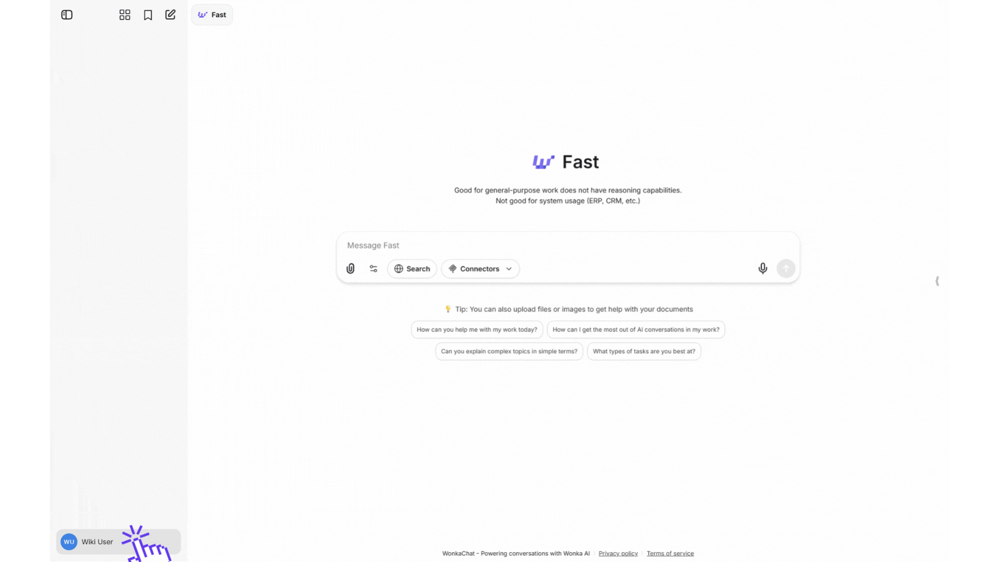
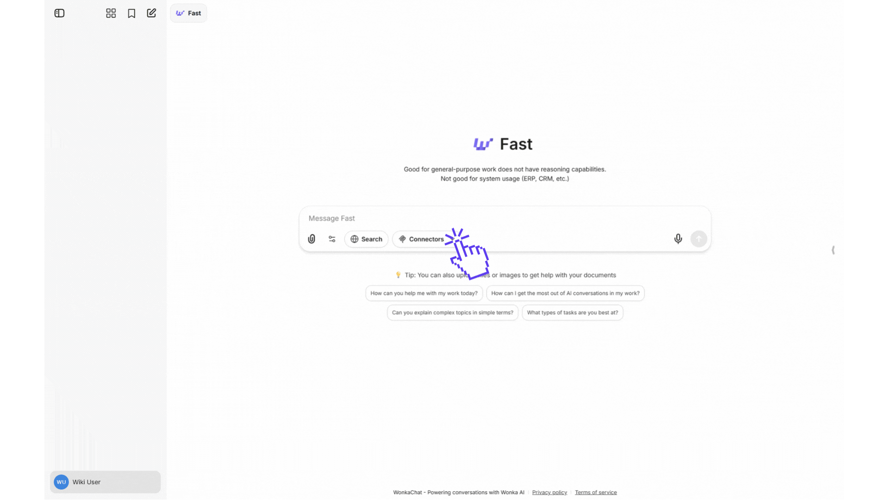

Connectez votre premier système métier à WonkaChat et débloquez l'accès alimenté par l'IA à vos données métier. Ce guide vous accompagne dans tout le processus de connexion, de la sélection d'une connexion jusqu'au test de votre première demande alimentée par l'IA.

## Comprendre les connexions et les outils

<AccordionGroup>
<Accordion title="Connexions" icon="usb">
**Les connexions** sont ce que vous ajoutez aux modèles IA — elles relient WonkaChat à vos systèmes métier comme Outlook, Slack ou Google Drive.
</Accordion>

<Accordion title="Outils" icon="wrench">
**Les outils** sont les capacités individuelles au sein de chaque connexion. Par exemple, une connexion Outlook peut inclure des outils pour lire les e-mails, envoyer des messages et gérer les événements de calendrier.
</Accordion>
</AccordionGroup>

## Avant de commencer

<CardGroup cols={2}>
<Card title="Vérifiez votre accès" icon="user-check">
Assurez-vous d'avoir les identifiants de connexion pour le système métier que vous souhaitez connecter (par exemple votre e-mail et mot de passe Outlook).
</Card>

<Card title="Connaissez vos autorisations" icon="shield">
Vous ne pourrez accéder, dans les systèmes métier connectés, qu'aux données que vous avez déjà la permission de voir ou de modifier.
</Card>
</CardGroup>

## Visite guidée en vidéo

Regardez ce guide étape par étape pour voir l'ensemble du processus de connexion en action :

<iframe
  className="w-full aspect-video rounded-xl"
  src="https://www.youtube.com/embed/srw1U5-SonA"
  title="Guide complet pour configurer votre première connexion"
  frameBorder="0"
  allow="accelerometer; clipboard-write; encrypted-media; gyroscope; picture-in-picture"
  allowFullScreen
></iframe>

<Tip>
Suivez la vidéo pendant que vous configurez votre première connexion. Mettez-la en pause à chaque étape pour la réaliser dans votre propre instance WonkaChat.
</Tip>

## Processus de connexion étape par étape

<Steps>
<Step title="Localiser la page Connecteurs">
Dans la barre latérale de WonkaChat, allez dans **Personnaliser → Connecteurs**. Cette page liste toutes les connexions de systèmes métier disponibles, avec recherche, filtres et options d'affichage.

<Frame caption="Bouton Connecteurs sous la zone de saisie du chat">

</Frame>
</Step>

<Step title="Sélectionner votre connexion">
Parcourez ou recherchez la connexion que vous souhaitez ajouter. Cliquez sur la fiche de la connexion pour lancer le processus de connexion.

**Premières connexions populaires :**
- **Outlook Mail** ou **Gmail** pour l'accès aux e-mails
- **Slack** pour la communication d'équipe
- **Google Drive** ou **OneDrive** pour l'accès aux documents

<Check>
Vous ne savez pas quel logiciel connecter en premier ? Commencez par votre fournisseur de messagerie, c'est la connexion la plus polyvalente pour les tâches quotidiennes.
</Check>
</Step>

<Step title="Authentifier votre compte">
Une fenêtre d'identifiants s'affiche, demandant l'authentification pour le système métier sélectionné. Le processus varie selon le type de connexion :

<Tabs>
<Tab title="OAuth">
<Info>
L'authentification **OAuth** est utilisée pour la plupart des connexions logicielles, comme <strong>Outlook, Gmail, Google Drive</strong>.
</Info>

1. Cliquez sur **« Se connecter »**.
2. Vous serez redirigé vers la page de connexion officielle du logiciel.
3. Entrez vos identifiants sur le site sécurisé du logiciel.
4. Vous serez automatiquement redirigé vers WonkaChat.

</Tab>

<Tab title="Clé API">
<Info>
Certains connecteurs nécessitent une clé API. Si vous avez besoin d'aide pour obtenir ou utiliser votre clé API, consultez la page <a href="/fr/support-resources/getting-help">Obtenir de l'aide</a> pour des options de support personnalisées.
</Info>

1. Cliquez sur la fiche du connecteur, puis ouvrez sa configuration.
2. Obtenez votre clé API directement auprès du fournisseur.
3. Collez la clé API dans le champ d'identifiants de WonkaChat.
4. Cliquez sur **« Se connecter »**.

<Tip>
Besoin d'aide pour trouver votre clé API ? La plupart des logiciels la proposent sous **Paramètres → API** ou **Paramètres → Intégrations**. Consultez la documentation du logiciel si vous n'êtes pas sûr.
</Tip>
</Tab>

<Tab title="Personnalisé">
<Info>
Certains systèmes métier, comme <strong>Odoo</strong>, nécessitent une configuration personnalisée au-delà de l'authentification standard. Si vous avez besoin d'aide pour vous connecter, consultez la page <a href="/fr/support-resources/getting-help">Obtenir de l'aide</a> pour des options de support personnalisées.
</Info>

Certains systèmes métier nécessitent des paramètres de connexion supplémentaires :
- URL de l'instance ou nom de la base de données
- Combinaison nom d'utilisateur et mot de passe
- Jetons d'authentification ou identifiants personnalisés

**Processus de connexion :**
1. Cliquez sur la fiche du connecteur pour ouvrir sa configuration.
2. Passez en revue les prérequis de connexion affichés dans la fenêtre d'identifiants de WonkaChat.
3. Renseignez tous les champs requis.
4. Vérifiez que tout est exact avant de continuer.
5. Cliquez sur **« Se connecter »** pour établir la connexion.

<Info>
Chaque connecteur affiche ses prérequis de connexion spécifiques dans la fenêtre d'identifiants.

Si vous avez besoin d'aide avec les détails de connexion ou rencontrez un problème, <a href="https://www.wonka-ai.com/contact">contactez notre équipe de support</a> pour une aide personnalisée.
</Info>

<Warning>
Vérifiez toujours que vous êtes bien sur la page officielle WonkaChat de votre organisation avant de saisir des identifiants ou de vous connecter à un logiciel.
</Warning>
</Tab>
</Tabs>

</Step>

<Step title="Activer la connexion">
Après une authentification réussie, activez la connexion pour le chat que vous utilisez.

1. Cliquez sur le bouton **« Connecteurs »** sous le champ de saisie du chat
2. Trouvez votre système métier dans la liste
3. Cliquez dessus pour activer la connexion pour le chat en cours

<Frame caption="Activer une connexion depuis la zone de saisie du chat">

</Frame>

<Check>
Une fois activé, le modèle IA peut accéder à ce système métier chaque fois que vous le lui demandez. Vous pouvez activer ou désactiver les connexions à tout moment.
</Check>
</Step>

<Step title="Tester votre connexion">
Vérifiez que la connexion fonctionne en posant à l'IA une question simple qui nécessite le système métier.

### Exemple pour la messagerie (Outlook/Gmail) :
```
Quels e-mails ai-je reçus aujourd'hui ?
```

Si l'IA récupère et affiche correctement les informations, votre connexion fonctionne !

<Check>
Connexion réussie ! Vous pouvez désormais utiliser le langage naturel pour accéder à ce système métier et interagir avec lui via WonkaChat.
</Check>
</Step>

<Step title="Désactiver une connexion">

Pour supprimer une connexion :
1. Cliquez sur le bouton **« Connecteurs »** sous le champ de saisie du chat
2. Trouvez votre système métier dans la liste
3. Cliquez dessus pour désactiver la connexion pour le chat en cours en la retirant des connexions sélectionnées

<Warning>
Déconnecter un système métier révoque immédiatement l'accès de WonkaChat à ce service. Cependant, vos identifiants d'authentification restent stockés en toute sécurité en vue de futures reconnexions.
</Warning>

</Step>
</Steps>

---

## Comprendre les autorisations et les actions

<AccordionGroup>
<Accordion title="À quoi WonkaChat peut-il accéder ?" icon="eye">
WonkaChat ne peut accéder qu'à :
- Aux données que vous avez personnellement la permission de voir dans le système métier connecté
- Aux informations que vous lui demandez explicitement de récupérer
- Aux ressources qui se trouvent dans vos limites organisationnelles (le cas échéant)

**WonkaChat ne peut pas :**
- Accéder aux données d'autres utilisateurs, sauf s'ils les ont partagées avec vous
- Contourner le système de permissions de votre système métier
- Lire ou modifier des données sans votre demande explicite
</Accordion>

<Accordion title="Quelles actions WonkaChat peut-il effectuer ?" icon="hand">
Les capacités de WonkaChat dépendent entièrement des outils implémentés pour chaque système métier. Si un fournisseur expose une action via sa connexion (MCP), l'IA peut l'effectuer. Si une action n'est pas implémentée dans le MCP, l'IA ne peut pas y accéder, que le système métier sous-jacent la prenne en charge ou non.

**Les capacités courantes incluent :**
- **Lecture** : voir des e-mails, documents, tâches, événements de calendrier, enregistrements de base de données, etc.
- **Écriture** : envoyer des e-mails, créer des tâches, mettre à jour des enregistrements, planifier des réunions, ajouter des commentaires
- **Suppression** : supprimer des éléments, archiver des enregistrements, effacer des données (uniquement quand vous le demandez explicitement)
- **Recherche** : interroger des documents, trouver des enregistrements spécifiques, filtrer des données
- **Exécution** : exécuter des flux de travail, déclencher des automatisations, effectuer des calculs

<Check>
Chaque connexion (MCP) définit son propre ensemble d'actions disponibles. Consultez la documentation du système métier concerné pour voir quelles opérations sont prises en charge par son implémentation MCP.
</Check>

**Important :** le modèle IA est restreint aux seules actions que le MCP expose. Même si l'interface native d'un système métier prend en charge une fonctionnalité, WonkaChat ne peut l'utiliser que si le serveur MCP correspondant a implémenté cette capacité.

Toutes les actions nécessitent votre instruction explicite via la conversation. WonkaChat n'effectue une action que lorsque vous le lui demandez.
</Accordion>

<Accordion title="Comment les identifiants sont-ils stockés ?" icon="lock">
Vos jetons d'authentification sont :
- Chiffrés au repos dans notre base de données sécurisée
- Propres à votre compte utilisateur (jamais partagés avec d'autres)
- Automatiquement renouvelés pour maintenir la connexion
- Supprimés immédiatement lorsque vous déconnectez un système métier

WonkaChat ne stocke jamais vos mots de passe réels. Il ne stocke que les jetons d'accès sécurisés fournis par le flux OAuth ou la clé API que vous saisissez.
</Accordion>
</AccordionGroup>

---

## Flux de travail multi-plateforme

Une fois plusieurs systèmes métier connectés, vous pouvez les combiner de manières puissantes :

<CardGroup cols={2}>
<Card title="Requêtes multi-plateforme" icon="arrows-left-right">
Posez des questions qui s'étendent sur plusieurs systèmes métier en une seule demande.

**Exemple :** *« Vérifie mon Google Calendar pour les disponibilités et envoie ces créneaux à Sarah via Outlook. »*
</Card>

<Card title="Transfert de données" icon="arrow-right-arrow-left">
Déplacez des informations entre systèmes métier sans copier-coller manuel.

**Exemple :** *« Prends les actions à mener de ce fil Slack et crée des tâches dans ClickUp. »*
</Card>

<Card title="Flux de travail automatisés" icon="gears">
Créez des agents qui surveillent un système métier et prennent des actions dans un autre.

**Exemple :** un agent qui vérifie Salesforce pour les nouveaux prospects et crée des tâches de suivi dans Asana.
</Card>

<Card title="Reporting unifié" icon="chart-line">
Combinez des données de plusieurs sources pour des analyses complètes.

**Exemple :** *« Résume ma semaine : e-mails d'Outlook, réunions du calendrier et tâches terminées dans Notion. »*
</Card>
</CardGroup>

---

## Bonnes pratiques

<AccordionGroup>
<Accordion title="Commencer par les connexions essentielles" icon="star">
Connectez d'abord vos systèmes métier les plus utilisés :
1. Messagerie (Outlook ou Gmail)
2. Calendrier (Google Calendar ou Cal.com)
3. Outil principal de gestion de projet
4. Espace de stockage de documents principal

Vous pourrez toujours ajouter d'autres connexions plus tard, au fil de vos besoins. Marquez vos connecteurs les plus utilisés comme favoris (icône étoile sur la page Connecteurs) pour qu'ils apparaissent en premier dans la zone de saisie du chat.
</Accordion>

<Accordion title="Tester avant les flux de travail complexes" icon="vial">
Après avoir connecté un système métier :
- Posez d'abord des questions simples pour vérifier que tout fonctionne
- Augmentez progressivement la complexité
- Comprenez quelles données le système métier expose avant de construire des flux de travail
</Accordion>

<Accordion title="Revoir les autorisations périodiquement" icon="calendar-check">
Tous les quelques mois :
- Passez en revue les systèmes métier connectés
- Déconnectez ceux que vous n'utilisez plus
- Vérifiez que les connexions sont toujours actives et fonctionnelles
</Accordion>

<Accordion title="Créer des agents IA avec des ensembles d'outils ciblés" icon="robot">
**Pourquoi c'est important :**

Des agents IA dotés de connexions à des systèmes métier conçues sur mesure donnent des résultats nettement meilleurs que des configurations généralistes. Lorsqu'un agent n'a accès qu'aux systèmes métier pertinents pour sa tâche spécifique, il :
- **Réduit les hallucinations** en limitant le contexte à ce qui est réellement nécessaire
- **Améliore la précision** en se concentrant sur des sources de données propres à son domaine
- **Répond plus vite**, avec moins de vérifications d'outils non pertinents
- **Conserve un meilleur contexte** dans son domaine d'expertise

**Exemples de bonnes pratiques :**

<Accordion title="Agent commercial" icon="handshake">
**Ne connecter que :** Salesforce, HubSpot, Gmail, Calendrier

- Concentré sur les données clients et la communication
- Ne va pas accidentellement interroger des outils de développement sans rapport
- Comprend en profondeur le contexte du pipeline commercial
</Accordion>

<Accordion title="Agent de développement" icon="code">
**Ne connecter que :** GitHub, GitLab, Linear, Slack

- Spécialisé dans le code et la gestion de projet
- Plus rapide car il ne vérifie pas la messagerie ou le CRM
- Meilleur pour comprendre le contexte technique
</Accordion>

<Accordion title="Agent assistant de direction" icon="briefcase">
**Ne connecter que :** Outlook, Google Calendar, Google Drive, Notion

- Dédié à la planification et à la gestion documentaire
- N'accède pas accidentellement aux systèmes techniques ou commerciaux
- Plus fiable pour les tâches de productivité personnelle
</Accordion>

<Accordion title="Agent des opérations" icon="gears">
**Ne connecter que :** Odoo, Airtable, Slack

- Concentré sur les opérations métier et la finance
- Connaissance spécialisée des flux de travail opérationnels
- Meilleur pour croiser les données opérationnelles
</Accordion>

<Tip>
Commencez par créer 2 à 3 agents spécialisés pour vos flux de travail les plus courants. Vous verrez rapidement la différence de qualité par rapport à un agent unique auquel tous les outils et logiciels sont connectés.
</Tip>
</Accordion>
</AccordionGroup>

---

## Prochaines étapes

<CardGroup cols={2}>
<Card title="Dépannage" icon="wrench" href="/fr/tools-connection/troubleshooting-connections">
Des problèmes pour connecter vos systèmes métier ? Trouvez des solutions aux problèmes de connexion courants.
</Card>

<Card title="Voir des exemples" icon="video" href="/fr/tools-connection/examples-of-tool-usage">
Regardez des exemples réels de connexions MCP en action avec Outlook, Odoo et bien d'autres.
</Card>
</CardGroup>
