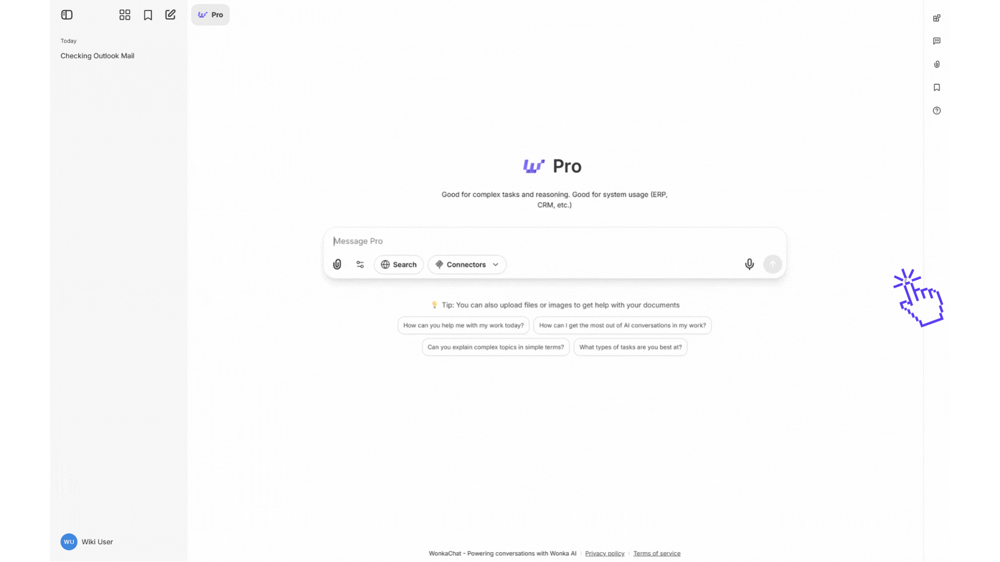
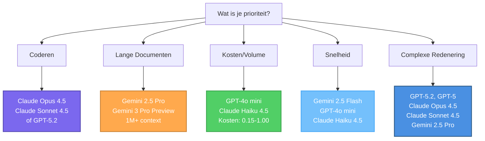

Maak gespecialiseerde AI agents op maat gemaakt voor je workflows. Deze gids behandelt agentcreatie van initiële setup tot deployment.

<Info>
Een AI Agent bouwen betekent zijn rol definiëren, instructies schrijven, een model selecteren en optioneel tools verbinden.
</Info>

<Tabs>
<Tab title="Aan de Slag">

## Agent Creatie - Video Uitleg

Verken de stap-voor-stap instructies over het maken van AI agents per video. Deze twee video's demonstreren visueel de belangrijkste beslissingen en acties die je nodig hebt om je eigen aangepaste agents te bouwen, configureren en deployen.


<AccordionGroup>
<Accordion title="Basis Agent Creatie" icon="user" defaultOpen="true">

### Basis Agent:

Bekijk hoe je een basis agent maakt met eenvoudige instructies. Dit helpt je de fundamenten van agentcreatie te leren.

<iframe
  className="w-full aspect-video rounded-xl"
  src="https://www.youtube.com/embed/GQ8LYovybDU"
  title="Een Basis Agent Maken"
  frameBorder="0"
  allow="accelerometer; clipboard-write; encrypted-media; gyroscope; picture-in-picture"
  allowFullScreen
></iframe>

<Tip>
Begin met eenvoudige agents om de kernconcepten te begrijpen voordat je overgaat naar meer complexe agents met toolconfiguraties.
</Tip>

</Accordion>

<Accordion title="Tool Verbonden Agent Creatie" icon="screwdriver-wrench">

### Tool Verbonden Agent:

Bekijk hoe je een agent maakt die een tool verbindt om workflows te automatiseren. Dit is een praktisch voorbeeld van cross-system integratie.

<iframe
  className="w-full aspect-video rounded-xl"
  src="https://www.youtube.com/embed/N8rC1fks2oY"
  title="Een Tool Verbonden Agent Maken"
  frameBorder="0"
  allow="accelerometer; clipboard-write; encrypted-media; gyroscope; picture-in-picture"
  allowFullScreen
></iframe>

<Tip>
Dit voorbeeld demonstreert hoe agents andere zakelijke systemen kunnen verbinden om workflows te automatiseren die normaal gesproken handmatige dataoverdracht vereisen.
</Tip>

</Accordion>
</AccordionGroup>


## Agent Creatie - Stap voor Stap Uitleg

<Steps>
<Step title="Voordat Je Begint">

Definieer het doel van je agent:
- **Welke taak** zal deze agent afhandelen?
- **Hoe complex** is de workflow?
- **Welke tools** heeft het nodig?
</Step>

<Step title="Krijg Toegang tot Agent Creatie">
Navigeer naar de agentcreatieinterface en klik op "Create New Agent."

<Frame caption="Agent creatieinterface">

</Frame>
</Step>

<Step title="Geef Je Agent een Naam">
Kies een duidelijke, beschrijvende naam die het doel aangeeft.

**Goed:** "Klantenondersteuning Assistent," "Q4 Verkoopdata Analist"  
**Vermijd:** "Helper," "Agent 1"

<Tip>
Als je organisatiebrede deling plant, kies dan namen die zinvol zijn voor alle gebruikers.
</Tip>
</Step>

<Step title="Schrijf Je Instructies">
Instructies specificeren de rol, expertise, toon en gedrag van je agent. Schrijf duidelijke, gedetailleerde instructies om ervoor te zorgen dat de agent consistent presteert zoals bedoeld.

### Basis Instructiegids

<AccordionGroup>
<Accordion title="Roldefinitie">
Vermeld wat de agent is en doet.

**Voorbeeld:** "Je bent een klantenondersteuning specialist voor ons SaaS platform. Help gebruikers technische problemen op te lossen, productv ragen te beantwoorden en leid ze door veelvoorkomende workflows."
</Accordion>

<Accordion title="Communicatiestijl">
Definieer toon en format.

**Voorbeeld:** "Communiceer in een vriendelijke, professionele toon. Wees beknopt maar grondig. Gebruik bullet points voor duidelijkheid."
</Accordion>

<Accordion title="Operationele Richtlijnen">
Geef specifieke regels voor hoe de agent taken moet uitvoeren en beslissingen moet nemen.

**Voorbeeld:** "Bij het analyseren van verkoopdata, vergelijk altijd met het vorige kwartaal en jaar-op-jaar metrics. Als data incompleet is, vermeld dan expliciet de hiaten in plaats van aannames te maken."
</Accordion>

<Accordion title="Tool Gebruiksrichtlijnen">
Specificeer wanneer en hoe de agent beschikbare tools moet gebruiken.

**Voorbeeld:** "Gebruik de CRM tool om klantinformatie op te halen voordat je aanbevelingen doet. Bij het bevragen van de database, beperk resultaten tot de laatste 90 dagen tenzij anders aangegeven."
</Accordion>

<Accordion title="Bedrijfscontext">
Voeg bedrijfsspecifieke informatie toe.

**Voorbeeld:** "Support uren: 9 AM-6 PM EST. We bieden drie tiers: Basic, Pro, Enterprise."
</Accordion>
</AccordionGroup>

<Check>
Duidelijke, gedetailleerde instructies zijn de basis van agenteffectiviteit.
</Check>
</Step>

<Step title="Kies een AI Model">
Selecteer het juiste model op basis van de taakomcomplexiteit en gebruiksfrequentie van je agent.

### Snelle Selectiegids

**Voor eenvoudige, frequente taken:**
- Gebruik **GPT-4o mini** (meest kosteneffectief) of **Gemini 2.5 Flash** (snel met grote context)
- Overweeg ook: **Claude Haiku 4.5** (snel met near-frontier intelligentie)
- Voorbeeldtaken: E-mail opstellen, data opzoeken, eenvoudige formattering, high-volume operaties

**Voor complexe redenering:**
- Gebruik **Claude Opus 4.5**, **Claude Sonnet 4.5**, **GPT-5.2**, of **GPT-5** (geavanceerde mogelijkheden)
- Voorbeeldtaken: Multi-step analyse, strategische planning, multi-tool gebruik, complex coderen

**Voor lange context:**
- Gebruik **Gemini 2.5 Pro** (1M context window) of **Gemini 2.5 Flash** (1M context, sneller)
- Voorbeeldtaken: Documentanalyse, uitgebreid onderzoek, verwerken van grote datasets

<Tip>
Begin met een kosteneffectief model zoals **GPT-4o mini** of **Claude Haiku 4.5** voor de meeste agents. Upgrade naar meer capabele modellen (Claude Opus 4.5, GPT-5.2, of Gemini 2.5 Pro) alleen als resultaten niet aan je behoeften voldoen.
</Tip>

<Info>
**Gedetailleerde richtlijnen nodig?** Zie de [Model Selectiegids](#model-selectiegids) in de Geavanceerde Kennis tab voor uitgebreide vergelijkingen, prijzen en use case aanbevelingen.
</Info>
</Step>

<Step title="Verbind Externe Software (Optioneel)">
Voeg MCP verbinding toe als je agent moet communiceren met externe systemen.


**Tool selectieprincipes:**
- Voeg alleen tools toe die de agent daadwerkelijk nodig heeft
- Te veel tools kunnen selectieconfusie veroorzaken
- Zorg ervoor dat je permissies hebt voor toegewezen tools

<Warning>
Agents kunnen alleen toegang krijgen tot tools die expliciet aan hen zijn toegewezen en erven je persoonlijke permissies. Zie de <a href="/nl/security-governance/access-control#tool-restrictions" target="_blank" rel="noopener">Tool Beperkingen</a> sectie in Toegangscontrole voor meer details.
</Warning>

**Voorbeeldconfiguraties:**
- **Klantenondersteuning:** CRM, ticketsysteem, kennisbank, e-mail
- **Data Analyse:** Database verbindingen, visualisatie, spreadsheets
- **Content:** Documentopslag, publicatieplatform, asset library
</Step>

<Step title="Beoordeel en Test">
Test grondig voor deployment.

**Test:**
- Kernfunctionaliteit met typische verzoeken
- Edge cases en incomplete informatie
- Foutafhandeling wanneer tools falen
- Consistentie over meerdere vergelijkbare verzoeken

<Check>
Grondig testen zorgt ervoor dat gebruikers betrouwbare resultaten krijgen.
</Check>
</Step>

<Step title="Deploy of Deel">
**Persoonlijk gebruik:** Begin direct te gebruiken, verfijn op basis van echt gebruik

**Organisatie deling:** Neem contact op met beheerder, geef context over doel en waarde, wacht op review en goedkeuring

<Info>
Zie [Toegangscontrole](/security-governance/access-control) voor agentdelingsdetails.
</Info>
</Step>
</Steps>

## Best Practices

<CardGroup cols={2}>
<Card title="Wees Expliciet" icon="list-check">
Definieer specifieke doelen, acties en verwachte resultaten voor elke stap om dubbelzinnigheid te verminderen.
</Card>

<Card title="Voeg Edge Cases Toe" icon="diamond-exclamation">
Anticipeer op ongebruikelijke situaties en geef richtlijnen voor afhandeling.
</Card>

<Card title="Geef Context" icon="lightbulb">
Geef agents achtergrondinformatie over je bedrijfsprocessen en terminologie.
</Card>

<Card title="Itereer" icon="rotate">
Begin simpel, test grondig, verfijn op basis van prestaties en real world use cases.
</Card>
</CardGroup>

## Veelvoorkomende Fouten

<AccordionGroup>
<Accordion title="Vage Instructies">
**Probleem:** "Je bent een behulpzame assistent" mist richtlijnen.  
**Oplossing:** Wees specifiek over rol, expertise, toon en richtlijnen.
</Accordion>

<Accordion title="Te Veel Verantwoordelijkheden">
**Probleem:** Eén agent behandelt ongerelateerde taken zoals klantenondersteuning en data-analyse.  
**Oplossing:** Maak gefocuste agents voor specifieke workflows.
</Accordion>

<Accordion title="Tool Overload">
**Probleem:** Elk beschikbare tool toewijzen.  
**Oplossing:** Voeg alleen noodzakelijke tools toe om selectieconfusie te vermijden.
</Accordion>

<Accordion title="Onvoldoende Testen">
**Probleem:** Deployen zonder grondig testen.  
**Oplossing:** Test eerst uitgebreid met realistische scenario's.
</Accordion>
</AccordionGroup>


</Tab>

<Tab title="Geavanceerde Kennis">

## AI Agent Instructie Crashcursus

Deze gids introduceert vijf belangrijke elementen die helpen bij het maken van effectievere agents. Hoewel deze fundamenten een solide startpunt bieden, vertegenwoordigen ze voorbeelden van goede praktijken in plaats van een compleet framework. Het bouwen van echt betrouwbare agents vereist echter diepere exploratie en iteratie voorbij deze basics.

<AccordionGroup>
<Accordion title="1. Persona: Wie is je agent?" icon="user">
Definieer de rol, expertise en perspectief van je agent om response stijl en diepte te vormen.

**Voorbeeld:**
```
Je bent een senior financieel adviseur met 20 jaar ervaring 
gespecialiseerd in pensioenplanning voor conservatieve investeerders.
```

<Tip>
**Specifiek verslaat generiek:** "Je bent een behulpzame assistent" geeft geen richtlijnen. Definieer expertise, ervaringsniveau en specialisatie.
</Tip>
</Accordion>

<Accordion title="2. Doelen: Wat moet het bereiken?" icon="bullseye">
Vermeld duidelijk het doel en gewenste uitkomst voor elke interactie.

**Voorbeeld:**
```
Je doel is om verkoopdata van het laatste kwartaal te analyseren, 
de top 3 dalende producten te identificeren en specifieke 
acties aan te bevelen om de trend om te keren. Presenteer bevindingen in een beknopt 
executive summary format.
```

<Check>
Specifieke, meetbare doelen produceren consistente, bruikbare resultaten.
</Check>
</Accordion>

<Accordion title="3. Tools: Wat kan het gebruiken?" icon="wrench">
Specificeer welke tools te gebruiken en wanneer. Geef duidelijke richtlijnen voor toolselectie wanneer meerdere opties bestaan.

**Voorbeeld:**
```
Beschikbare tools:
- database_query: Gebruik voor alle klantdata lookups
- crm_api: Gebruik alleen wanneer database niet beschikbaar is
- email_tool: Gebruik voor het verzenden van notificaties

Bevraag altijd eerst de database voordat je aanbevelingen doet.
Update nooit records zonder expliciete gebruikersbevestiging.
```

<Warning>
Te veel vergelijkbare tools verwarren agents. Als je agent worstelt met toolselectie, geef dan duidelijkere gebruikscriteria of verminder het aantal tools.
</Warning>
</Accordion>

<Accordion title="4. Beperkingen: Wat zijn de grenzen?" icon="shield-halved">
Stel duidelijke grenzen in voor format, toon, lengte, permissies en verboden acties.

**Voorbeeld:**
```
Beperkingen:
- Houd reacties onder 200 woorden tenzij analyse detail vereist
- Gebruik professionele maar vriendelijke toon
- Beloof nooit leveringsdata
- Als klantverzoeken \$500 overschrijden, escaleer naar menselijke goedkeuring
- Formatteer alle datatables in markdown
```

<Info>
Beperkingen voorkomen veelvoorkomende faalmodi. Voeg nieuwe beperkingen toe naarmate je edge cases ontdekt in productie.
</Info>
</Accordion>

<Accordion title="5. Context: Welke achtergrond is belangrijk?" icon="book-open">
Geef relevante achtergrondinformatie, bedrijfsregels en domein-specifieke kennis.

**Voorbeeld:**
```
Bedrijfscontext:
- We bedienen B2B SaaS klanten met 3 pricing tiers
- Standaard support uren: 9 AM-6 PM EST, Ma-Vr
- Enterprise klanten krijgen prioriteit binnen 2 uur
- Ons restitutiebeleid staat 30-dagen geld-terug-garantie toe
- Veelvoorkomende afkortingen: ARR (Annual Recurring Revenue), 
  MRR (Monthly Recurring Revenue)
```

<Tip>
Voeg terminologie, acroniemen, bedrijfsregels en domeinkennis toe die de agent nodig heeft om verzoeken correct te interpreteren.
</Tip>
</Accordion>
</AccordionGroup>

### Snel Framework

Gebruik deze template als je startpunt:

```
[PERSONA]
Je bent een [specifieke rol] met [expertise/ervaring].

[DOELEN]
Je doel is om [primair doel]. Focus op [belangrijkste uitkomsten].

[CONTEXT]
Belangrijke achtergrond: [domeinkennis, bedrijfsregels, terminologie]

[TOOLS]
Beschikbare tools: [lijst]
Gebruik [tool A] wanneer [conditie].
Gebruik [tool B] voor [scenario].

[BEPERKINGEN]
- Format: [vereisten]
- Toon: [stijlrichtlijnen]
- Nooit: [verboden acties]
- Altijd: [vereist gedrag]
- Escaleer wanneer: [escalatiecriteria]
```

<CardGroup cols={2}>
<Card title="Begin Simpel" icon="seedling">
Begin met persona, doel en beperkingen. Voeg complexiteit alleen toe indien nodig.
</Card>

<Card title="Test Grondig" icon="flask">
Voer je prompts uit tegen edge cases. Verfijn op basis van werkelijke fouten.
</Card>

<Card title="Itereer" icon="arrows-rotate">
Prompts verbeteren door echt gebruik. Update op basis van productie learnings.
</Card>

<Card title="Leer Meer" icon="graduation-cap">
Verken meer geavanceerde technieken met [OpenAI's](https://platform.openai.com/docs/guides/prompt-engineering), [Anthropic's](https://docs.anthropic.com/en/docs/build-with-claude/prompt-engineering/overview), of zelfs [Google's](https://ai.google.dev/gemini-api/docs/prompting-intro) prompting guides.
</Card>
</CardGroup>

<Info>
**Wil je diepere kennis?** Zoek naar "prompt engineering best practices", "AI agent design patterns" en "tool calling strategies" om geavanceerde technieken te verkennen.
</Info>

---

## Model Selectiegids

Snelle vergelijking om je te helpen het juiste model te kiezen. Voor gedetailleerde specs en benchmarks, bezoek [OpenAI](https://openai.com), [Anthropic](https://anthropic.com), of [Google DeepMind](https://deepmind.google/technologies/gemini/).

### Model Vergelijking

<AccordionGroup>
<Accordion title="OpenAI Modellen" icon="openai">

| Model | Context | Kosten (Input/Output) | Het Beste Voor |
|-------|---------|---------------------|----------|
| **GPT-5.2** | 128K+ | Premium pricing | Nieuwste model, geavanceerde redenering, complexe taken |
| **GPT-5** | 128K+ | \$2.50 / \$10 per 1M | Geavanceerd coderen, agentic workflows, complexe redenering |
| **GPT-4o** | 128K | \$2.50 / \$10 per 1M | Algemeen gebruik, gebalanceerde taken, multimodaal |
| **GPT-4o mini** | 128K | \$0.15 / \$0.60 per 1M | High-volume, kosteneffectieve taken |

**Belangrijkste Functies:** Sterke algemene prestaties, bewezen betrouwbaarheid, multimodale mogelijkheden
</Accordion>

<Accordion title="Anthropic (Claude) Modellen" icon="brain">

| Model | Context | Kosten (Input/Output) | Het Beste Voor |
|-------|---------|---------------------|----------|
| **Claude Opus 4.5** | 200K | \$5 / \$25 per 1M | Hoogste capaciteit, complexe redenering, geavanceerd coderen |
| **Claude Sonnet 4.5** | 200K-1M | \$3 / \$15 per 1M | Gebalanceerde prestaties, coderen, agents (1M beta) |
| **Claude Sonnet 4** | 200K | \$3 / \$15 per 1M | Sterk coderen en redeneren |
| **Claude Haiku 4.5** | 200K | \$1 / \$5 per 1M | Snelste, meest kostenefficiënt, near-frontier intelligentie |
| **Claude Sonnet 3.7** | 200K | \$3 / \$15 per 1M | Algemene taken, bewezen prestaties |

**Belangrijkste Functies:** Toonaangevend coderen, sterke redenering, flexibele context windows
</Accordion>

<Accordion title="Google (Gemini) Modellen" icon="google">

| Model | Context | Kosten (Input/Output) | Het Beste Voor |
|-------|---------|---------------------|----------|
| **Gemini 3 Pro Preview** | 1M+ | Preview pricing | Next-gen mogelijkheden, geavanceerde analyse (preview) |
| **Gemini 3 Flash Preview** | 1M+ | Preview pricing | Next-gen snelheid en efficiëntie (preview) |
| **Gemini 2.5 Pro** | 1M | \$1.25-2.50 / \$10-15 per 1M | Lange documenten, complexe analyse |
| **Gemini 2.5 Flash** | 1M | \$0.30 / \$2.50 per 1M | Snelheid, real-time, kostenefficiëntie |

**Belangrijkste Functies:** Grootste context window (1M+ tokens), geoptimaliseerd voor snelheid en documentanalyse
</Accordion>

<Accordion title="Mistral Modellen" icon="wind">

| Model | Context | Kosten (Input/Output) | Het Beste Voor |
|-------|---------|---------------------|----------|
| **Mistral Large Latest** | 128K | Competitieve prijzen | Sterke prestaties, Europese AI |
| **Mistral Medium Latest** | 32K | Lagere kosten | Gebalanceerde taken, kosteneffectief |

**Belangrijkste Functies:** Open-source basis, Europese data soevereiniteit optie
</Accordion>
</AccordionGroup>

<Info>
**Pro Modellen Beschikbaar:** GPT-5.2, GPT-5, Claude Opus 4.5, Claude Sonnet 4.5, Claude Sonnet 4, en Gemini 2.5 Pro ondersteunen allemaal geavanceerde redenering en complexe taakafhandeling.
</Info>

### Snelle Selectie per Taak

<AccordionGroup>
<Accordion title="Coderen & Ontwikkeling" icon="code">
**Pro:** Claude Opus 4.5, Claude Sonnet 4.5, GPT-5.2, of GPT-5 (geavanceerd coderen, grote context)  
**Budget:** GPT-4o mini (\$0.15/\$0.60) of Claude Haiku 4.5 (\$1/\$5)

<Check>
Gebruik Pro modellen voor productiecode of complexe refactoring. Gebruik budget modellen voor scripts en eenvoudige taken.
</Check>
</Accordion>

<Accordion title="Lange Documenten & Analyse" icon="chart-bar">
**Beste:** Gemini 2.5 Pro (1M context) of Gemini 3 Pro Preview (1M+ context)  
**Alternatief:** Claude Sonnet 4.5 (200K-1M beta), GPT-5.2, of GPT-5

<Tip>
Gemini modellen behandelen documenten boven 200K tokens het beste met hun 1M+ context windows. Voor diepe redenering op kortere documenten, gebruik Claude Opus 4.5, Claude Sonnet 4.5, of GPT-5.2.
</Tip>
</Accordion>

<Accordion title="High-Volume Taken" icon="bolt">
**Beste:** GPT-4o mini (laagste kosten op \$0.15/\$0.60)  
**Alternatief:** Gemini 2.5 Flash (sneller, 1M context, \$0.30/\$2.50) of Claude Haiku 4.5 (\$1/\$5)

<Warning>
Kostenverschillen verhogen snel op schaal. GPT-4o mini en Claude Haiku 4.5 kunnen duizenden maandelijks besparen op high-volume agents.
</Warning>
</Accordion>

<Accordion title="Complexe Redenering & Planning" icon="brain">
**Premium Modellen voor Complexe Taken:** GPT-5.2, GPT-5, Claude Opus 4.5, Claude Sonnet 4.5, Gemini 2.5 Pro

**Kies op basis van behoeften:**
- **Lange context:** Gemini 2.5 Pro (1M tokens) of Claude Sonnet 4.5 (1M beta)
- **Beste coderen:** Claude Opus 4.5 of Claude Sonnet 4.5 (toonaangevend)
- **Nieuwste mogelijkheden:** GPT-5.2 (nieuwste OpenAI model)
- **Gebalanceerd:** GPT-5 of Claude Sonnet 4.5
- **Next-gen preview:** Gemini 3 Pro Preview

<Info>
Gebruik premium modellen voor echt complexe redenering, multi-step workflows en agentic taken. Voor eenvoudigere taken volstaan fast modellen zoals GPT-4o mini of Claude Haiku 4.5.
</Info>
</Accordion>

<Accordion title="Snelheid & Real-Time" icon="gauge-high">
**Snel:** Gemini 2.5 Flash (geoptimaliseerde latency, 1M context) of Gemini 3 Flash Preview (next-gen snelheid)  
**Snelste & Goedkoopste:** GPT-4o mini (laagste kosten, geweldige snelheid) of Claude Haiku 4.5 (near-frontier intelligentie)

Real-time chat, live dataverwerking, interactieve apps, streaming
</Accordion>
</AccordionGroup>


### Snelle Beslissingsboom



---

## Model Parameters

Verfijn agentgedrag met deze parameters. Standaardinstellingen werken voor de meeste gevallen, je moet alleen aanpassen indien nodig.

<AccordionGroup>
<Accordion title="Max Context Tokens" icon="inbox">
**Wat het doet:** Maximale inputlengte die het model kan verwerken (inclusief je prompt + gespreksgeschiedenis)

**Wanneer aanpassen:**
- Je agent moet lange documenten of uitgebreide gespreksgeschiedenis verwerken
- Standaard meestal voldoende voor de meeste agents

<Tip>
Controleer de contextlimiet van je model: GPT-4o (128K), GPT-5/5.2 (128K+), Claude modellen (200K-1M), Gemini modellen (1M+)
</Tip>
</Accordion>

<Accordion title="Max Output Tokens" icon="message">
**Wat het doet:** Beperkt hoe lang de reacties van de agent kunnen zijn

**Aanbevolen waarden:**
- **Korte reacties:** 100-300 tokens (~75-225 woorden)
- **Standaard reacties:** 500-1000 tokens (~375-750 woorden)
- **Lange content:** 2000+ tokens

<Warning>
Lagere waarden voorkomen te uitgebreide reacties en verminderen kosten. Verhoog alleen als reacties worden afgesneden.
</Warning>
</Accordion>

<Accordion title="Temperature (0.0-2.0)" icon="temperature-half">
**Wat het doet:** Controleert creativiteit vs consistentie in reacties

**Aanbevolen waarden:**
- **0.0-0.3:** Feitelijke taken, data extractie, precieze antwoorden. Het produceert consistente, voorspelbare en gefocuste reacties
- **0.7-1.2:** Creatief schrijven, brainstormen, gevarieerde reacties. Het genereert meer creatieve, diverse en onvoorspelbare outputs
- **1.0:** Gebalanceerde instelling met goede mix van coherentie en creativiteit voor de meeste algemene taken (standaard)
- **1.5-2.0:** Zeer creatief/onvoorspelbaar (zelden nodig)

<Check>
Lager = voorspelbaarder en gefocust. Hoger = creatiever en diverser.
</Check>
</Accordion>

<Accordion title="Top P (0.0-1.0)" icon="filter">
**Wat het doet:** Alternatief voor temperature. Het beperkt woordkeuzes tot meest waarschijnlijke opties

**Aanbevolen waarden:**
- **0.1-0.5:** Zeer gefocust, consistente outputs
- **0.6-0.8:** Kleine reductie van diversiteit
- **0.95-1.0:** Maximale diversiteit (standaard)

<Info>
**Belangrijk:** Pas Temperature OF Top P aan, niet beide tegelijkertijd. Beide tegelijkertijd aanpassen kan onverwachte resultaten produceren.
</Info>
</Accordion>

<Accordion title="Frequency Penalty (-2.0 to 2.0)" icon="repeat">
**Wat het doet:** Vermindert woord/zinsnede herhaling op basis van hoe vaak ze al zijn verschenen

**Aanbevolen waarden:**
- **0.0:** Geen penalty (standaard, staat natuurlijke herhaling toe)
- **0.3-0.7:** Vermindert repetitieve frasering
- **1.0-2.0:** Ontmoedigt sterk herhaling (kan kwaliteit beïnvloeden)

**Gebruik wanneer:** Agent herhaalt te vaak dezelfde zinsneden, woorden of zinsstructuren
</Accordion>

<Accordion title="Presence Penalty (-2.0 to 2.0)" icon="lightbulb">
**Wat het doet:** Moedigt aan om nieuwe onderwerpen/concepten te introduceren in plaats van bij huidige te blijven

**Aanbevolen waarden:**
- **0.0:** Geen penalty (standaard, natuurlijke onderwerpvoortzetting)
- **0.3-0.7:** Moedigt onderwerpdiversiteit aan
- **1.0-2.0:** Pusht sterk voor nieuwe onderwerpen (kan coherentie verliezen)

**Gebruik wanneer:** Je wilt uitgebreide dekking van meerdere aspecten of agent blijft bij één onderwerp steken
</Accordion>

<Accordion title="Stop Sequences" icon="octagon">
**Wat het doet:** Aangepaste tekstreeksen die het model vertellen om te stoppen met genereren

**Hoe te gebruiken:**
- Voeg specifieke zinsneden toe zoals `---`, `END`, of aangepaste markers
- Model stopt onmiddellijk wanneer het een stop sequence genereert
- Nuttig voor gestructureerde outputs of het voorkomen van ongewenste voortzetting

**Voorbeeld:** Gebruik `\n\n---\n\n` om te stoppen na het voltooien van een sectie
</Accordion>
</AccordionGroup>

<CardGroup cols={2}>
<Card title="Begin met Standaarden" icon="circle-check">
Standaardinstellingen werken goed voor de meeste use cases. Pas alleen aan als je specifieke vereisten hebt.
</Card>

<Card title="Pas Eén Tegelijk Aan" icon="sliders">
Verander één parameter, test, pas dan een andere aan. Houd notities bij van wat werkte en wat niet
</Card>
</CardGroup>

---

## Beveiligings Best Practices

Volg deze essentiële beveiligingspraktijken bij het bouwen van agents:

### Beperk Tool Toegang

Geef alleen tools die absoluut noodzakelijk zijn voor de specifieke taak van de agent. Als je agent e-mails opstelt met Outlook of Gmail, verwijder dan de "send email" mogelijkheid om onbedoeld verzenden te voorkomen. De agent kan concepten voorbereiden terwijl jij eindcontrole houdt over verzenden.

<Tip>
Minder tools betekent minder potentiële risico's voor slecht gedrag en voorspelbaarder output.
</Tip>

### Isoleer Integraties

Vermijd het verbinden van systemen die niet met elkaar moeten communiceren in dezelfde agent. Als je twee softwaresystemen hebt die gescheiden moeten blijven, voeg dan niet beide integraties toe aan dezelfde agent. Maak aparte agents voor verschillende domeinen om duidelijke grenzen te behouden.

### Test Iteratief

Begin met minimale permissies en test uitgebreid voordat je mogelijkheden uitbreidt. Vermijd het deployen van agents met volledige permissies in eerste instantie. Onverwacht gedrag is gebruikelijk en moet worden geïdentificeerd tijdens testen.

**Aanbevolen aanpak:**
- Begin met alleen-lezen toegang indien mogelijk
- Test eerst met non-productie data
- Voeg geleidelijk tools toe naarmate je gedrag verifieert
- Monitor agentacties nauwlettend tijdens initiële deployment

<Warning>
Probeer niet alles in één keer te bouwen. Test incrementeel om verrassende en ongewenste resultaten te vermijden.
</Warning>

### Implementeer Veiligheidsmaatregelen

Voeg beschermende maatregelen toe voor gevoelige operaties:
- Vereist menselijke bevestiging voor high-impact acties (Safe Mode)
- Definieer duidelijke grenzen voor agentscope en autoriteit
- Test wijzigingen in een staging omgeving voor productie deployment

<Info>
Zie [Security & Governance](/security-governance/security-overview) voor uitgebreide beveiligingspraktijken.
</Info>

</Tab>
</Tabs>
