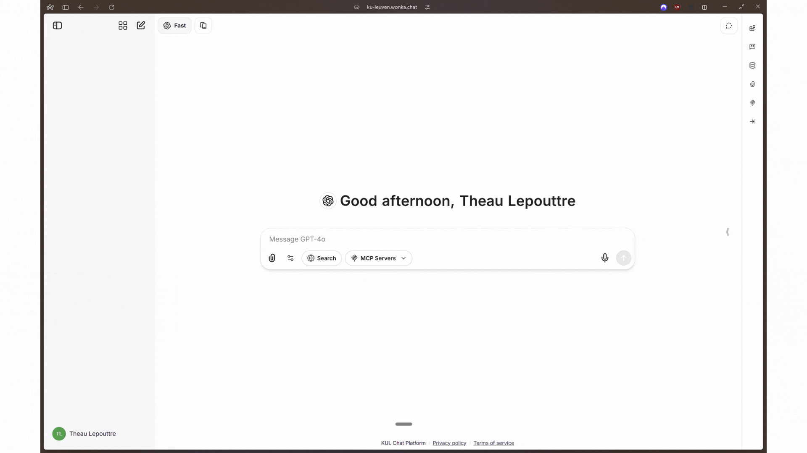
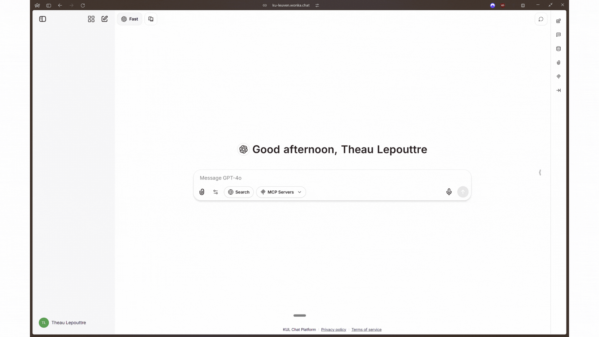
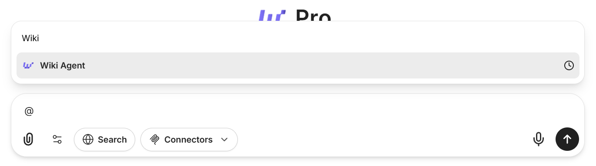

Agents bevinden zich op twee plaatsen: de creatieinterface voor het bouwen en beheren van agents, en de gebruikersinterface voor het starten van gesprekken met agents.

---

## Agents Vinden

### Agent Gebruikersinterface

Er zijn twee manieren om agents te gebruiken en gesprekken te starten met agents:

#### 1. Agent Marketplace

Krijg toegang tot de agent marketplace linksboven op je scherm. De marketplace organiseert agents op categorieën, waardoor het gemakkelijk is om beschikbare agents te ontdekken en te bladeren. Het is vooral handig wanneer je veel agents hebt om uit te kiezen.

<Frame caption="Agent marketplace locatie">

</Frame>

**Functies:**
- Blader agents op categorie
- Zoekfunctionaliteit voor snelle ontdekking
- Bekijk gedetailleerde agentbeschrijvingen

#### 2. Mijn Agents Snelle Toegang

Krijg direct toegang tot je agents vanaf het modelselectie dropdown bovenaan het scherm. Onderaan het dropdown zie je "My Agents". Je kunt eroverheen bewegen om een lijst van al je beschikbare agents met een zoekveld te onthullen.

<Frame caption="Mijn Agents snelle toegang in model selector">

</Frame>

**Functies:**
- Snelle toegang tot je veelgebruikte agents
- Geïntegreerd zoekveld voor snelle agent lookup
- Geen noodzaak om weg te navigeren van je huidige scherm

<Tip>
Snel gebruik: Agents kunnen worden aangeroepen door `@` te typen gevolgd door hun naam direct vanuit elk gesprek.
</Tip>

<Frame caption="Prompt voorbeeld met een aangepast commando '@Wiki'">

</Frame>

---

### Agent Creatie & Beheer

In je WonkaChat-interface, vind de **Agent bouwer** aan de rechterkant van het scherm. Dit paneel stelt je in staat om je AI agents te maken en beheren.

<Frame caption="Agent bouwer paneel locatie">

</Frame>

<Tip>
Als je het rechterpaneel niet ziet, klik dan op het pijlpictogram in het midden-rechts van je scherm om de zijbalk uit te klappen.
</Tip>

**Wat je kunt doen:**
- Maak nieuwe agents aan met aangepaste instructies
- Geef bestanden en mogelijkheden aan agents
- Wijs Tools (Externe Verbindingen) toe aan agents
- Wijzig bestaande agentconfiguraties

<Check>
Alle gebruikers kunnen persoonlijke agents maken. Organisatiebrede deling vereist goedkeuring van de beheerder.
</Check>
---

## Volgende Stappen

<CardGroup cols={2}>
<Card title="Bestaande Agents Gebruiken" icon="play" href="/nl/ai-agents/using-existing-agents">
Leer hoe je de beste resultaten krijgt van vooraf gebouwde agents.
</Card>

<Card title="Je Eerste Agent Maken" icon="plus-circle" href="/nl/ai-agents/creating-your-first-agent">
Bouw je eigen agent op maat gemaakt voor je workflows.
</Card>
</CardGroup>
