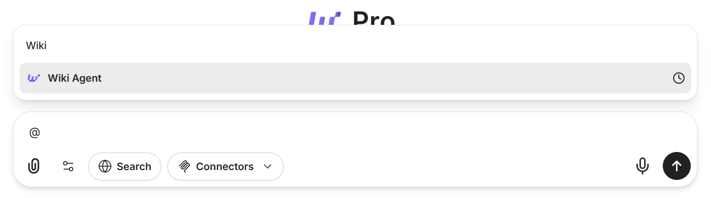

Agenten bevinden zich in de sectie **Agents** van je zijbalk. Daar kun je alle agenten bekijken die je kunt gebruiken, een gesprek starten of een nieuwe agent maken.

---

## De sectie Agents in de zijbalk

Open **Agents** in de zijbalk om te zien:

- **Alle agenten** — opent de volledige agentbibliotheek (`/agents`)
- **Agent maken** — start de geleide creatieflow
- **Vastgezette agenten** — agenten die je als favoriet hebt gemarkeerd
- **Recente agenten** — agenten die je onlangs hebt gebruikt

<Tip>
Klik op een vastgezette of recente agent om er meteen een nieuw gesprek mee te starten.
</Tip>

---

## De agentbibliotheek (Alle agenten)

De bibliotheek organiseert alle agenten die je kunt gebruiken met tabbladen bovenaan:

| Tabblad | Toont |
|---------|-------|
| **Alle** | Alle agenten die je kunt gebruiken |
| **Mijne** | Agenten die jij hebt gemaakt |
| **Favorieten** | Agenten die je hebt vastgezet |
| **Gedeeld met mij** | Agenten die anderen met jou hebben gedeeld |
| **Organisatie** | Alle organisatiebrede agenten (alleen voor beheerders) |

Gebruik het zoekveld en tagfilters om de lijst te verfijnen, en sorteer op naam, eigenaar, model of laatst gebruikt.

**Functies:**
- Agenten doorbladeren en filteren per tabblad
- Zoeken op naam of omschrijving
- Sorteren en filteren met tags
- **Templates bekijken** openen om te starten vanuit een kant-en-klare template in plaats van een lege agent

---

## Snel gebruik vanuit een gesprek

Je kunt elke agent waartoe je toegang hebt rechtstreeks vanuit een gesprek aanroepen door `@` gevolgd door zijn naam te typen.

<Frame caption="Een agent aanroepen met @ vanuit een gesprek">

</Frame>

---

## Een nieuwe agent maken

Klik op **Agent maken** in de zijbalk (of op **Agent maken** in de agentbibliotheek) om de geleide creatieflow te openen.

<Info>
Zie [Je eerste agent maken](/nl/ai-agents/creating-your-first-agent) voor de volledige uitleg.
</Info>

---

## Volgende stappen

<CardGroup cols={2}>
<Card title="Bestaande agenten gebruiken" icon="play" href="/nl/ai-agents/using-existing-agents">
Ontdek hoe je het beste uit bestaande agenten haalt.
</Card>

<Card title="Je eerste agent maken" icon="plus-circle" href="/nl/ai-agents/creating-your-first-agent">
Bouw je eigen agent, afgestemd op jouw workflows.
</Card>
</CardGroup>
