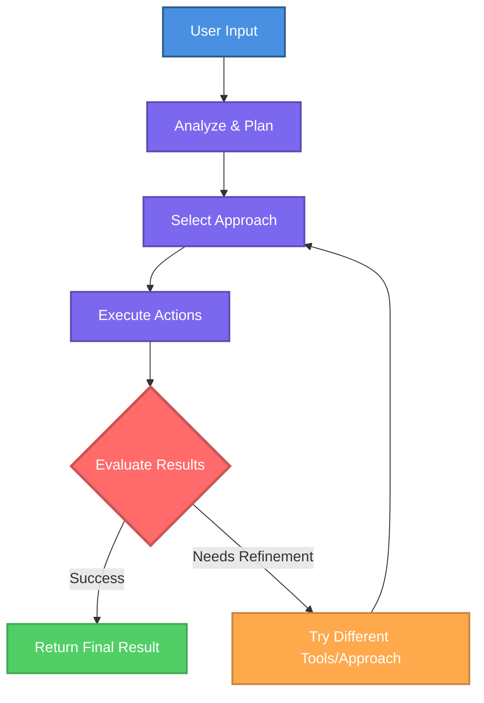

AI agents zijn gespecialiseerde AI-assistenten met persistente instructies en toegewijde tool toegang die consistente, betrouwbare resultaten leveren.

<Info>
Agents zijn zoals AI-teamleden met specifieke rollen en expertise. Ze onthouden hun taak over alle gesprekken heen.
</Info>

---

## Hoe Agents Verschillen van Reguliere Chat

<Tabs>
<Tab title="Aan de Slag">

Reguliere chat begint elke keer opnieuw. Agents hebben persistente instructies, rollen en tools die automatisch van toepassing zijn op elk gesprek.

**Belangrijkste voordelen:**

<CardGroup cols={2}>
<Card title="Persistente Instructies" icon="file-lines">
Geef agents permanente richtlijnen, rollen en expertise die automatisch van toepassing zijn op elk gesprek.
</Card>

<Card title="Consistent Gedrag" icon="equals">
Agents volgen elke keer dezelfde aanpak en leveren voorspelbare, betrouwbare resultaten over alle interacties heen.
</Card>

<Card title="Toegewijde Tools" icon="wrench">
Rust agents uit met specifieke externe verbindingen (MCP) die ze automatisch gebruiken wanneer nodig voor hun taken.
</Card>

<Card title="Gespecialiseerde Rollen" icon="user-tie">
Definieer agentpersoonlijkheden, toon en expertise om te matchen met specifieke workflows of teamfuncties.
</Card>
</CardGroup>

<Check>
Configureer één keer, gebruik overal. Agents behouden hun rol en instructies over alle gesprekken heen.
</Check>

## Wanneer Agents Gebruiken

Gebruik agents voor:
- **Terugkerende workflows**: Taken die je regelmatig uitvoert met consistente vereisten
- **Gespecialiseerde expertise**: Domein-specifieke kennis consistent toegepast
- **Cross-tool workflows**: Complexe taken die meerdere systemen omvatten
- **Team standaardisatie**: Gedeelde workflows over je organisatie

## Agent Voorbeelden

Praktische agents die je kunt maken voor veelvoorkomende zakelijke workflows:

<AccordionGroup>
<Accordion title="E-mail Assistent" icon="envelope">
Bekijk automatisch je laatste ongelezen e-mails, vat belangrijke informatie samen, markeer urgente berichten en stel antwoorden op op basis van je communicatiestijl.

**Benodigde Tools:** E-mail (Outlook, Gmail)  
**Complexiteit:** Eenvoudig
</Accordion>

<Accordion title="Meeting Planner" icon="calendar">
Vind beschikbare tijdslots over meerdere agenda's, plan meetings met deelnemers, verstuur uitnodigingen en maak meeting agenda's aan op basis van meeting context.

**Benodigde Tools:** Agenda, E-mail  
**Complexiteit:** Eenvoudig
</Accordion>

<Accordion title="Customer Support Agent" icon="headset">
Behandel klantvragen door toegang te krijgen tot je CRM, bestelstatus te controleren, restitutie aanvragen te verwerken binnen gedefinieerde limieten en complexe kwesties te escaleren naar menselijke agents.

**Benodigde Tools:** CRM, Orderbeheer, E-mail  
**Complexiteit:** Gemiddeld
</Accordion>

<Accordion title="Data Analyse Agent" icon="chart-line">
Bevraag databases voor verkoopdata, voer cohortanalyse uit, identificeer trends en genereer rapporten met visualisaties op basis van je rapportagestandaarden.

**Benodigde Tools:** Database, Spreadsheet, Visualisatietools  
**Complexiteit:** Gemiddeld
</Accordion>

<Accordion title="Lead Kwalificatie Agent" icon="user-check">
Bekijk nieuwe leads uit meerdere bronnen, verrijk data uit publieke bronnen, score op basis van je criteria, wijs toe aan geschikte salesteamleden en verstuur gepersonaliseerde outreach.

**Benodigde Tools:** CRM, E-mail, Data verrijking  
**Complexiteit:** Complex
</Accordion>

<Accordion title="Cross-System Workflow Agent" icon="diagram-project">
Orkestreer processen over meerdere systemen. Bijvoorbeeld, haal informatie op uit Outlook, maak records aan in Odoo, update spreadsheets en breng teams op de hoogte via berichtenplatforms.

**Benodigde Tools:** Meerdere systeemintegraties  
**Complexiteit:** Complex
</Accordion>
</AccordionGroup>

<Tip>
Begin met eenvoudige, single-purpose agents en breid uit naar meer complexe workflows naarmate je ervaring opdoet.
</Tip>

---

## Aan de Slag met Agents

<CardGroup cols={2}>
  <Card
    title="Agents Vinden en Gebruiken"
    icon="magnifying-glass"
    href="/nl/ai-agents/finding-and-accessing-agents"
  >
    Leer waar agents zich bevinden en hoe je ze kunt gebruiken in WonkaChat.
  </Card>
  <Card
    title="Bestaande Agents Gebruiken"
    icon="play"
    href="/nl/ai-agents/using-existing-agents"
  >
    Begin met het gebruiken van vooraf gebouwde agents gemaakt door je organisatie.
  </Card>
  <Card
    title="Je Eerste Agent Maken"
    icon="plus-circle"
    href="/nl/ai-agents/creating-your-first-agent"
  >
    Bouw je eigen agent op maat gemaakt voor je specifieke workflows.
  </Card>
  <Card
    title="Business Teaching"
    icon="graduation-cap"
    href="/nl/ai-agents/business-teaching"
  >
    Geef bedrijfscontext aan agents voor betere, nauwkeurigere resultaten.
  </Card>
</CardGroup>

</Tab>

<Tab title="Geavanceerde Kennis">

## Agent Architectuur

Agents zijn gebouwd op verschillende belangrijke componenten die samenwerken om gespecialiseerde AI-assistenten te creëren:

<AccordionGroup>
<Accordion title="1. Agent Naam" icon="tag">
Een duidelijke, beschrijvende identifier die het doel van de agent aangeeft en het gemakkelijk maakt om te vinden en te selecteren bij het starten van gesprekken.
</Accordion>

<Accordion title="2. System Prompt (Instructies)" icon="file-lines">
De **system prompt** is de fundamentele set instructies die de identiteit en het gedrag van je agent definieert. In tegenstelling tot reguliere gespreksberichten die kunnen worden gewijzigd of genegeerd, is de system prompt persistent en gezaghebbend. Deze prompt vormt elk antwoord dat de agent genereert.

**System prompts bevatten:**
- Roldefinitie en expertisegebieden
- Communicatietoon en stijl
- Operationele regels en beperkingen
- Bedrijfscontext en beleid
- Decision-making frameworks
- Foutafhandeling procedures

De kwaliteit van je system prompt heeft direct impact op de effectiviteit van de agent. Goed opgestelde instructies produceren consistente, betrouwbare resultaten; vage instructies leiden tot onvoorspelbaar gedrag.
</Accordion>

<Accordion title="3. Model Selectie" icon="microchip">
Het AI-model is een belangrijke keuze die zowel prestaties als kosten aanzienlijk beïnvloedt. Verschillende modellen hebben verschillende mogelijkheden, snelheid en prijzen.

**Belangrijke overwegingen:**
- **Prestaties**: Meer capabele modellen (thinking modellen) blinken uit in complexe redenering maar zijn duurder
- **Kosten**: Eenvoudigere modellen zijn kosteneffectief voor eenvoudige taken
- **Snelheid**: Snellere modellen verminderen latentie voor high-frequency interacties
- **Context window**: Bepaalt hoeveel informatie de agent in één keer kan verwerken

<Warning>
Modelselectie heeft impact op de kwaliteit en operationele kosten van je agent. Match modelcapaciteit met taakomcomplexiteit: geef niet te veel uit aan eenvoudige taken of te weinig aan complexe workflows.
</Warning>

Naast de modelkeuze kun je **modelparameters** aanpassen die randomness, creativiteit en herhaling van reacties controleren. Zie [Je Eerste Agent Maken](/ai-agents/creating-your-first-agent) voor gedetailleerde parameterconfiguratie.
</Accordion>

<Accordion title="4. Mogelijkheden" icon="wand-magic-sparkles">
Agents kunnen worden uitgerust met verschillende mogelijkheden naast tekstgeneratie:

**Code Execution**: Voer code snippets uit om berekeningen, datatransformaties of complexe logische operaties uit te voeren.

**Web Search**: Krijg toegang tot actuele informatie van het internet wanneer nodig voor real-time data of recente gebeurtenissen.

**Externe Verbindingen (MCP)**: De belangrijkste mogelijkheid, directe integratie met je zakelijke systemen via het Model Context Protocol.

Agents selecteren dynamisch welke tools ze gebruiken op basis van de taak en hun system prompt richtlijnen.

<Info>
**MCP** verbindt agents met je zakelijke systemen voor echte acties.\
Zie [Tools Connection](/tools-connection/introduction) voor setup details.
</Info>

</Accordion>
</AccordionGroup>

## Execution Loop

Agents werken autonoom via een continue loop, itereren tot ze het gewenste resultaat behalen:

<Check>
Agents itereren door meerdere benaderingen en toolcombinaties totdat ze de taak met succes voltooien of gedefinieerde limieten bereiken.
</Check>

## Model Selectie

WonkaChat ondersteunt meerdere AI-providers, waardoor je elk model kunt kiezen dat het beste bij je behoeften past. Modelselectie hangt af van verschillende factoren:

- **Taakomcomplexiteit**: Meer complexe redenering vereist meer capabele modellen
- **Response snelheid**: Sommige modellen prioriteren snellere reacties
- **Kostenover wegingen**: Modelprijzen variëren aanzienlijk tussen providers

<Info>
Voor gedetailleerde richtlijnen over het selecteren van het juiste model voor je agent, zie [Je Eerste Agent Maken](/ai-agents/creating-your-first-agent).
</Info>

## Beveiliging en Toegangscontrole

### Permissie Overerving

Agents werken binnen je bestaande beveiligingsgrenzen. Ze kunnen geen enkele actie uitvoeren die je niet zelf zou kunnen uitvoeren zonder WonkaChat. Als je geen permissie hebt om toegang te krijgen tot een systeem, een bestand te lezen of een operatie handmatig uit te voeren, kan de agent deze beperkingen niet voor je omzeilen.

<Info>
Zie [Security & Governance](/security-governance/access-control) voor uitgebreide beveiligingsdetails.
</Info>

</Tab>
</Tabs>
