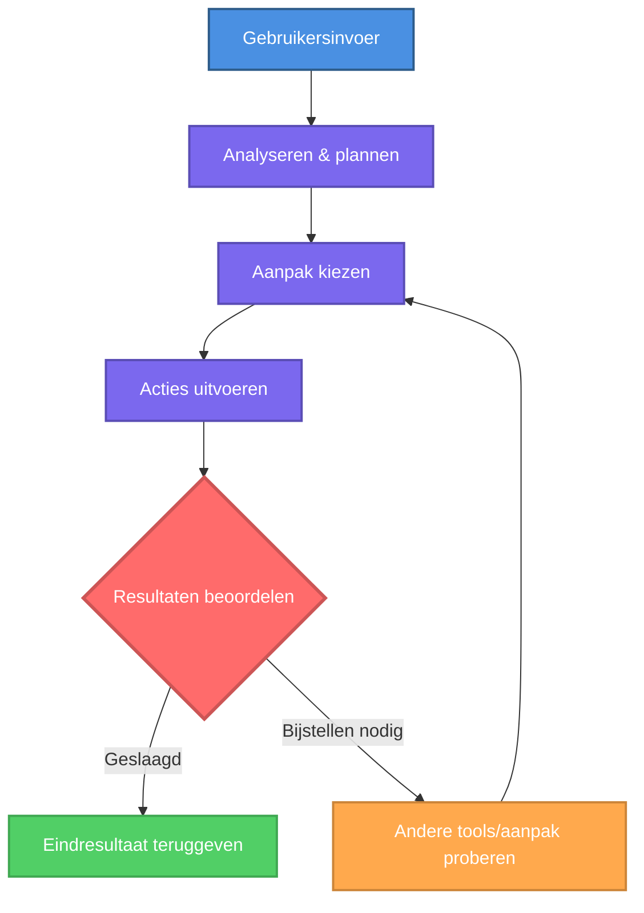

AI-agenten zijn gespecialiseerde AI-assistenten met permanente instructies en toegang tot specifieke tools, die consistente en betrouwbare resultaten leveren.

<Info>
Agenten zijn als AI-teamleden met een duidelijke rol en expertise. Ze onthouden hun taak in elk gesprek.
</Info>

---

## Hoe een agent verschilt van een gewoon gesprek

<Tabs>
<Tab title="Aan de slag">

Een gewoon gesprek begint elke keer opnieuw. Een agent heeft permanente instructies, een rol en tools die automatisch gelden in elk gesprek.

**Belangrijkste voordelen:**

<CardGroup cols={2}>
<Card title="Permanente instructies" icon="file-lines">
Geef een agent blijvende richtlijnen, een rol en expertise die automatisch gelden in elk gesprek.
</Card>

<Card title="Consistent gedrag" icon="equals">
Een agent volgt telkens dezelfde aanpak, met voorspelbare en betrouwbare resultaten.
</Card>

<Card title="Specifieke tools" icon="wrench">
Rust een agent uit met specifieke connectors die hij automatisch gebruikt wanneer nodig.
</Card>

<Card title="Gespecialiseerde rollen" icon="user-tie">
Bepaal de persoonlijkheid, toon en expertise van een agent voor een specifieke workflow of functie.
</Card>
</CardGroup>

<Check>
Eén keer instellen, overal gebruiken. Een agent behoudt zijn rol en instructies in elk gesprek.
</Check>

## Wanneer gebruik je een agent?

Gebruik een agent voor:
- **Terugkerende workflows**: taken die je regelmatig uitvoert met consistente vereisten
- **Gespecialiseerde expertise**: domeinkennis die consistent wordt toegepast
- **Workflows over meerdere tools**: complexe taken die meerdere systemen doorkruisen
- **Standaardisatie binnen het team**: gedeelde workflows binnen je organisatie

## Voorbeelden van agenten

Praktische agenten die je kunt maken voor veelvoorkomende zakelijke workflows:

<AccordionGroup>
<Accordion title="E-mailassistent" icon="envelope">
Bekijkt automatisch je ongelezen e-mails, vat de belangrijkste informatie samen, markeert urgente berichten en stelt reacties op in jouw communicatiestijl.

**Benodigde connectors:** Outlook of Gmail
**Complexiteit:** Eenvoudig
</Accordion>

<Accordion title="Vergaderplanner" icon="calendar">
Vindt beschikbare tijdslots over meerdere agenda's, plant vergaderingen met deelnemers en stelt een agenda op op basis van de context.

**Benodigde connectors:** Agenda, e-mail
**Complexiteit:** Eenvoudig
</Accordion>

<Accordion title="Klantenserviceagent" icon="headset">
Behandelt klantvragen door je CRM te raadplegen, controleert bestelstatussen en escaleert complexe zaken naar een medewerker.

**Benodigde connectors:** CRM, orderbeheer, e-mail
**Complexiteit:** Gemiddeld
</Accordion>

<Accordion title="Data-analyseagent" icon="chart-line">
Bevraagt je verkoopdatabases, signaleert trends en genereert rapporten volgens jouw rapportagestandaarden.

**Benodigde connectors:** Database, spreadsheet
**Complexiteit:** Gemiddeld
</Accordion>

<Accordion title="Leadkwalificatieagent" icon="user-check">
Beoordeelt nieuwe leads, scoort ze volgens jouw criteria en stelt gepersonaliseerde outreach op.

**Benodigde connectors:** CRM, e-mail
**Complexiteit:** Complex
</Accordion>

<Accordion title="Cross-systeem workflowagent" icon="diagram-project">
Coördineert een proces over meerdere systemen: haalt informatie op uit Outlook, maakt records aan in je ERP en werkt een spreadsheet bij.

**Benodigde connectors:** Meerdere integraties
**Complexiteit:** Complex
</Accordion>
</AccordionGroup>

<Tip>
Begin met eenvoudige agenten met één doel en breid uit naar complexere workflows naarmate je ervaring opdoet.
</Tip>

---

## Aan de slag met agenten

<CardGroup cols={2}>
  <Card title="Agenten vinden en openen" icon="magnifying-glass" href="/nl/ai-agents/finding-and-accessing-agents">
    Ontdek waar agenten zich bevinden in WonkaChat en hoe je ze opent.
  </Card>
  <Card title="Bestaande agenten gebruiken" icon="play" href="/nl/ai-agents/using-existing-agents">
    Begin met het gebruik van agenten die door jou of je organisatie zijn gemaakt.
  </Card>
  <Card title="Je eerste agent maken" icon="plus-circle" href="/nl/ai-agents/creating-your-first-agent">
    Bouw je eigen agent, afgestemd op jouw specifieke workflows.
  </Card>
  <Card title="Zakelijke context meegeven" icon="graduation-cap" href="/nl/ai-agents/business-teaching">
    Geef agenten zakelijke context voor betere, nauwkeurigere resultaten.
  </Card>
</CardGroup>

</Tab>

<Tab title="Verdieping">

## Architectuur van een agent

Een agent is opgebouwd uit verschillende kernonderdelen die samenwerken:

<AccordionGroup>
<Accordion title="1. Naam van de agent" icon="tag">
Een duidelijke, beschrijvende naam waarmee je de agent makkelijk terugvindt en selecteert bij het starten van een gesprek.
</Accordion>

<Accordion title="2. Instructies" icon="file-lines">
De **instructies** vormen de basisset richtlijnen die de identiteit en het gedrag van je agent bepalen. In tegenstelling tot gewone berichten in een gesprek zijn instructies permanent en bepalen ze elk antwoord dat de agent geeft.

**Instructies bevatten doorgaans:**
- Rolomschrijving en expertisegebieden
- Communicatietoon en -stijl
- Operationele regels en beperkingen
- Zakelijke context en beleid
- Beslissingscriteria

De kwaliteit van je instructies bepaalt rechtstreeks hoe effectief een agent is. Duidelijke instructies leveren consistente, betrouwbare resultaten op; vage instructies leiden tot onvoorspelbaar gedrag.
</Accordion>

<Accordion title="3. Modelkeuze" icon="microchip">
De modelkeuze beïnvloedt zowel de kwaliteit als de snelheid. WonkaChat groepeert modellen op grootte — snel / standaard / geavanceerd — in plaats van per aanbieder, zodat je kiest op basis van de taak.

**Overwegingen:**
- **Prestaties**: geavanceerdere modellen zijn beter in complexe, meerstaps-redenering
- **Snelheid**: snellere modellen verminderen de latentie bij frequente interacties
- **Contextvenster**: hoeveel informatie de agent tegelijk kan verwerken

<Warning>
Modelkeuze heeft invloed op zowel kwaliteit als operationele kosten. Stem de modelgrootte af op de complexiteit van de taak.
</Warning>

Zie [Een model kiezen](/nl/improved-usage/choosing-a-model) voor een leidraad, en [Je eerste agent maken](/nl/ai-agents/creating-your-first-agent) om dit toe te passen.
</Accordion>

<Accordion title="4. Mogelijkheden" icon="wand-magic-sparkles">
Een agent kan worden uitgerust met mogelijkheden naast tekstgeneratie:

**Code uitvoering**: voert codefragmenten uit voor berekeningen, datatransformaties of complexe logica — indien geactiveerd voor je organisatie.

**Zoeken op het web**: haalt actuele informatie van internet op wanneer nodig — indien geactiveerd voor je organisatie en toegestaan voor de agent.

**Connectors (MCP)**: de belangrijkste mogelijkheid, directe integratie met je bedrijfssystemen via het Model Context Protocol.

De agent kiest dynamisch welke tool te gebruiken op basis van de taak en zijn instructies.

<Info>
Connectors koppelen een agent aan je bedrijfssystemen voor echte acties. Zie [Tools verbinden](/nl/tools-connection/introduction) voor het instellen ervan.
</Info>
</Accordion>
</AccordionGroup>

## Uitvoeringslus

Een agent werkt autonoom via een continue lus, en herhaalt stappen tot het gewenste resultaat is bereikt:

```mermaid
graph TD
    A[Gebruikersinvoer] --> B[Analyseren & plannen]
    B --> C[Aanpak kiezen]
    C --> D[Acties uitvoeren]
    D --> E{Resultaten beoordelen}
    E -->|Geslaagd| F[Eindresultaat teruggeven]
    E -->|Bijstellen nodig| G[Andere tools/aanpak proberen]
    G --> C

    style A fill:#4A90E2,stroke:#2E5C8A,stroke-width:2px,color:#fff
    style B fill:#7B68EE,stroke:#5A4DB5,stroke-width:2px,color:#fff
    style C fill:#7B68EE,stroke:#5A4DB5,stroke-width:2px,color:#fff
    style D fill:#7B68EE,stroke:#5A4DB5,stroke-width:2px,color:#fff
    style E fill:#FF6B6B,stroke:#CC5555,stroke-width:3px,color:#fff
    style F fill:#51CF66,stroke:#40A852,stroke-width:2px,color:#fff
    style G fill:#FFA94D,stroke:#CC8539,stroke-width:2px,color:#fff
```

<Check>
Een agent doorloopt meerdere aanpakken en tool-combinaties tot de taak lukt of een gestelde limiet is bereikt.
</Check>

## Beveiliging en toegangscontrole

### Overerving van rechten

Een agent werkt binnen jouw bestaande beveiligingsgrenzen. Hij kan geen enkele actie uitvoeren die jij zelf niet zou kunnen uitvoeren. Heb je geen toestemming om een systeem te benaderen, een bestand te lezen of een handeling handmatig uit te voeren, dan kan de agent die beperking niet omzeilen.

<Info>
Zie [Beveiliging & governance](/nl/security-governance/security-overview) voor alle beveiligingsdetails.
</Info>

</Tab>
</Tabs>
