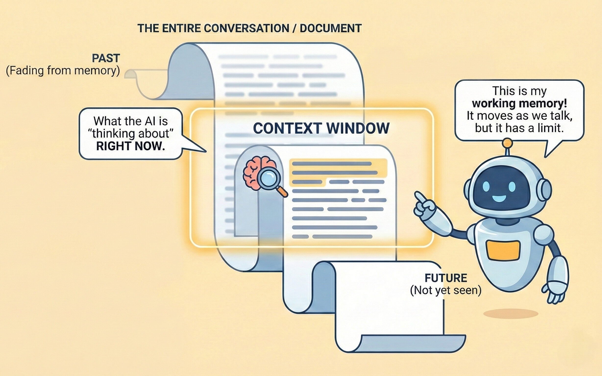

Begrijpen hoe AI-modellen gespreksgeschiedenis verwerken is essentieel voor het krijgen van consistente, relevante antwoorden. Deze gids legt contextvensters uit en strategieën voor effectief gespreksbeheer.

<Info>
AI-modellen hebben geen geheugen over afzonderlijke gesprekken, ze onthouden alleen wat in het contextvenster van het huidige gesprek staat.
</Info>


<Tabs>
<Tab title="Aan de Slag">

## Wat is een Contextvenster?

Beschouw het contextvenster als het "werkgeheugen" van de AI - het is hoeveel van je gesprek de AI kan "zien" en onthouden op een bepaald moment.

**Analogie:**
Stel je voor dat je een boek leest door een smalle gleuf die je maar een paar pagina's tegelijk laat zien. Als je de gleuf naar voren schuift om nieuwe pagina's te lezen, schuiven de eerdere pagina's uit het zicht. Zo werkt een contextvenster.

<Frame caption="Contextvenster visualisatie - Geheugenverlies">

</Frame>

### Waarom het Belangrijk is

<CardGroup cols={2}>
<Card title="Antwoordrelevantie" icon="bullseye">
De AI kan alleen verwijzen naar informatie binnen zijn huidige contextvenster.
</Card>

<Card title="Samenhang" icon="link">
Details van vroeg in zeer lange gesprekken kunnen "vergeten" worden als ze buiten het venster vallen.
</Card>
</CardGroup>

### Wat Gebeurt er Wanneer Context Vol Raakt?

Wanneer een gesprek het contextvenster overschrijdt, "vergeet" de AI de vroegste delen van je gesprek. Dit kan leiden tot:

- Verlies van context van eerdere beslissingen of informatie
- Potentiële inconsistentie met eerdere uitspraken
- Verwarde antwoorden wanneer je verwijst naar oude berichten

<Warning>
Als je verwijst naar iets van veel eerder in een lang gesprek en een verward antwoord krijgt, is het contextvenster mogelijk vol. Start een nieuw gesprek en vat de relevante context samen.
</Warning>

---

## Wanneer een Gesprek Starten of Voortzetten

Gebruik de volgende richtlijnen om te beslissen of je een nieuw gesprek start of je huidige gesprek voortzet voor optimale AI-antwoorden.

<Tabs>
<Tab title="Start een Nieuw Gesprek" icon="sparkles">

Je moet een nieuw gesprek starten wanneer:

<CardGroup cols={2}>
<Card title="Onderwerpen Wisselen" icon="arrows-turn-to-dots">
Je gaat naar een compleet ongerelateerd onderwerp.
</Card>

<Card title="AI Raakt Verward" icon="circle-question">
De AI lijkt verward of geeft onnauwkeurige, off-topic of incorrecte antwoorden.
</Card>

<Card title="Lange Uitwisselingen" icon="scroll">
Je gesprek is langdurig geworden met uitgebreide heen-en-weer.
</Card>

<Card title="Behoefte aan Fris Perspectief" icon="broom-ball">
Je wilt een onbevooroordeeld antwoord, vrij van eerdere gesprekscontext.
</Card>
</CardGroup>

<Warning>
Als de antwoordkwaliteit daalt of de AI verwijst naar verouderde informatie, is het vaak efficiënter om een nieuw gesprek te starten met een beknopte samenvatting van je huidige behoeften in plaats van te proberen het lopende gesprek te corrigeren.
</Warning>

</Tab>


<Tab title="Zet het Huidige Gesprek Voort" icon="layer-group">

Zet het huidige gesprek voort wanneer:

<CardGroup cols={2}>
<Card title="Voortbouwen op Eerder Werk" icon="layer-group">
Elke uitwisseling bouwt direct voort op eerdere vragen of resultaten.
</Card>

<Card title="Iteratieve Verfijning" icon="pen-to-square">
Je bent het eerder besprokene aan het verbeteren, verfijnen of herzien.
</Card>

<Card title="Gerelateerde Subonderwerpen Verkennen" icon="sitemap">
Je verdiept je in gerelateerde facetten of aspecten van hetzelfde algemene onderwerp.
</Card>

<Card title="Context Behouden" icon="memory">
De AI moet eerdere details, keuzes of beperkingen onthouden om effectief te reageren.
</Card>
</CardGroup>

<Tip>
Vraag jezelf af: "Heeft de AI onze eerdere discussie nodig om dit goed te beantwoorden?" Zo ja, ga door. Zo nee, start een nieuw gesprek.
</Tip>

</Tab>
</Tabs>


---

## Voortbouwen op Eerdere Antwoorden

Effectieve gespreksstroom bouwt natuurlijk voort op wat al besproken is.

**Voorbeeldprogressie:**
```
Jij: "Leg de voordelen van containerisatie met Docker uit."

AI: [Geeft uitleg inclusief draagbaarheid, consistentie en isolatie]

Jij: "Je noemde isolatie als een voordeel. Hoe verhoudt Docker's isolatie 
zich tot traditionele virtuele machines op het gebied van resourcegebruik?"
```

In langere gesprekken, vat periodiek belangrijke punten samen om belangrijke context te versterken:

```
Tot nu toe hebben we vastgesteld dat:
1. Microservices schaalbaarheidsvoordelen bieden voor onze use case
2. Het team Kubernetes-ervaring nodig heeft
3. De initiële opzetkosten ongeveer 3 maanden zijn

Gegeven deze context, wat is de aanbevolen teamstructuur?
```

</Tab>
<Tab title="Geavanceerde Kennis">
 
### Tokens en Modelselectie Begrijpen

Contextvensters worden gemeten in **tokens** die ongeveer 4 tekens of ongeveer ¾ van een woord vertegenwoordigen.

**Veelvoorkomende Modellen en Hun Contextvensters:**

| Model | Contextvenster | Het Beste Voor |
|-------|---------------|----------|
| **GPT-4o** | 128K tokens | Gebalanceerde prestaties, algemene taken |
| **GPT-4o mini** | 128K tokens | Hoog volume, kosteneffectieve gesprekken |
| **Claude Sonnet 4** | 200K tokens | Geavanceerd redeneren, documentanalyse |
| **Gemini 2.5 Pro** | 1M tokens | Uitgebreide gesprekken, grote documentanalyse |
| **Gemini 2.5 Flash** | 1M tokens | Snelheid-geoptimaliseerde lange gesprekken |

<Info>
Bij het selecteren van een model in WonkaChat, houd rekening met het contextvenster als je uitgebreide gesprekken plant. Lees meer in [Je Eerste Agent Maken](/nl/ai-agents/creating-your-first-agent).
</Info>

### Meerdere Werkstromen Beheren

Voor het jongleren met meerdere projecten, gebruik afzonderlijke gesprekken per project:

```
Gesprek 1: "Project Alpha - Frontend Ontwikkeling"
Gesprek 2: "Project Alpha - Backend API"
Gesprek 3: "Project Beta - Data-analyse"
```

Deze aanpak houdt context schoon en voorkomt "vervuiling" van je contextvenster met informatie die toekomstige antwoorden zou kunnen beïnvloeden.

### Context Rehydrateren

Bij het starten van een nieuw gesprek over een gerelateerd onderwerp, geef een beknopte samenvatting van relevante eerdere context:

```
"Context van vorige sessie: We implementeren een nieuw CRM-systeem voor 
ons verkoopteam van 50 mensen. Budget is €100K, tijdlijn is 6 maanden, en 
we hebben integratie nodig met ons bestaande e-mailplatform en kalendersysteem.

Nieuwe vraag: Gegeven deze vereisten, welke trainingsaanpak zou je 
aanbevelen voor onboarding van het verkoopteam?"
```
</Tab>
</Tabs>

## Veelvoorkomende Valkuilen om te Vermijden

<AccordionGroup>
<Accordion title="Verwachten dat de AI Eerdere Gesprekken Onthoudt">
**Probleem:** Een nieuw gesprek beginnen met "Zoals we gisteren bespraken..." zonder context te herstellen.

**Oplossing:** Geef altijd relevante context aan het begin van nieuwe gesprekken.
</Accordion>

<Accordion title="Eén Gesprek Overbelasten">
**Probleem:** Eén gesprek gebruiken voor meerdere niet-gerelateerde taken, wat leidt tot verwarde antwoorden.

**Oplossing:** Start nieuwe gesprekken voor verschillende onderwerpen.
</Accordion>

<Accordion title="Kwaliteitsachteruitgang Negeren">
**Probleem:** Een gesprek voortzetten zelfs wanneer antwoorden minder relevant of nauwkeurig worden.

**Oplossing:** Herken wanneer het contextvenster vol is en start opnieuw met een samenvatting.
</Accordion>
</AccordionGroup>
