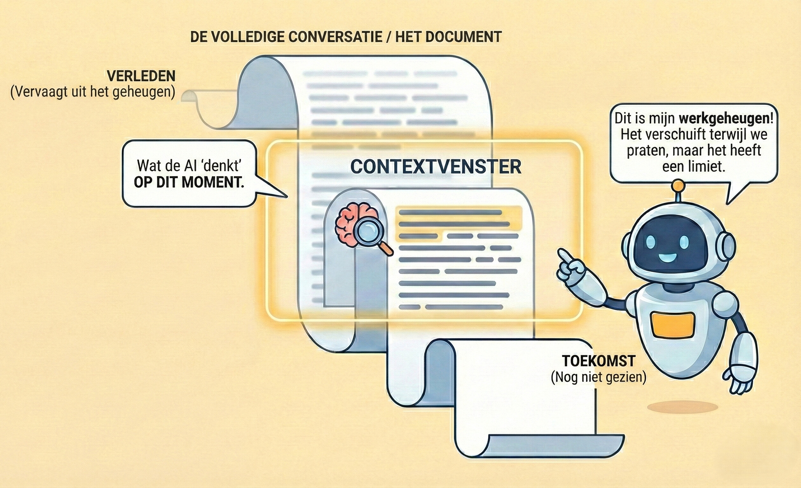

Begrijpen hoe AI-modellen gespreksgeschiedenis verwerken, is essentieel om consistente, relevante antwoorden te krijgen. Deze gids legt contextvensters uit en biedt strategieën voor effectief gespreksbeheer.

<Info>
Binnen één gesprek onthoudt de AI alles wat in het contextvenster past. Een apart gesprek deelt die geschiedenis niet automatisch — tenzij uw organisatie [Memories](/nl/improved-usage/memories) of [Projects](/nl/improved-usage/projects) gebruikt om context tussen gesprekken door te geven.
</Info>

<Tabs>
<Tab title="Aan de slag">

## Wat is een contextvenster?

Beschouw het contextvenster als het "werkgeheugen" van de AI — het is hoeveel van uw gesprek de AI op een bepaald moment kan "zien" en onthouden.

**Analogie:**
Stel u leest een boek door een smalle gleuf die maar een paar pagina's tegelijk toont. Terwijl u de gleuf naar voren schuift om nieuwe pagina's te lezen, schuiven de eerdere pagina's uit beeld. Zo werkt een contextvenster.

<Frame caption="Visualisatie van het contextvenster">

</Frame>

### Waarom het belangrijk is

<CardGroup cols={2}>
<Card title="Relevantie van antwoorden" icon="bullseye">
De AI kan alleen verwijzen naar informatie binnen het huidige contextvenster.
</Card>

<Card title="Samenhang" icon="link">
Details van vroeg in zeer lange gesprekken kunnen buiten het venster vallen.
</Card>
</CardGroup>

### Wat gebeurt er wanneer de context vol raakt?

Wanneer een gesprek het contextvenster overschrijdt, verliest de AI toegang tot de vroegste delen van uw gesprek. Dit kan leiden tot:

- Verlies van context over eerdere beslissingen of informatie
- Mogelijke inconsistentie met eerdere uitspraken
- Verwarde antwoorden wanneer u naar oude berichten verwijst

<Warning>
Verwijst u naar iets van veel eerder in een lang gesprek en krijgt u een verward antwoord? Dan is het contextvenster mogelijk vol. Start een nieuw gesprek en vat de relevante context samen.
</Warning>

---

## Wanneer start of vervolgt u een gesprek?

Gebruik onderstaande richtlijnen om te beslissen of u een nieuw gesprek start of het huidige voortzet, voor optimale AI-antwoorden.

<Tabs>
<Tab title="Start een nieuw gesprek" icon="sparkles">

Start een nieuw gesprek wanneer:

<CardGroup cols={2}>
<Card title="U van onderwerp wisselt" icon="arrows-turn-to-dots">
U gaat over naar een volledig ongerelateerd onderwerp.
</Card>

<Card title="De AI in de war raakt" icon="circle-question">
De AI lijkt verward of geeft onnauwkeurige, irrelevante of onjuiste antwoorden.
</Card>

<Card title="Het gesprek lang wordt" icon="scroll">
Uw gesprek is lang geworden, met veel heen-en-weer.
</Card>

<Card title="U een frisse blik wilt" icon="broom-ball">
U wilt een onbevooroordeeld antwoord, los van de eerdere discussie.
</Card>
</CardGroup>

<Warning>
Als de antwoordkwaliteit daalt of de AI verouderde informatie blijft aanhalen, is het vaak efficiënter om een nieuw gesprek te starten met een beknopte samenvatting van uw huidige behoefte, in plaats van het lopende gesprek te proberen te corrigeren.
</Warning>

</Tab>

<Tab title="Zet het huidige gesprek voort" icon="layer-group">

Zet het huidige gesprek voort wanneer:

<CardGroup cols={2}>
<Card title="U voortbouwt op eerder werk" icon="layer-group">
Elke uitwisseling bouwt direct voort op eerdere vragen of resultaten.
</Card>

<Card title="U iteratief verfijnt" icon="pen-to-square">
U verbetert, verfijnt of herziet wat eerder is besproken.
</Card>

<Card title="U verwante subonderwerpen verkent" icon="sitemap">
U verdiept zich in gerelateerde facetten van hetzelfde onderwerp.
</Card>

<Card title="Context behouden moet blijven" icon="memory">
De AI moet eerdere details, keuzes of beperkingen onthouden om goed te kunnen antwoorden.
</Card>
</CardGroup>

<Tip>
Vraag uzelf af: "Heeft de AI onze eerdere discussie nodig om dit goed te beantwoorden?" Zo ja, ga door. Zo niet, start een nieuw gesprek.
</Tip>

</Tab>
</Tabs>

---

## Voortbouwen op eerdere antwoorden

Een effectief gespreksverloop bouwt op natuurlijke wijze voort op wat al besproken is.

**Voorbeeld van opbouw:**
```
U: "Leg de voordelen van containerisatie met Docker uit."

AI: [Geeft uitleg over onder meer draagbaarheid, consistentie en isolatie]

U: "U noemde isolatie als voordeel. Hoe verhoudt Docker's isolatie zich 
tot traditionele virtuele machines qua resourcegebruik?"
```

Vat in langere gesprekken periodiek de belangrijkste punten samen om belangrijke context te versterken:

```
Tot nu toe hebben we vastgesteld dat:
1. Microservices schaalbaarheidsvoordelen bieden voor onze use case
2. Het team Kubernetes-ervaring nodig heeft
3. De initiële opzetkosten ongeveer 3 maanden bedragen

Gegeven deze context, welke teamstructuur raadt u aan?
```

</Tab>
<Tab title="Geavanceerde kennis">

### Tokens en modelkeuze begrijpen

Contextvensters worden gemeten in **tokens**, die ongeveer 4 tekens of ¾ woord vertegenwoordigen.

De grootte van een model bepaalt een afweging tussen contextlengte, snelheid en redeneerdiepte: snelle modellen hebben doorgaans kleinere contextvensters, terwijl standaard- en geavanceerde redeneermodellen grotere vensters bieden — soms groot genoeg om lange gesprekken of hele documenten in één contextvenster te bevatten.

<Info>
Houd bij het kiezen van een model in WonkaChat rekening met het contextvenster als u lange gesprekken of documenten verwacht. Zie [Een model kiezen](/nl/improved-usage/choosing-a-model) voor uitleg over modelgroottes, de Router en de modi Fast/Pro.
</Info>

### Meerdere werkstromen beheren

Gebruik voor het jongleren met meerdere projecten aparte gesprekken per project:

```
Gesprek 1: "Project Alpha - Frontend-ontwikkeling"
Gesprek 2: "Project Alpha - Backend API"
Gesprek 3: "Project Beta - Data-analyse"
```

Deze aanpak houdt de context overzichtelijk en voorkomt dat uw contextvenster "vervuild" raakt met informatie die toekomstige antwoorden kan beïnvloeden.

<Tip>
Beheert u meerdere gerelateerde gesprekken voor hetzelfde stuk werk? Overweeg dan om ze te groeperen in een [Project](/nl/improved-usage/projects) — gerelateerde chats blijven bij elkaar en kunnen contextinformatie op projectniveau delen.
</Tip>

### Context herstellen

Geef bij het starten van een nieuw gesprek over een gerelateerd onderwerp een beknopte samenvatting van de relevante eerdere context:

```
"Context van vorige sessie: we implementeren een nieuw CRM-systeem voor 
ons verkoopteam van 50 mensen. Budget is €100.000, tijdlijn is 6 maanden, en 
we hebben integratie nodig met ons bestaande e-mailplatform en agendasysteem.

Nieuwe vraag: welke trainingsaanpak raadt u aan voor de onboarding van het 
verkoopteam, gegeven deze vereisten?"
```

### Eerdere gesprekken terugvinden

Uw eerdere gesprekken raken niet kwijt wanneer u een nieuw gesprek start. Gebruik **Conversations** in de zijbalk om ze terug te vinden en opnieuw te openen, en **Gearchiveerde chats** om gesprekken te doorzoeken die u heeft gearchiveerd om uw zijbalk overzichtelijk te houden.

</Tab>
</Tabs>

## Veelvoorkomende valkuilen om te vermijden

<AccordionGroup>
<Accordion title="Verwachten dat de AI zich een ongerelateerd gesprek herinnert">
**Probleem:** Een nieuw gesprek beginnen met "Zoals we gisteren bespraken..." zonder de context opnieuw te geven, terwijl die eerdere discussie in een apart, ongerelateerd gesprek plaatsvond.

**Oplossing:** Geef de relevante context opnieuw, of gebruik een gedeeld [Project](/nl/improved-usage/projects) als het om doorlopend, gerelateerd werk gaat.
</Accordion>

<Accordion title="Eén gesprek overbelasten">
**Probleem:** Eén gesprek gebruiken voor meerdere ongerelateerde taken, wat tot verwarde antwoorden leidt.

**Oplossing:** Start nieuwe gesprekken voor afzonderlijke onderwerpen.
</Accordion>

<Accordion title="Kwaliteitsverlies negeren">
**Probleem:** Een gesprek voortzetten terwijl de antwoorden minder relevant of nauwkeurig worden.

**Oplossing:** Herken wanneer het contextvenster vol is en begin opnieuw met een samenvatting.
</Accordion>
</AccordionGroup>

---

## Volgende stappen

<CardGroup cols={2}>
<Card title="Goede vragen stellen" icon="lightbulb" href="/nl/improved-usage/asking-great-questions">
Leer effectieve prompttechnieken voor betere AI-antwoorden.
</Card>

<Card title="Promptbibliotheek" icon="bookmark" href="/nl/improved-usage/prompt-library">
Bewaar en hergebruik uw beste prompts met variabelen.
</Card>
</CardGroup>
