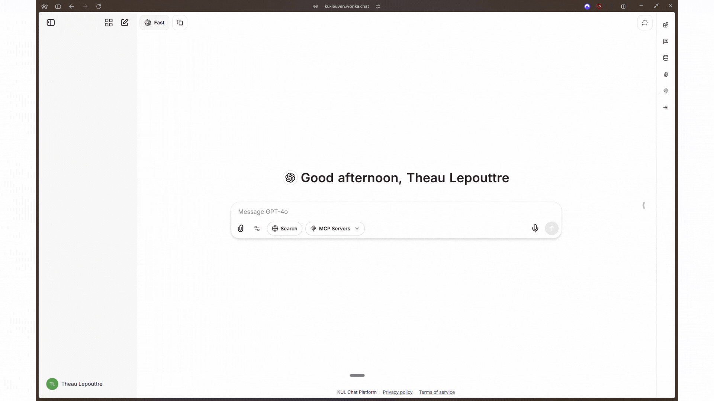
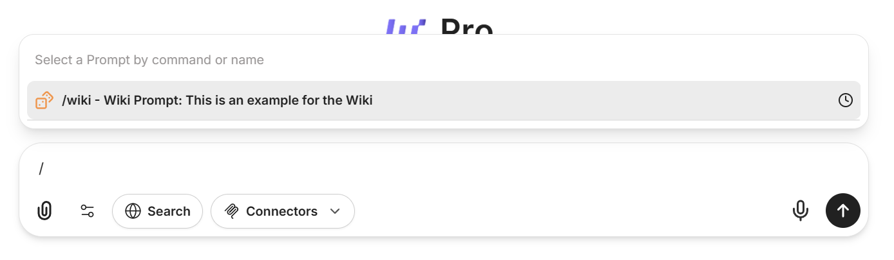

Bouw een persoonlijke bibliotheek van effectieve prompts die je kunt hergebruiken en aanpassen met variabelen. 
Behoud de prompts die goed werken en gebruik ze opnieuw in gesprekken en projecten; bespaar tijd en behoud consistentie in je AI-interacties.

<Info>
De Promptbibliotheek helpt je succesvolle prompts vast te leggen en ze om te zetten in herbruikbare templates voor veelvoorkomende taken.
</Info>

### Waarom een Promptbibliotheek Bouwen?

<CardGroup cols={2}>
<Card title="Consistentie" icon="equals">
Gebruik bewezen prompts die elke keer betrouwbare resultaten leveren.
</Card>

<Card title="Efficiëntie" icon="bolt">
Sla het herschrijven van dezelfde instructies over en spring direct naar resultaten.
</Card>

<Card title="Kennisdeling" icon="users">
Deel effectieve prompts met je team om AI-gebruik te standaardiseren.
</Card>

<Card title="Continue Verbetering" icon="chart-line">
Verfijn en herhaal prompts in de loop van de tijd op basis van wat het beste werkt.
</Card>
</CardGroup>

## Video Walkthrough

Bekijk deze stapsgewijze video om te leren hoe je opgeslagen prompts in je bibliotheek maakt en beheert:

<iframe
  className="w-full aspect-video rounded-xl"
  src="https://www.youtube.com/embed/0afpiO461LA"
  title="Promptbibliotheek Video Walkthrough"
  frameBorder="0"
  allow="accelerometer; clipboard-write; encrypted-media; gyroscope; picture-in-picture"
  allowFullScreen
></iframe>

## Je Eerste Opgeslagen Prompt Maken

<Steps>
<Step title="Identificeer Succesvolle Prompts">
Wanneer je geweldige resultaten krijgt van een prompt, markeer het als kandidaat voor je bibliotheek. Zoek naar prompts die:
- Consequent goede outputs produceren
- Veelvoorkomende terugkerende taken oplossen
- Nuttige structuur of opmaak bevatten
- Fouten minimaliseren door grondige tests

<Tip>
Overweeg de bladwijzerfunctie te gebruiken om prompts in je persoonlijke bibliotheek op te slaan voordat je ze officieel toevoegt aan je promptbibliotheek.
</Tip>

</Step>


<Step title="Opslaan in Je Bibliotheek">
Om een prompt op te slaan in je bibliotheek, navigeer naar het rechterpaneel en selecteer de sectie "Prompts". Vandaar kun je elke prompt in je bibliotheek maken of openen.

<Frame caption="Zoek het Bibliotheek Icoon">

</Frame>


</Step>

<Step title="Vul Promptdetails In">
Geef in het promptcreatieformulier:
- **Promptnaam** (vereist): Een beschrijvende naam voor je prompt
- **Tekst** (vereist): De volledige prompttekst met eventuele [_variabelen_](#variabelebeheer) die je nodig hebt
- **Beschrijving** (optioneel): Een korte beschrijving die wordt weergegeven bij het gebruiken van de prompt
- **Commandonaam** (optioneel): Maak een aangepaste commandoshortcut om deze prompt snel aan te roepen

<Tip>
Geef je opgeslagen prompts beschrijvende namen die hun doel uitleggen, zoals "Code Review Template" of "Vergadernotities Samenvatting."
</Tip>

</Step>

<Step title="Opslaan en Gebruiken">
Eenmaal opgeslagen, verschijnt je prompt in de Promptenbibliotheek waar je kunt:
- Zoeken naar prompts op naam met behulp van het filter
- Klikken op een prompt om deze in een gesprek te gebruiken
- Eventuele variabelen invullen bij het gebruiken van de prompt

<Tip>
Snel gebruik: Prompts kunnen worden aangeroepen door `/` te typen gevolgd door hun naam of je aangepaste commando direct vanuit elk gesprek.
</Tip>

<Frame caption="Promptvoorbeeld met een aangepast commando '/exp'">

</Frame>


</Step>
</Steps>

---

## Variabelebeheer

Maak je prompts flexibel en herbruikbaar met variabelen die je elke keer aanpast. WonkaChat ondersteunt drie soorten variabelen: **basisvariabelen** voor je eigen invoer, **speciale variabelen** die automatisch systeeminformatie invoegen, en **dropdown variabelen** waarmee je kunt kiezen uit vooraf ingestelde opties.

<Tabs>
<Tab title="Basis Variabele Syntax">
Gebruik dubbele accolades `{{ }}` om variabelen overal in je prompt te definiëren.

**Voorbeeld 1:**
```
Vat het {{document_type}} samen voor het {{target_audience}}.
```
- Bij gebruik word je gevraagd om `{{document_type}}` (bijv. "vergadernotities") en `{{target_audience}}` (bijv. "managementteam") in te vullen.

**Voorbeeld 2:**
```
Beoordeel de {{codebase}} en benadruk {{review_focus}}.
```
</Tab>

<Tab title="Speciale Variabelen">
Voeg dynamische informatie in met deze ingebouwde opties (geen handmatige invoer nodig):

- `{{current_date}}` - Datum van vandaag
- `{{current_user}}` - Je gebruikersnaam

**Voorbeeld 1:**
```
Bereid een samenvatting voor voor {{current_user}} per {{current_date}}.
```

**Voorbeeld 2:**
```
Log-invoer gemaakt op {{current_datetime}} door {{current_user}}.
```
</Tab>

<Tab title="Dropdown Variabelen">
Gebruik dropdowns voor velden met beperkte, vooraf gedefinieerde keuzes.

**Voorbeeld 1:**
```
Vat dit samen als {{output_style:opsommingstekens|paragraaf|tabel}}.
```

**Voorbeeld 2:**
```
Vergelijk de oplossing over {{environment:development|staging|production}} omgevingen.
```

Kies elke keer dat je de prompt gebruikt een optie uit de dropdown.
</Tab>
</Tabs>

<Check>
Goed ontworpen variabelen maken je prompts aanpasbaar aan veel situaties zonder effectiviteit te verliezen.
</Check>

---

## Voorbeelden Promptbibliotheek

Kant-en-klare templates, georganiseerd op moeilijkheidsgraad. Begin met eenvoudige communicatie- en organisatieprompts. Ga verder naar technische en gedetailleerde prompts naarmate je meer vertrouwen krijgt.

<Tabs>
<Tab title="Eenvoudige Voorbeelden">
### Communicatie en Organisatie

<AccordionGroup>
<Accordion title="E-mail Composer" icon="envelope">
**Doel**: Snel een professionele e-mail opstellen

**Prompt**:
```
Schrijf een {{tone:formeel|informeel}} e-mail aan {{recipient}} over {{subject}}.
Hoofdpunten:
{{main_points}}
```

**Variabelen**:
- `{{tone}}`: E-mailtoon (dropdown)
- `{{recipient}}`: Persoon of groep
- `{{subject}}`: E-mailonderwerp
- `{{main_points}}`: Wat te behandelen
</Accordion>

<Accordion title="Vergadernotities Samenvatting" icon="clipboard">
**Doel**: Ruwe notities omzetten in een nette samenvatting

**Prompt**:
```
Vat deze vergadernotities samen:

Datum: {{current_date}}
Personen: {{participants}}
Notities: {{raw_notes}}
```

**Variabelen**:
- `{{current_date}}`: Datum van vandaag
- `{{participants}}`: Wie aanwezig was
- `{{raw_notes}}`: Notities van de vergadering
</Accordion>

<Accordion title="Korte Artikel Samenvatting" icon="magnifying-glass">
**Doel**: Artikelen of webcontent samenvatten

**Prompt**:
```
Vat dit {{content_type:artikel|blogpost}} samen over {{topic}} voor {{target_audience}}:
{{content}}
```

**Variabelen**:
- `{{content_type}}`: Type content (dropdown)
- `{{topic}}`: Onderwerp van het artikel
- `{{target_audience}}`: Lezer (bijv. studenten, team)
- `{{content}}`: Tekst om samen te vatten
</Accordion>
</AccordionGroup>
</Tab>

<Tab title="Geavanceerde Voorbeelden">
### Technische, Coderings- en Analytische Prompts

<AccordionGroup>
<Accordion title="Code Review Template" icon="code">
**Doel**: Vraag een gerichte code review

**Prompt**:
```
Beoordeel deze {{language}} code voor {{component_name}}.
{{code_block}}

Geef commentaar op:
1. Leesbaarheid
2. {{review_focus}}
```

**Variabelen**:
- `{{language}}`: Programmeertaal
- `{{component_name}}`: Naam of doel van code
- `{{code_block}}`: Code om te beoordelen
- `{{review_focus}}`: Prioriteitsgebied (bijv. beveiliging, prestaties)
</Accordion>

<Accordion title="Bug Diagnose Verzoek" icon="bug">
**Doel**: Analyseer en fix een bug

**Prompt**:
```
Help debug dit in {{system_component}}.
Fout: {{error_message}}
Code:
{{code_snippet}}
```

**Variabelen**:
- `{{system_component}}`: Waar de bug optreedt
- `{{error_message}}`: Volledige foutmelding
- `{{code_snippet}}`: Relevante code
</Accordion>

<Accordion title="Snelle Documentatie Generator" icon="file-lines">
**Doel**: Genereer code documentatie snel

**Prompt**:
```
Documenteer deze {{language}} code als {{doc_type:API|README}}.
{{code_block}}
```

**Variabelen**:
- `{{language}}`: Programmeertaal
- `{{doc_type}}`: Soort documentatie (dropdown)
- `{{code_block}}`: Code om te documenteren
</Accordion>

<Accordion title="Data-analyse Briefing" icon="chart-column">
**Doel**: Analyseer gegevens en vat inzichten samen

**Prompt**:
```
Analyseer {{data_type:sales|gebruikersgegevens}} voor {{business_question}}:
{{data_content}}
```

**Variabelen**:
- `{{data_type}}`: Type gegevens (dropdown)
- `{{business_question}}`: Wat te onderzoeken
- `{{data_content}}`: De gegevens zelf
</Accordion>

<Accordion title="Testcase Creator" icon="vial">
**Doel**: Stel belangrijke testscenario's voor

**Prompt**:
```
Maak testcases voor {{feature_name}} in een {{application_type:web|API}}.
User story: {{user_story}}
```

**Variabelen**:
- `{{feature_name}}`: Functienaam
- `{{application_type}}`: App-type (dropdown)
- `{{user_story}}`: Korte gebruikersvereiste
</Accordion>

<Accordion title="SQL Query Helper" icon="database">
**Doel**: Schrijf of verbeter SQL-query's

**Prompt**:
```
{{task_type:Schrijf|Optimaliseer}} een SQL-query voor {{database_type:PostgreSQL|MySQL}}.
Doel: {{query_requirement}}
```

**Variabelen**:
- `{{task_type}}`: Wat te doen (dropdown)
- `{{database_type}}`: Databasesysteem (dropdown)
- `{{query_requirement}}`: Query-doelstelling
</Accordion>
</AccordionGroup>
</Tab>
</Tabs>

---


### Best Practices

<CardGroup cols={2}>
<Card title="Beschrijvende Namen" icon="tag">
Gebruik duidelijke, beschrijvende namen die prompts gemakkelijk vindbaar maken bij het zoeken in je bibliotheek.
</Card>

<Card title="Voeg Beschrijvingen Toe" icon="note-sticky">
Gebruik het optionele beschrijvingsveld om context te bieden over wanneer en hoe elke prompt te gebruiken.
</Card>

<Card title="Maak Slash Commando's" icon="terminal">
Voor vaak gebruikte prompts, stel slash commando's in voor directe toegang zonder zoeken.
</Card>

<Card title="Test en Verfijn" icon="rotate">
Test regelmatig je opgeslagen prompts en werk ze bij op basis van de resultaten die je krijgt.
</Card>
</CardGroup>

<Tip>
Begin met 5-10 prompts voor je meest voorkomende taken, en breid je bibliotheek geleidelijk uit naarmate je meer herbruikbare patronen identificeert.
</Tip>

--- 

## Tips voor een Schone Promptbibliotheek

<AccordionGroup>
<Accordion title="Gebruik Beschrijvende Variabelenamen">
Kies variabelenamen die duidelijk aangeven welke informatie nodig is. Gebruik `{{user_feedback}}` in plaats van `{{text}}` of `{{input}}`.
</Accordion>

<Accordion title="Benut Speciale Variabelen">
Maak gebruik van `{{current_date}}`, `{{current_user}}` en andere ingebouwde variabelen om automatisch context op te nemen zonder handmatige invoer.
</Accordion>

<Accordion title="Maak Dropdown Opties voor Veelvoorkomende Keuzes">
Gebruik de dropdown syntax `{{variable:optie1|optie2|optie3}}` voor variabelen met een beperkte set geldige waarden om typen en fouten te verminderen.
</Accordion>

<Accordion title="Houd Prompts Gefocust">
Maak afzonderlijke prompts voor verschillende taken in plaats van één te complexe prompt. 
Gefocuste prompts zijn niet alleen gemakkelijker te onderhouden en hergebruiken, maar leveren ook betere resultaten.
</Accordion>
</AccordionGroup>
