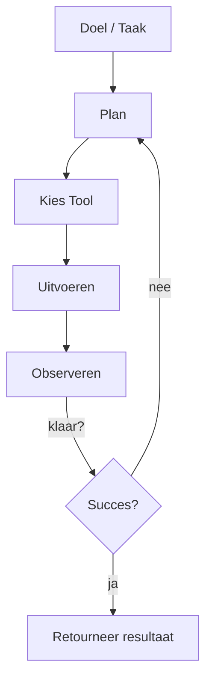

<Frame caption="Agents plannen, gebruiken tools en herhalen totdat het doel is bereikt.">

</Frame>

### Definitie
Een AI-agent is een softwaresysteem dat autonoom een doel kan nastreven door stappen te plannen, tools of API's aan te roepen, resultaten te observeren en te herhalen totdat de doelstelling is bereikt.

- **Redeneren**: kies volgende acties op basis van doelen en observaties
- **Tools**: roep externe mogelijkheden aan (API's, databases, browsers)
- **Geheugen**: herinner eerdere stappen en domeinkennis
- **Planning**: ontleed doelstellingen in uitvoerbare taken

### Minimale agent-lus

### Praktijkpatronen
- Klantenondersteuning triage en antwoord opstellen
- Data-extractie en rapportgeneratie
- Operatie-automatiseringen (tickets, CRM-updates)

<Tip>
Agents zijn het meest effectief wanneer ze beperkt zijn met duidelijke doelen, gecureerde tools en beveiligingsmaatregelen.
</Tip>

### Verder lezen
- Model Context Protocol (MCP) basics → `/nl/learn/mcp`
- Bouw een werkende agent → `/nl/learn/build-agents`
