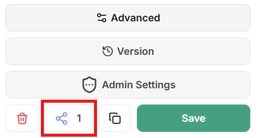

Bepaal wie toegang heeft tot wat in je WonkaChat-organisatie. Beheer gebruikers, wijs rollen toe, definieer gedetailleerde permissies voor AI-agents en beperk welke tools agents kunnen gebruiken om veilige samenwerking te waarborgen.

<Info>
Toegangsbeheer implementeert het principe van least privilege dat gebruikers en agents alleen de permissies geeft die ze nodig hebben om hun werk te doen.
</Info>

---

## Gebruikersbeheer

Voeg gebruikers toe, beheer en verwijder ze in je organisatie via het Instellingenpaneel.

<Steps>
<Step title="Toegang tot Instellingen">
Klik op je naam linksonder in het WonkaChat-dashboard en selecteer vervolgens **Gebruikersbeheer**. Alleen beheerders hebben toegang tot gebruikersbeheerfuncties.

</Step>

<Step title="Nieuwe Gebruikers Uitnodigen">
Stuur e-mailuitnodigingen naar gebruikers die je wilt toevoegen aan je organisatie. Gebruikers ontvangen een uitnodigingslink om hun account aan te maken en lid te worden.

</Step>

<Step title="Rol Toewijzen">
Kies of de nieuwe gebruiker een **Admin** of een **Gebruiker** wordt bij het versturen van de uitnodiging.

<Check>
Je kunt gebruikersrollen op elk moment wijzigen nadat ze lid zijn geworden van de organisatie.
</Check>
</Step>

<Step title="Bestaande Gebruikers Beheren">

<AccordionGroup>
<Accordion title="Rollen Wijzigen" icon="user-gear">
Promoveer gebruikers tot beheerders of verwijder adminrechten wanneer verantwoordelijkheden veranderen.

<Warning>
Beheerders kunnen hun eigen adminrechten beheren, maar kunnen adminrechten van andere beheerders niet overschrijven of verwijderen.
</Warning>
</Accordion>

<Accordion title="Gebruikers Verwijderen" icon="user-slash">
Verwijder gebruikers permanent uit je organisatie. Hoewel je gebruikers gemakkelijk kunt verwijderen en opnieuw toevoegen, worden alle gegevens die aan het account zijn gekoppeld permanent verwijderd en kunnen niet worden hersteld.

<Warning>
Het verwijderen van een gebruiker wist al hun gegevens onomkeerbaar. Je kunt de gebruiker later opnieuw toevoegen, maar hun eerdere agents, configuraties en instellingen zijn voor altijd weg. Overweeg deactivering voor tijdelijke toegangsverwijdering.
</Warning>
</Accordion>
</AccordionGroup>
</Step>
</Steps>


---

## Rolgebaseerde Permissies

WonkaChat gebruikt een eenvoudig twee-rollen-systeem voor duidelijke permissiegrenzen.

<iframe
  className="w-full aspect-video rounded-xl"
  src="https://www.youtube.com/embed/HiCEHQkDpms"
  title="Governance en RBAC uitgelegd"
  frameBorder="0"
  allow="accelerometer; clipboard-write; encrypted-media; gyroscope; picture-in-picture"
  allowFullScreen
></iframe>

### Beschikbare Rollen

<CardGroup cols={2}>
<Card title="Gebruiker" icon="user">
**Persoonlijke agent creatie**

• Maak hun eigen persoonlijke AI-agents\
• Gebruik agents gedeeld door beheerders\
• Wijzig gedeelde agents alleen indien toestemming verleend\
• Toegang alleen tot persoonlijk gemaakte agents of door admin gedeelde agents

<Info>
Gebruikers kunnen agents niet delen met anderen, alleen beheerders kunnen agents organisatiebreed beschikbaar maken.
</Info>
</Card>

<Card title="Beheerder" icon="user-shield">
**Volledige organisatiecontrole**

• Beheer alle gebruikers\
• Maak, wijzig en deel agents organisatiebreed\
• Beheer agent-permissies (wie kan bekijken/wijzigen)\
• Promoveer gebruikers tot beheerdersrollen

<Check>
Admins hebben volledige controle behalve dat ze andere beheerders' privileges niet kunnen overschrijven.
</Check>
</Card>
</CardGroup>

<Tip>
Houd het aantal beheerders beperkt tot degenen die volledige organisatiecontrole nodig hebben. De meeste teamleden moeten Gebruikersrollen hebben.
</Tip>

### Agent Zichtbaarheidsbereik

<Tabs>
<Tab title="Persoonlijke Agents">
Agents gemaakt door gebruikers zijn **standaard privé** en alleen zichtbaar voor de maker.

Gebruikers kunnen hun persoonlijke agents niet organisatiebreed delen. Alleen beheerders kunnen agents delen.

<Tip>
Als een gebruiker een waardevolle agent maakt en deze wil delen, moeten ze contact opnemen met een beheerder om deze te beoordelen en te delen.
</Tip>
</Tab>

<Tab title="Gedeelde Agents">
Agents gedeeld door beheerders kunnen beschikbaar worden gemaakt voor:
- **Specifieke gebruikers**: Selecteer individuen die toegang hebben tot de agent
- **Hele organisatie**: Alle gebruikers in de organisatie

Admins bepalen het exacte permissieniveau (Viewer, Editor of Owner) voor elke gedeelde agent.

<Check>
Gedeelde agents verschijnen in gebruikersagentlijsten op basis van de permissies die ze hebben gekregen.
</Check>
</Tab>
</Tabs>

---

## AI-Agents Delen

Beheerders kunnen AI-Agents direct vanuit het Agent Builder-paneel delen.

<Tabs>
<Tab title="Ik ben een Beheerder">

Als beheerder beheer je het delen van agents vanuit het Agent Builder-paneel.

### Hoe een Agent te Delen

<Steps>
<Step title="Open Agent Builder">
Navigeer naar de agent die je wilt delen (of maak een nieuwe) in de Agent Builder.

</Step>

<Step title="Configureer Deelinstellingen">
In het Agent Builder-paneel vind je deelopties:

<Frame caption="Agent Delen locatie">

</Frame>

**Zichtbaarheid:**
- Deel met de hele organisatie, of
- Deel met specifieke gebruikers

**Permissieniveaus:**
- **Viewer**: Kan de agent bekijken en gebruiken (geen wijzigingen)
- **Editor**: Kan de agent bekijken, gebruiken en wijzigen
- **Owner**: Heeft volledige controle inclusief delen en verwijderen

<Tip>
Voor belangrijke organisatie-agents, gebruik Viewer-permissies voor de meeste gebruikers en verleen alleen Editor-toegang aan vertrouwde medewerkers.
</Tip>
</Step>

<Step title="Bekijk Tool Toegang">
Verifieer voor het delen welke tools en MCP-verbindingen de agent heeft. Zorg ervoor dat ze geschikt zijn voor alle gebruikers die toegang zullen hebben.

<Warning>
Wanneer gebruikers interacteren met een gedeelde agent, erft de agent de permissies van die gebruiker in verbonden tools. Overweeg welke gegevens verschillende gebruikers kunnen benaderen.
</Warning>
</Step>

<Step title="Opslaan en Delen">
Sla je deelconfiguratie op. De agent wordt onmiddellijk beschikbaar voor de opgegeven gebruikers op basis van de permissies die je hebt ingesteld.

<Check>
Gebruikers zullen de gedeelde agent in hun agentlijst zien en kunnen deze gebruiken volgens hun verleende permissies.
</Check>
</Step>
</Steps>

</Tab>

<Tab title="Ik ben een Gebruiker">

Als standaardgebruiker kun je persoonlijke agents maken, maar heb je beheerdersbetrokkenheid nodig om ze organisatiebreed te delen.\
Als je een agent maakt die anderen zou helpen, neem dan contact op met een beheerder om organisatiebrede deling aan te vragen.

Geef:
- Duidelijke beschrijving van wat de agent doet
- Beoogde use cases
- Waarom het de organisatie zou helpen
- Welke tools het vereist

<Tip>
Beheerders moeten agents beoordelen op beveiliging, tool-toegang en compliance voordat ze breed worden gedeeld.
</Tip>

### Gedeelde Agents Gebruiken

Wanneer een beheerder een agent deelt, kunnen ze één van drie permissieniveaus toewijzen:

<AccordionGroup>
<Accordion title="Viewer" icon="eye">
**Kan de agent bekijken en gebruiken maar niet wijzigen**

Viewers kunnen:
- De agent in gesprekken gebruiken
- De agent in hun agentlijst zien
- Toegang hebben tot de mogelijkheden van de agent

Viewers kunnen niet:
- De configuratie, prompts of tools van de agent wijzigen
- De agent met anderen delen
- Agent-instellingen wijzigen

<Check>
Viewer-permissie is ideaal voor de meeste gebruikers die de agent moeten gebruiken zonder wijzigingen aan te brengen.
</Check>
</Accordion>

<Accordion title="Editor" icon="pen-to-square">
**Kan de agent bekijken en wijzigen**

Editors kunnen:
- De agent in gesprekken gebruiken
- De configuratie en instellingen van de agent bekijken
- De prompts, tools en configuratie van de agent wijzigen
- Wijzigingen aanbrengen die alle gebruikers beïnvloeden

Editors kunnen niet:
- De agent met anderen delen
- Eigenaarschap wijzigen of de agent verwijderen

<Warning>
Het verlenen van editor-permissie stelt gebruikers in staat het gedrag van de agent voor iedereen te wijzigen. Gebruik dit voorzichtig voor collaboratieve agentontwikkeling.
</Warning>
</Accordion>

<Accordion title="Owner" icon="crown">
**Heeft volledige controle over de agent inclusief het delen ervan**

Owners kunnen:
- De agent in gesprekken gebruiken
- Alle agent-instellingen bekijken en wijzigen
- De agent met anderen delen (Viewer/Editor/Owner-permissies toewijzen)
- Eigenaarschap wijzigen of overdragen
- De agent verwijderen

<Info>
Alleen beheerders kunnen worden toegewezen als owners bij het organisatiebreed delen van agents. De agent-maker is automatisch de oorspronkelijke owner.
</Info>
</Accordion>
</AccordionGroup>

</Tab>
</Tabs>


---

## Tool-restrictie

Bij het maken van een AI-agent kun je precies bepalen tot welke tools deze toegang heeft. Dit zorgt ervoor dat agents alleen de mogelijkheden hebben die ze nodig hebben om hun beoogde functie uit te voeren.

### Hoe Tool-restrictie Werkt

Wanneer je een MCP-verbinding (zoals Outlook, GitHub of Slack) aan een agent toevoegt, kun je individuele tools binnen die verbinding selectief in- of uitschakelen.

**Bijvoorbeeld**, als je de Outlook MCP-verbinding aan een agent toevoegt:
- Je kunt tools zoals "concept e-mail" en "e-mails lezen" **behouden**
- Je kunt tools zoals "e-mail verzenden" en "e-mail verwijderen" **verwijderen**

Het verwijderen van de "e-mail verzenden" tool betekent dat de agent geen e-mails kan verzenden, zelfs niet als hierom wordt gevraagd, omdat de mogelijkheid eenvoudigweg niet bestaat voor die agent.

<Check>
Tool-restrictie vindt plaats op agent creatieniveau. Elke agent kan verschillende tool-toegang hebben op basis van zijn beoogde doel.
</Check>

### Waarom Tools Beperken?

<AccordionGroup>
<Accordion title="Onbedoelde Acties Voorkomen">
Door tools te verwijderen die onomkeerbare acties uitvoeren (e-mails verzenden, bestanden verwijderen, code implementeren), elimineer je het risico dat agents fouten maken of prompts verkeerd interpreteren.

**Beveiliging door afwezigheid**: Als een agent de "e-mail verzenden" tool niet heeft, is het onmogelijk om een e-mail te verzenden (zelfs per ongeluk).
</Accordion>

<Accordion title="Risico Oppervlak Minimaliseren">
Hoe minder tools een agent heeft, hoe minder er fout kan gaan. Verminder het aanvalsoppervlak door agents alleen de specifieke mogelijkheden te geven die ze nodig hebben.

**Voorbeeld**: Een data-analyse agent heeft geen tools nodig om gegevens te wijzigen of verwijderen. Hij moet alleen leestoegang krijgen.
</Accordion>

<Accordion title="Doelgerichte Agents">
Maak gespecialiseerde agents geoptimaliseerd voor specifieke taken door ze precieze toolsets te geven.

**Voorbeeld**: Een "Concept E-mail" agent met Outlook MCP maar alleen concept tools ingeschakeld. Hij moet geen verzend-, verwijder- of doorstuurmogelijkheden krijgen.
</Accordion>
</AccordionGroup>

### Voorbeeld: E-mail Concept Agent

Het verschil tussen een nuttige concept assistent en een potentieel beveiligingsrisico komt vaak neer op één enkele tool.

<Tip>
Schakel bij het maken van agents tools uit die eindacties uitvoeren, tenzij de agent deze specifiek nodig heeft. Schakel tools in voor voorbereiding en analyse, maar beperk tools die verzenden, verwijderen, implementeren of productiesystemen wijzigen.
</Tip>
<Tabs>
<Tab title="✅ Goed Voorbeeld: Verzend Tool Uitgeschakeld">

Dezelfde agent, maar met de `send-email` tool beperkt.

**Het Resultaat:**
```
Gebruikersprompt: "Stel een e-mail op voor john@example.com over het Q4-rapport."

Agent antwoord: "Hier is een concept e-mail voor john@example.com over het Q4-rapport:

Onderwerp: Q4 Rapport Update

Hallo John,
[concept inhoud]

Wil je dat ik iets aanpas?"
```

Zonder toegang tot de `send-email` tool kan de agent alleen inhoud opstellen. De gebruiker beoordeelt het, maakt indien nodig wijzigingen en verzendt handmatig wanneer klaar.

<Check>
**Veilig**: Gebruiker behoudt volledige controle over wanneer en wat wordt verzonden. Agent biedt waarde zonder risico.
</Check>

</Tab>

<Tab title="❌ Slecht Voorbeeld: Verzend Tool Ingeschakeld">

Een agent geconfigureerd om te helpen met het opstellen van e-mails maar met de `send-email` tool nog ingeschakeld.

**Het Probleem:**
```
Gebruikersprompt: "Stel een e-mail op voor john@example.com over het Q4-rapport."

Agent antwoord: "Ik heb de volgende e-mail opgesteld en verzonden naar john@example.com..."
```

Omdat de agent toegang had tot de `send-email` tool, interpreteerde het "stel een e-mail op" als toestemming om deze ook te verzenden. De e-mail ging eruit voordat de gebruiker deze kon beoordelen.

<Warning>
**Risico**: Niet-beoordeelde e-mails worden verzonden, potentiële gegevenslekken, onprofessionele communicatie of verzenden naar verkeerde ontvangers.
</Warning>


</Tab>
</Tabs>


---

## Safe Mode: Human-in-the-Loop

Safe Mode zorgt ervoor dat je elke actie goedkeurt die een AI Agent wil ondernemen voordat deze wordt uitgevoerd.

<Info>
**Visuele Gids Komt Binnenkort**: We maken een stapsgewijze visuele gids met screenshots die precies laat zien hoe Safe Mode werkt, inclusief de goedkeuringsdialoog en beslissingsworkflow.
</Info>

### Hoe Safe Mode Werkt

<Steps>

<Step title="Identificeer Wanneer Safe Mode te Gebruiken">
Schakel Safe Mode in voor agents die risicovolle operaties uitvoeren:
- Communicatie verzenden (e-mails, berichten, posts)
- Productiegegevens wijzigen of verwijderen
- Code of configuraties implementeren
- Financiële transacties uitvoeren

<Warning>
Safe Mode biedt essentieel toezicht om fouten en ongeautoriseerde acties in kritieke operaties te voorkomen.
</Warning>
</Step>

<Step title="Agent Vraagt Actie">
Wanneer een AI-agent een tool wil gebruiken of een actie wil uitvoeren, pauzeert het en vraagt om je goedkeuring.

Je ziet precies wat de agent wil doen, welke tool het wil gebruiken en welke parameters het zal doorgeven.
</Step>

<Step title="Je Beoordeelt & Beslist">
Beoordeel de gevraagde actie en besluit of je:
- **Toestaat**: De actie wordt uitgevoerd zoals gevraagd
- **Weigert**: De actie wordt geblokkeerd en de agent gaat verder zonder deze uit te voeren

<Tip>
Dit is je kans om potentiële fouten op te vangen, te verifiëren dat acties passend zijn en toezicht te behouden.
</Tip>
</Step>

<Step title="Actie Wordt Uitgevoerd of Geblokkeerd">
- Indien goedgekeurd, wordt de actie uitgevoerd en ontvangt de agent de resultaten
- Indien geweigerd, wordt de agent geïnformeerd dat de actie niet was toegestaan en kan de aanpak worden aangepast

<Check>
Je kunt Safe Mode uitschakelen voor vertrouwde agents die routinematige taken uitvoeren, maar het wordt aanbevolen voor agents met toegang tot krachtige tools.
</Check>
</Step>

</Steps>


---

## Toegangsbeheer Adviezen 

<CardGroup cols={2}>
<Card title="Beperk Beheerders" icon="user-shield">
Verleen adminrollen alleen aan degenen die volledige organisatiecontrole nodig hebben. Minder admins = gemakkelijkere auditing en verminderd risico.
</Card>

<Card title="Begin Restrictief" icon="user-lock">
Begin met minimale tool-toegang en permissies, en voeg alleen toe indien nodig. Het is gemakkelijker om toegang te verlenen dan te herstellen van fouten.
</Card>

<Card title="Regelmatig Beoordelen" icon="calendar-check">
Controleer periodiek wie toegang heeft tot welke agents en tools, en pas aan naarmate rollen en verantwoordelijkheden veranderen.
</Card>

<Card title="Test met Safe Mode" icon="flask">
Test altijd nieuwe agents met Safe Mode ingeschakeld om te observeren welke acties ze proberen voordat je autonome operatie toestaat.
</Card>
</CardGroup>

<Tip>
Duidelijke communicatie over agent-doeleinden, permissies en tool-restricties helpt gebruikers begrijpen wat ze kunnen doen en vermindert supportverzoeken.
</Tip>
