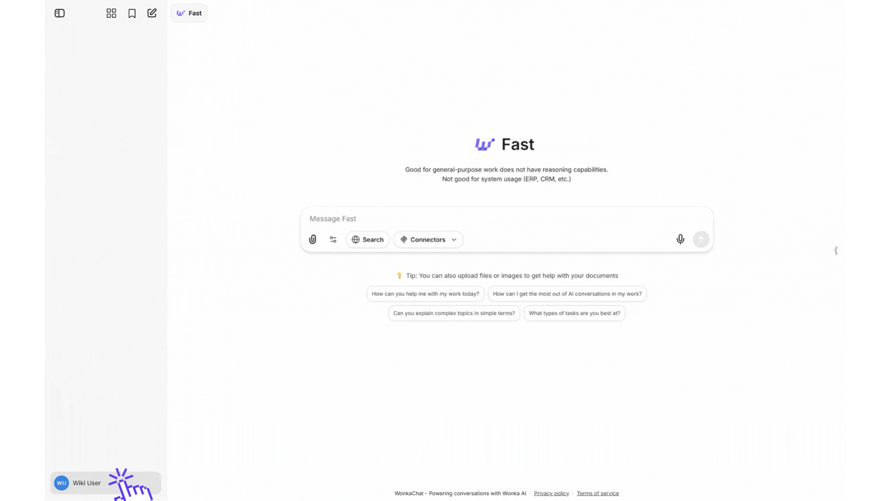
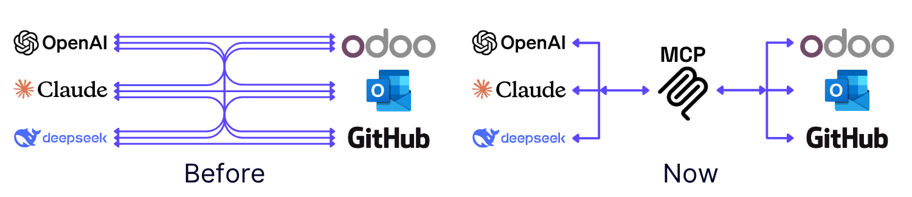
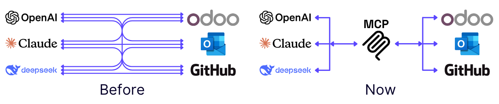
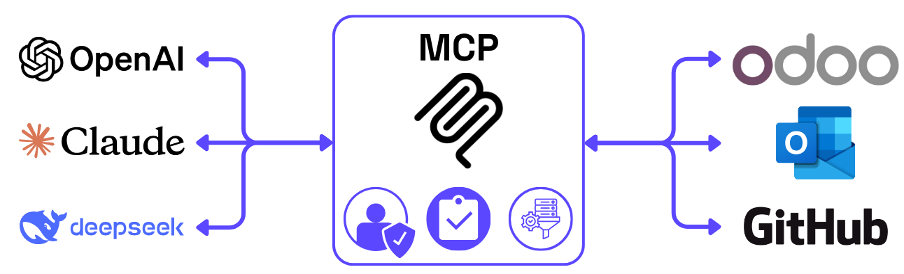
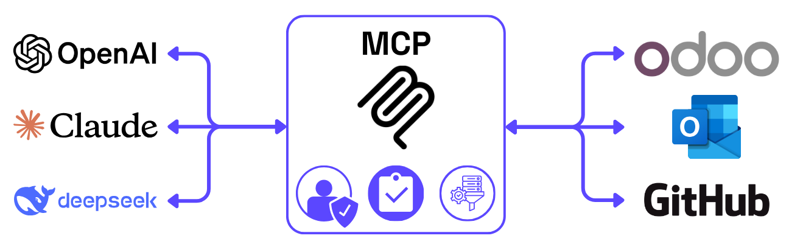
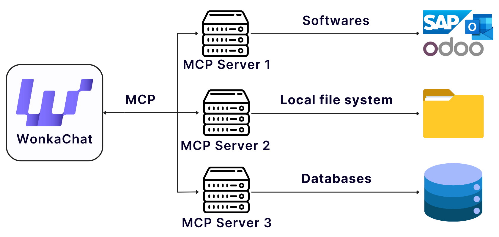
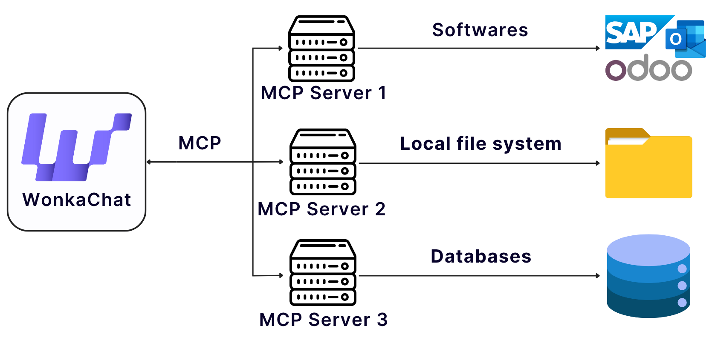

WonkaChat kan verbinden met je zakelijke tools, databases en software, waardoor je toegang krijgt tot echte informatie en acties kunt uitvoeren via natuurlijke conversatie. Deze worden **Connectors** of **MCP connections** genoemd voor meer technische mensen.

<Info>
Wil je de technische details begrijpen van hoe deze verbindingen werken?
[Spring naar Technische Details](#technische-details) om te leren over het Model Context Protocol (MCP) dat deze integraties aandrijft.
</Info>

<Tabs>
<Tab title="Aan de Slag">

## Wat Externe Verbinding Mogelijk Maakt

Het verbinden van je externe software en databronnen transformeert WonkaChat van een standalone AI-assistent naar een verbonden systeem dat kan werken met je werkelijke data en workflows. In plaats van alleen algemene vragen te beantwoorden, kan WonkaChat toegang krijgen tot je echte e-mails, je agenda beheren, je CRM updaten, documenten maken in je systemen en acties coördineren over meerdere platforms, allemaal via natuurlijke conversatie.

### Real-World Mogelijkheden

<CardGroup cols={2}>
<Card title="Toegang Tot Je Data" icon="database">
Lees e-mails, agenda-evenementen, documenten en databases via natuurlijke conversatie zonder tussen apps te schakelen.
</Card>

<Card title="Voer Acties Uit" icon="bolt">
Verstuur e-mails, maak taken aan, update records en trigger workflows, allemaal door WonkaChat te vragen in gewone taal.
</Card>

<Card title="Multi-Platform Workflows" icon="layer-group">
Combineer meerdere verbindingen in één enkel verzoek. Bijvoorbeeld: "Controleer mijn agenda, vind open slots en e-mail ze naar John."
</Card>

<Card title="Altijd Up-to-Date" icon="arrows-rotate">
Krijg toegang tot live data van je systemen in plaats van te vertrouwen op statische kennis of handmatige updates.
</Card>
</CardGroup>

### Hoe Te Beginnen

<Steps>
<Step title="Start een verbinding">
Ga naar de instellingen en maak verbinding met de tool (zoals Outlook, Gmail of Slack) door je credentials te verstrekken. Voeg het dan toe aan je chat.

<Frame caption="Outlook Mail knop locatie">

</Frame>

<Info>
Deze externe verbindingen worden "MCP" (Model Context Protocol) genoemd.

Hoewel **je de technische details niet hoeft te begrijpen om ze te gebruiken**, kun je meer leren in de [Technische Details](#technische-details) sectie als je nieuwsgierig bent.
</Info>
</Step>

<Step title="WonkaChat krijgt veilige toegang">
Er wordt een veilige verbinding tot stand gebracht tussen WonkaChat en je zakelijke tools. WonkaChat werkt namens jou met natuurlijke taal, werkend binnen je bestaande permissies.

<Warning>
**Belangrijk:** WonkaChat erft je exacte permissies. Het kan alleen toegang krijgen tot data en acties uitvoeren waartoe jij persoonlijk permissie hebt. Als je geen toegang hebt tot een bestand, een e-mail kunt versturen vanaf een specifiek account of een record kunt wijzigen in je reguliere workflow, kan WonkaChat het ook niet.
</Warning>
</Step>

<Step title="Chat natuurlijk">
Stel vragen of maak verzoeken in gewone taal. WonkaChat gebruikt automatisch de juiste tools en acties om je te helpen.

```
"Welke e-mails heb ik deze week van Sarah ontvangen?"
```

WonkaChat maakt verbinding met je e-mail, haalt de informatie op en presenteert het duidelijk.
</Step>
</Steps>

---

## Externe Verbindingen (MCP) Voorbeeld

Het verbinden van je zakelijke tools verandert dramatisch wat WonkaChat kan bereiken. Hier is een echt voorbeeld dat het verschil toont:

<Tabs>
<Tab title="Zonder Verbindingen">

**Je verzoek:**
```
"Plan een meeting met het marketingteam voor volgende dinsdag om 14:00 om de Q2 campagneresultaten te bespreken."
```

**WonkaChat's reactie (beperkt):**
```
Ik kan je helpen een meeting uitnodiging op te stellen, maar ik kan geen toegang krijgen tot je agenda 
of e-mailsysteem om de meeting daadwerkelijk in te plannen.

Dit is wat ik voorst el:
1. Controleer je agenda voor beschikbaarheid op dinsdag om 14:00
2. Verstuur een meeting uitnodiging naar je marketingteam
3. Voeg "Q2 Campagneresultaten Bespreking" toe als onderwerp

Wil je dat ik de meeting uitnodigingstekst voor je opstel?
```

<Warning>
Zonder verbindingen kan WonkaChat alleen algemene richtlijnen geven en geen toegang krijgen tot je werkelijke data of echte acties ondernemen.
</Warning>

</Tab>

<Tab title="Met Verbindingen">

**Je verzoek:**
```
"Plan een meeting met het marketingteam voor volgende dinsdag om 14:00 om de Q2 campagneresultaten te bespreken."
```

**WonkaChat's reactie (krachtig):**
```
Ik zal die meeting voor je inplannen.

Je agenda controleren... Dinsdag om 14:00 is beschikbaar.

"marketingteam" leden opzoeken... 5 teamleden gevonden:
- Sarah Johnson (Marketing Director)
- Mike Chen (Content Lead)  
- Emma Rodriguez (Social Media Manager)
- David Kim (Analytics Specialist)
- Lisa Wang (Designer)

Meeting uitnodiging maken met:
- Titel: "Q2 Campagneresultaten Bespreking"
- Tijd: Dinsdag 21 oktober 2025 om 14:00 - 15:00
- Locatie: Vergaderruimte B (gereserveerd)
- Deelnemers: Alle 5 marketingteamleden

✓ Meeting ingepland en uitnodigingen verzonden.
✓ Vergaderruimte gereserveerd.
✓ Agenda bijgewerkt.

Is er nog iets anders dat je wilt toevoegen aan de meeting?
```

<Check>
Met verbindingen krijgt WonkaChat toegang tot je echte agenda, identificeert teamleden, controleert kamerbeschikbaarheid en voltooit de hele taak automatisch.
</Check>

</Tab>
</Tabs>

Dit voorbeeld toont hoe het verbinden van je zakelijke tools WonkaChat in staat stelt om van advies geven naar echte acties ondernemen met je werkelijke bedrijfsdata te gaan.

---

## Beschikbare Externe Verbindingen (MCP)

WonkaChat ondersteunt MCP verbindingen met **40+ zakelijke tools** over alle belangrijke categorieën. Hier zijn alle momenteel beschikbare verbindingen:

<AccordionGroup>
<Accordion title="Microsoft 365 & Productiviteit" icon="microsoft">
Verbind je Microsoft tools voor uitgebreide kantoorproductiviteit.

**Beschikbare Verbindingen:**
- Outlook Mail (e-mail)
- Outlook Calendar (planning)
- Microsoft Teams (communicatie)
- OneDrive (opslag)
- Excel (spreadsheets)
- Word (documenten)
</Accordion>

<Accordion title="Google Workspace" icon="google">
Integreer met Google's suite van productiviteits- en samenwerkingstools.

**Beschikbare Verbindingen:**
- Gmail (e-mail)
- Google Calendar (planning)
- Google Drive (opslag)
- Google Docs (documenten)
- Google Sheets (spreadsheets)
</Accordion>

<Accordion title="Projectmanagement & Samenwerking" icon="list-check">
Verbind je projectmanagement en teamsamenwerking platforms.

**Beschikbare Verbindingen:**
- Asana (projectmanagement)
- ClickUp (productiviteit)
- Jira (issue tracking)
- Linear (projectmanagement)
- Monday (werkbeheer)
- Notion (kennisbank)
- Confluence (documentatie)
</Accordion>

<Accordion title="CRM & Sales" icon="handshake">
Integreer met customer relationship management en verkoopplatforms.

**Beschikbare Verbindingen:**
- Salesforce (CRM)
- HubSpot (CRM & marketing)
- Attio (CRM)
- Close (sales CRM)
- Klaviyo (marketing automatisering)
</Accordion>

<Accordion title="Ontwikkeling & Engineering" icon="code">
Verbind je ontwikkelingstools, repositories en deployment platforms.

**Beschikbare Verbindingen:**
- GitHub (version control)
- GitLab (version control)
- Vercel (deployment)
- Supabase (database)
</Accordion>

<Accordion title="Communicatie & Planning" icon="comments">
Integreer messaging en planningstools voor naadloze communicatie.

**Beschikbare Verbindingen:**
- Slack (team messaging)
- Cal.com (planning)
- LinkedIn (professioneel netwerken)
</Accordion>

<Accordion title="Opslag & Databases" icon="database">
Verbind bestandsopslag en databeheer platforms.

**Beschikbare Verbindingen:**
- Airtable (database)
- Box (opslag)
- Fathom (analytics)
</Accordion>

<Accordion title="Design & Gespecialiseerde Tools" icon="palette">
Integreer design en gespecialiseerde zakelijke tools.

**Beschikbare Verbindingen:**
- Figma (design)
- Odoo (ERP)
</Accordion>
</AccordionGroup>

<Info>
Heb je een verbinding nodig die niet vermeld staat? [Neem contact op met ons supportteam](/support-resources/getting-help) om nieuwe MCP integraties aan te vragen. We breiden onze verbindingsbibliotheek voortdurend uit op basis van gebruikersbehoeften.
</Info>

</Tab>

<Tab title="Technische Details">

## Het Model Context Protocol (MCP) Begrijpen

WonkaChat gebruikt het **Model Context Protocol (MCP)** om AI-modellen te verbinden met je zakelijke tools, databases en software, waardoor AI toegang kan krijgen tot echte informatie en acties namens jou kan uitvoeren.

<Info>
MCP is een open protocol dat AI-systemen in staat stelt om op uniforme wijze te communiceren met externe databronnen en software.

Zie het als een universele connector (zoals USB voor AI-systemen) die verschillende AI-modellen en softwaretools naadloos laat samenwerken zonder aangepaste integraties voor elke combinatie.
</Info>

### Hoe MCP Werkt

In plaats van aangepaste connectors te bouwen voor elk AI- en databron-paar, stelt MCP alle AI-clients en databronnen in staat om via één enkele integratie verbonden te worden.

<Frame caption="Voor en na MCP - van gefragmenteerde verbindingen naar verenigd protocol">


</Frame>

**In eenvoudige bewoordingen:** De AI Client (WonkaChat) verstuurt gestructureerde verzoeken via MCP. De MCP Server communiceert met je onderliggende systemen (Outlook, GitHub, Odoo, etc.) en stuurt een gestructureerde reactie terug.

---

## Risicobeheer & Beveiliging

<Frame caption="MCP fungeert als centraal beveiligingscheckpoint voor alle AI-interacties">


</Frame>

<Warning>
Een van de grootste zorgen rond AI is hoe het toegang krijgt tot en gevoelige data gebruikt.
</Warning>

**MCP pakt dit aan door te fungeren als beveiligingscheckpoint voor al je AI-systemen**, elke data-interactie volgen en bedrijfsbeleid afdwingen. Zie het als een gedetailleerd logboek van wie toegang heeft tot wat, wanneer en waarom, wat essentieel is voor regulatory compliance.

### Hoe MCP Je Data Beschermt

<AccordionGroup>
<Accordion title="Centrale Beveiligingslaag" icon="shield-halved">
MCP introduceert een centrale laag waardoor alle AI-interacties worden geleid. Dit biedt **consistentie in beveiligingsbeleid**, waardoor bedrijven authenticatie, autorisatie en datamaskering kunnen afdwingen op protocolniveau.

Al je AI-tools maken verbinding via één veilige gateway, in plaats van afzonderlijke beveiligingsimplementaties te hebben voor elke verbinding.
</Accordion>

<Accordion title="Gecontroleerd AI Gedrag" icon="gavel">
MCP lijnt AI-gedrag uit met intern bedrijfsbeleid. Omdat alle mogelijkheden worden blootgesteld en beheerd via de MCP server, kunnen bedrijven exact definiëren **wat een AI-systeem mag doen** en niets meer.

AI-systemen **kunnen geen toegang krijgen tot gevoelige data** of acties triggeren die ze niet expliciet zijn verleend. Elke permissie wordt gecontroleerd en is controleerbaar.
</Accordion>

<Accordion title="Volledig Audit Trail" icon="clipboard-list">
Elke interactie via MCP wordt gelogd:
- **Wie** toegang had tot de data (gebruikersidentiteit)
- **Wat** voor data werd toegankelijk gemaakt (resources, acties)
- **Wanneer** het gebeurde (timestamps)
- **Waarom** het nodig was (context, verzoekdetails)

Deze gedetailleerde logging is essentieel voor regulatory compliance en beveiligingsaudits.
</Accordion>
</AccordionGroup>

---

## MCP Architectuur Overzicht

Het Model Context Protocol is een open standaard ontwikkeld door [Anthropic](https://www.anthropic.com/news/model-context-protocol) die veilige, tweerichtingsverbindingen mogelijk maakt tussen AI-applicaties en externe databronnen.

<Info>
WonkaChat implementeert MCP als client, verbindend met MCP servers die je zakelijke tools en data blootstellen aan de AI-modellen. Leer meer op [modelcontextprotocol.io](https://modelcontextprotocol.io).
</Info>

### Technische Implementatie

MCP gebruikt een **client-server architectuur** waarbij WonkaChat fungeert als de MCP Client, verbindend met MCP Servers die integreren met je zakelijke tools:

<Frame caption="WonkaChat verbindt met meerdere MCP servers voor verschillende soorten systemen">


</Frame>


**Architectuur Flow:**
- **WonkaChat (MCP Client)** verstuurt gestructureerde verzoeken en beheert authenticatie
- **MCP Server** fungeert als integratielaag, verbindend met externe systemen
- **Externe Systemen** (Outlook, Odoo, Salesforce, etc.) leveren data via hun API's
- Alle reacties stromen terug via hetzelfde veilige kanaal

**Belangrijkste Technische Voordelen:**
- JSON-RPC gebaseerd communicatieprotocol
- Capability negotiation tijdens initialisatie
- Duidelijke beveiligingsgrenzen via client-host-server architectuur
- Gebruikerstoestemmingsmechanismen voor AI-interacties

### Beveiligingsimplementatie

WonkaChat implementeert MCP met enterprise-grade beveiligingsfuncties die voortbouwen op de basis van het protocol:

<AccordionGroup>
<Accordion title="MCP Protocol Beveiliging" icon="shield">
**Ingebouwd in het Protocol:**
- **Gebruikerstoestemming**: Alle AI-acties vereisen expliciete gebruikersautorisatie ([MCP Best Practices](https://modelcontextprotocol.io/specification/draft/basic/security_best_practices))
- **Capability Negotiation**: Clients en servers komen overeen over beschikbare functies tijdens initialisatie
- **Token Validatie**: Servers accepteren alleen tokens die expliciet voor hen zijn uitgegeven (OAuth 2.1 framework)
- **Sessiebeheer**: Veilig sessiebeheer om hijacking en impersonatie te voorkomen
- **Beveiligingsgrenzen**: Client-host-server architectuur met duidelijke isolatie

**Aanbevolen door MCP:**
- Input validatie en sanitatie voor alle parameters
- Rate limiting en misbruikmonitoring
- Veilig transport (TLS encryptie) voor alle verbindingen
</Accordion>

<Accordion title="WonkaChat's Implementatie" icon="lock">
**Authenticatie & Toegangscontrole:**
- OAuth 2.0 voor third-party services (Google, Microsoft, Salesforce)
- API key authenticatie voor ontwikkeltools
- Token encryptie at rest (AES-256) met automatische refresh
- Per-gebruiker token opslag met volledige isolatie
- Gebruikers erven alleen hun bestaande platformpermissies

**Enterprise Beveiliging:**
- Role-Based Access Control (RBAC) op organisatieniveau
- Gecentraliseerd beveiligingsbeleid over alle MCP verbindingen
- Verbinding timeouts en resource bescherming
- Multi-region deployment met veilige failover
</Accordion>

<Accordion title="Audit & Compliance" icon="clipboard-list">
**WonkaChat's Audit Trail:**
<Info>
Gedetailleerde audit en compliance functiedocumentatie komt binnenkort.

Dit zijn WonkaChat implementatiefuncties, niet ingebouwd in het MCP protocol zelf.
</Info>
</Accordion>
</AccordionGroup>

<Tip>
Als je specifieke vereisten of unieke behoeften hebt voor MCP integraties, neem dan contact op met ons supportteam. We zijn er om te helpen verbindingen uit te breiden of aan te passen aan je workflows.
</Tip>


</Tab>
</Tabs>
