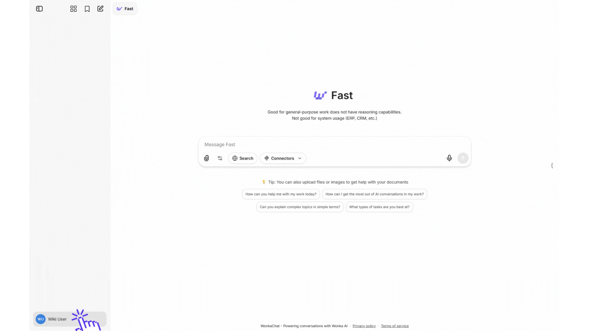
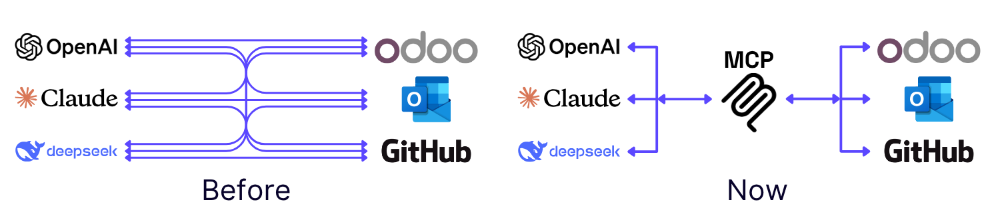
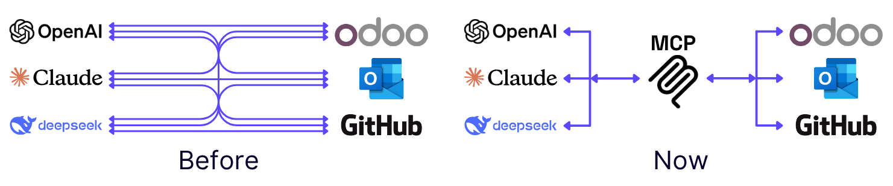
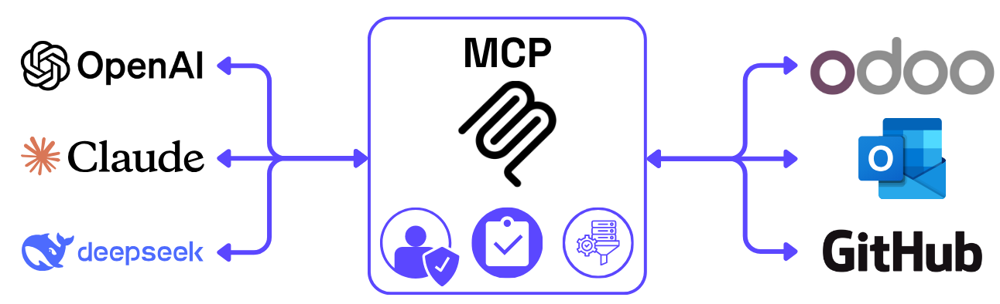
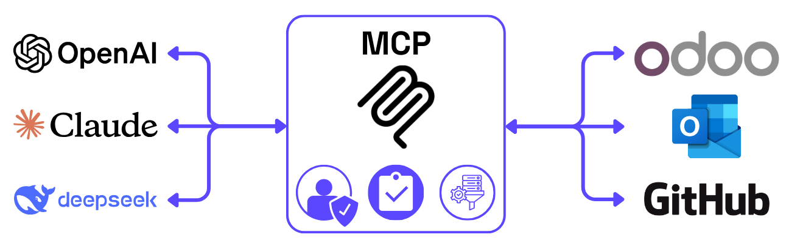
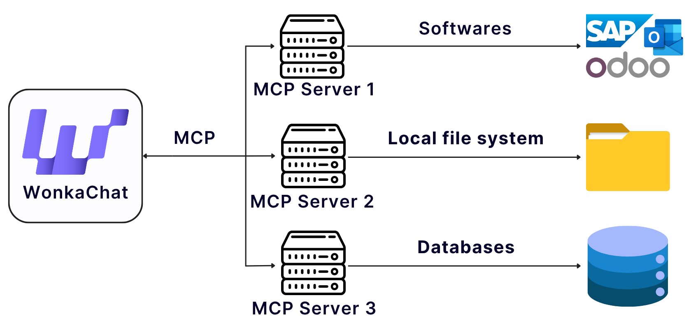
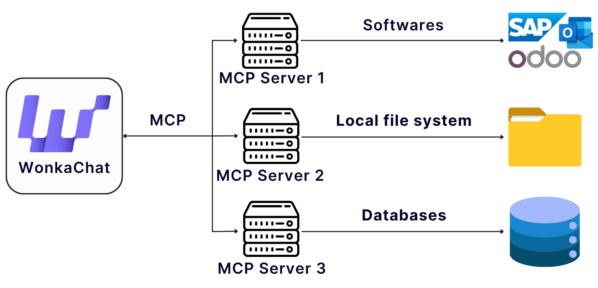

WonkaChat kan verbinding maken met je zakelijke tools, databases en software, waardoor je toegang krijgt tot echte informatie en acties kunt uitvoeren via natuurlijke conversatie. Deze worden **Connectors** of **MCP-verbindingen** genoemd voor meer technische mensen.

<Info>
Wil je de technische details begrijpen van hoe deze verbindingen werken?
[Ga naar Technische Details](#technical-details) om te leren over het Model Context Protocol (MCP) dat deze integraties aandrijft.
</Info>

<Tabs>
<Tab title="Aan de Slag">

## Wat Externe Verbindingen Mogelijk Maken

Het verbinden van je externe software en databronnen transformeert WonkaChat van een standalone AI-assistent naar een verbonden systeem dat kan werken met je werkelijke data en workflows. In plaats van alleen algemene vragen te beantwoorden, kan WonkaChat toegang krijgen tot je echte e-mails, je agenda beheren, je CRM bijwerken, documenten aanmaken in je systemen en acties coördineren over meerdere platforms, allemaal via natuurlijke conversatie.

### Mogelijkheden in de Praktijk

<CardGroup cols={2}>
<Card title="Toegang tot Je Data" icon="database">
Lees e-mails, agenda-afspraken, documenten en databases via natuurlijke conversatie, zonder tussen apps te schakelen.
</Card>

<Card title="Voer Acties Uit" icon="bolt">
Verstuur e-mails, maak taken aan, werk records bij en trigger workflows, allemaal door WonkaChat gewoon iets te vragen.
</Card>

<Card title="Multi-Platform Workflows" icon="layer-group">
Combineer meerdere verbindingen in één enkel verzoek. Bijvoorbeeld: "Controleer mijn agenda, vind vrije momenten en e-mail ze naar John."
</Card>

<Card title="Altijd Actueel" icon="arrows-rotate">
Krijg toegang tot live data uit je systemen in plaats van te vertrouwen op statische kennis of handmatige updates.
</Card>
</CardGroup>

### Hoe Je Begint

<Steps>
<Step title="Start een verbinding">
Ga naar **Aanpassen → Connectoren** en verbind met de tool die je wilt (bijvoorbeeld Outlook, Gmail of Slack) door je gegevens in te voeren. Schakel de connector daarna in voor je chat via de knop **Connectoren** onder het berichtenveld.

<Frame caption="Connectoren-knop onder het chatveld">

</Frame>

<Info>
Deze externe verbindingen worden "MCP" (Model Context Protocol) genoemd.

Hoewel **je de technische details niet hoeft te begrijpen om ze te gebruiken**, kun je meer lezen in de sectie [Technische Details](#technical-details) als je nieuwsgierig bent.
</Info>
</Step>

<Step title="WonkaChat krijgt veilige toegang">
Er wordt een veilige verbinding tot stand gebracht tussen WonkaChat en je zakelijke tools. WonkaChat werkt namens jou via natuurlijke taal, binnen je bestaande rechten.

<Warning>
**Belangrijk:** WonkaChat erft exact jouw rechten. Het kan alleen data raadplegen en acties uitvoeren waarvoor jij persoonlijk toestemming hebt. Kun je een bestand niet openen, geen e-mail versturen vanaf een specifiek account of geen record wijzigen in je normale workflow? Dan kan WonkaChat dat ook niet.
</Warning>
</Step>

<Step title="Chat natuurlijk">
Stel vragen of doe verzoeken in gewone taal. WonkaChat gebruikt automatisch de juiste tools en acties om je te helpen.

```
"Welke e-mails heb ik deze week van Sarah ontvangen?"
```

WonkaChat maakt verbinding met je e-mail, haalt de informatie op en presenteert ze duidelijk.
</Step>
</Steps>

---

## Voorbeeld van Externe Verbindingen (MCP)

Het verbinden van je zakelijke tools verandert drastisch wat WonkaChat kan doen. Hier is een concreet voorbeeld dat het verschil laat zien:

<Tabs>
<Tab title="Zonder Verbindingen">

**Jouw verzoek:**
```
"Plan een meeting met het marketingteam voor volgende dinsdag om 14u om de Q2-campagneresultaten te bespreken."
```

**WonkaChat's antwoord (beperkt):**
```
Ik kan je helpen een uitnodiging op te stellen, maar ik heb geen toegang tot
je agenda of e-mailsysteem om de meeting daadwerkelijk in te plannen.

Dit stel ik voor:
1. Controleer je agenda op beschikbaarheid dinsdag om 14u
2. Verstuur een uitnodiging naar je marketingteam
3. Gebruik "Bespreking Q2-campagneresultaten" als onderwerp

Wil je dat ik de uitnodigingstekst voor je opstel?
```

<Warning>
Zonder verbindingen kan WonkaChat alleen algemeen advies geven en heeft het geen toegang tot je echte data of de mogelijkheid om zelf actie te ondernemen.
</Warning>

</Tab>

<Tab title="Met Verbindingen">

**Jouw verzoek:**
```
"Plan een meeting met het marketingteam voor volgende dinsdag om 14u om de Q2-campagneresultaten te bespreken."
```

**WonkaChat's antwoord (krachtig):**
```
Ik plan die meeting voor je in.

Je agenda controleren... Dinsdag om 14u is beschikbaar.

"marketingteam" leden opzoeken... 5 teamleden gevonden:
- Sarah Johnson (Marketing Director)
- Mike Chen (Content Lead)
- Emma Rodriguez (Social Media Manager)
- David Kim (Analytics Specialist)
- Lisa Wang (Designer)

Uitnodiging aanmaken met:
- Titel: "Bespreking Q2-campagneresultaten"
- Tijd: dinsdag 14:00 - 15:00
- Deelnemers: alle 5 marketingteamleden

✓ Meeting ingepland en uitnodigingen verstuurd.
✓ Agenda bijgewerkt.

Wil je nog iets toevoegen aan de meeting?
```

<Check>
Met verbindingen krijgt WonkaChat toegang tot je echte agenda, herkent het teamleden en voltooit het de hele taak automatisch.
</Check>

</Tab>
</Tabs>

Dit voorbeeld toont hoe het verbinden van je zakelijke tools WonkaChat laat evolueren van advies geven naar echte acties uitvoeren met je werkelijke bedrijfsdata.

---

## Beschikbare Externe Verbindingen (MCP)

WonkaChat ondersteunt MCP-verbindingen met tientallen zakelijke tools, verspreid over alle belangrijke categorieën.

<AccordionGroup>
<Accordion title="CRM & Sales" icon="handshake">
Salesforce, HubSpot, Attio, Close, Dynamics 365
</Accordion>

<Accordion title="Productiviteit & Documenten" icon="file-lines">
Airtable, Asana, Box, ClickUp, Confluence, Google Docs, Google Sheets, Google Drive, Notion, OneDrive, OneNote, SharePoint, monday.com, Canva, Figma
</Accordion>

<Accordion title="Communicatie" icon="comments">
Slack, Microsoft Teams, Gmail, Outlook Mail, LinkedIn
</Accordion>

<Accordion title="Agenda & Meetings" icon="calendar">
Google Calendar, Outlook Calendar, Cal.com, Fathom, Leexi
</Accordion>

<Accordion title="Ontwikkeltools" icon="code">
GitHub, GitLab, Vercel, Supabase, Jira, Linear
</Accordion>

<Accordion title="Marketing & Analytics" icon="chart-line">
Google Ads, Google Analytics, Klaviyo, Mailchimp
</Accordion>

<Accordion title="Business & ERP" icon="building">
Odoo
</Accordion>
</AccordionGroup>

<Info>
Deze lijst geeft de connectoren weer die beschikbaar waren op het moment van schrijven. De lijst in de app (**Aanpassen → Connectoren**) is de referentie. Mis je een connector? [Neem contact op met ons supportteam](/nl/support-resources/getting-help) om die aan te vragen.
</Info>

</Tab>

<Tab title="Technische Details">

## Het Model Context Protocol (MCP) Begrijpen

WonkaChat gebruikt het **Model Context Protocol (MCP)** om AI-modellen te verbinden met je zakelijke tools, databases en software, zodat AI toegang krijgt tot echte informatie en namens jou acties kan uitvoeren.

<Info>
MCP is een open protocol waarmee AI-systemen op een uniforme manier kunnen communiceren met externe databronnen en software.

Zie het als een universele connector (zoals USB voor AI-systemen) waarmee verschillende AI-modellen en softwaretools naadloos samenwerken, zonder aangepaste integraties per combinatie.
</Info>

### Hoe MCP Werkt

In plaats van voor elk AI- en databron-paar een aparte connector te bouwen, laat MCP alle AI-clients en databronnen via één enkele integratie verbinden.

<Frame caption="Voor en na MCP: van versnipperde verbindingen naar één protocol">


</Frame>

**Eenvoudig gezegd:** de AI-client (WonkaChat) stuurt gestructureerde verzoeken via MCP. De MCP-server communiceert met je onderliggende systemen (Outlook, GitHub, Odoo, enz.) en stuurt een gestructureerd antwoord terug.

---

## Risicobeheer & Beveiliging

<Frame caption="MCP fungeert als centraal beveiligingscheckpoint voor alle AI-interacties">


</Frame>

<Warning>
Een van de grootste zorgen rond AI is hoe het toegang krijgt tot gevoelige data en die gebruikt.
</Warning>

**MCP pakt dit aan door te fungeren als een beveiligingscheckpoint voor al je AI-systemen**, waarbij elke data-interactie wordt bijgehouden en bedrijfsbeleid wordt afgedwongen. Zie het als een gedetailleerd logboek van wie wat, wanneer en waarom heeft geraadpleegd, essentieel voor regelgevingsconformiteit.

### Hoe MCP Je Data Beschermt

<AccordionGroup>
<Accordion title="Centrale Beveiligingslaag" icon="shield-halved">
MCP introduceert een centrale laag waarlangs alle AI-interacties verlopen. Dit zorgt voor **consistent beveiligingsbeleid**, waardoor bedrijven authenticatie, autorisatie en datamaskering kunnen afdwingen op protocolniveau.

Al je AI-tools verbinden via één veilige gateway, in plaats van via afzonderlijke beveiligingsimplementaties per verbinding.
</Accordion>

<Accordion title="Gecontroleerd AI-Gedrag" icon="gavel">
MCP stemt AI-gedrag af op intern bedrijfsbeleid. Omdat alle mogelijkheden worden blootgesteld en beheerd via de MCP-server, kunnen bedrijven exact bepalen **wat een AI-systeem mag doen**, en niets meer.

AI-systemen **kunnen geen gevoelige data raadplegen** of acties triggeren die niet expliciet zijn toegestaan. Elke toestemming is gecontroleerd en controleerbaar. Beheerders kunnen bovendien beperken welke connectoren en acties beschikbaar zijn via [tool policies](/nl/administration/groups-and-tool-policies).
</Accordion>

<Accordion title="Volledig Audit Trail" icon="clipboard-list">
Elke interactie via MCP wordt gelogd:
- **Wie** de data heeft geraadpleegd (gebruikersidentiteit)
- **Welke** data werd geraadpleegd (resources, acties)
- **Wanneer** het gebeurde (tijdstempels)
- **Waarom** het nodig was (context, verzoekdetails)

Deze gedetailleerde logging is essentieel voor regelgevingsconformiteit en beveiligingsaudits.
</Accordion>
</AccordionGroup>

---

## MCP-Architectuur in Vogelvlucht

Het Model Context Protocol is een open standaard, ontwikkeld door [Anthropic](https://www.anthropic.com/news/model-context-protocol), die veilige, tweerichtingsverbindingen mogelijk maakt tussen AI-toepassingen en externe databronnen.

<Info>
WonkaChat implementeert MCP als client en verbindt met MCP-servers die je zakelijke tools en data beschikbaar stellen aan de AI-modellen. Meer info op [modelcontextprotocol.io](https://modelcontextprotocol.io).
</Info>

### Technische Implementatie

MCP gebruikt een **client-server-architectuur** waarbij WonkaChat optreedt als MCP-client en verbindt met MCP-servers die integreren met je zakelijke tools:

<Frame caption="WonkaChat verbindt met meerdere MCP-servers voor verschillende soorten systemen">


</Frame>

**Architectuurstroom:**
- **WonkaChat (MCP-client)** stuurt gestructureerde verzoeken en beheert authenticatie
- **MCP-server** fungeert als integratielaag en verbindt met externe systemen
- **Externe systemen** (Outlook, Odoo, Salesforce, enz.) leveren data via hun eigen API's
- Alle antwoorden lopen via hetzelfde beveiligde kanaal terug

**Belangrijkste technische voordelen:**
- Communicatieprotocol op basis van JSON-RPC
- Onderhandeling van mogelijkheden tijdens initialisatie
- Duidelijke beveiligingsgrenzen via een client-host-server-architectuur
- Toestemmingsmechanismen voor AI-interacties

### Beveiligingsimplementatie

WonkaChat implementeert MCP met enterprise-grade beveiligingsfuncties die voortbouwen op de basis van het protocol:

<AccordionGroup>
<Accordion title="Beveiliging van het MCP-Protocol" icon="shield">
**Ingebouwd in het protocol:**
- **Gebruikerstoestemming**: elke AI-actie vereist expliciete toestemming van de gebruiker ([MCP Best Practices](https://modelcontextprotocol.io/specification/draft/basic/security_best_practices))
- **Onderhandeling van mogelijkheden**: clients en servers spreken tijdens initialisatie af welke functies beschikbaar zijn
- **Tokenvalidatie**: servers accepteren alleen tokens die expliciet voor hen zijn uitgegeven (OAuth 2.1-framework)
- **Sessiebeheer**: veilig sessiebeheer om hijacking en identiteitsdiefstal te voorkomen
- **Beveiligingsgrenzen**: client-host-server-architectuur met duidelijke afscherming

**Aanbevolen door MCP:**
- Invoervalidatie en -opschoning voor alle parameters
- Rate limiting en monitoring van misbruik
- Beveiligd transport (TLS-encryptie) voor alle verbindingen
</Accordion>

<Accordion title="Implementatie van WonkaChat" icon="lock">
**Authenticatie & toegangscontrole:**
- OAuth 2.0 voor externe diensten (Google, Microsoft, Salesforce en meer)
- API-sleutel-authenticatie voor ontwikkeltools
- Tokenversleuteling in rust (AES-256) met automatische vernieuwing
- Opslag van tokens per gebruiker, volledig geïsoleerd
- Gebruikers erven alleen hun bestaande platformrechten

**Enterprise-beveiliging:**
- Rolgebaseerde toegangscontrole (RBAC) op organisatieniveau
- Gecentraliseerd beveiligingsbeleid voor alle MCP-verbindingen
- Verbindingstime-outs en resourcebescherming
</Accordion>

<Accordion title="Audit & Compliance" icon="clipboard-list">
**Audit trail van WonkaChat:**
<Info>
Documentatie over gedetailleerde audit- en compliancefuncties volgt binnenkort.

Dit zijn functies van de WonkaChat-implementatie, niet standaard ingebouwd in het MCP-protocol zelf.
</Info>
</Accordion>
</AccordionGroup>

<Tip>
Heb je specifieke vereisten of unieke behoeften voor MCP-integraties? Neem contact op met ons supportteam. We helpen je graag verbindingen uit te breiden of af te stemmen op je workflows.
</Tip>

</Tab>
</Tabs>
